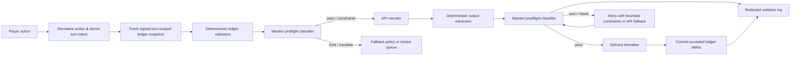

# SynapticGM Continuity Warden MVP — Build-Ready Specification

**Scope lock.** This specification is for **live SynapticGM only**. It assumes that the **ledger is truth**, that a custom full narrator is premature, and that the custom model’s first job is a narrow **Continuity Warden classifier**. It does not propose WOF, hybrid-climate functionality, or patent work.

> **Continuity Warden:** a constrained, evidence-citing classification service that compares a proposed or generated turn against SynapticGM’s authoritative ledger and declared narrative permissions. It may permit, warn, hold, block, or escalate; it must not invent, repair, or write story prose, and it must never mutate the ledger.

## 1. Product Contract and Non-Negotiables

The Warden is a **validator and routing control**, not a narrator, world modeller, or autonomous canon editor. Its only source of truth for established facts, promises, disclosures, inventory, state transitions, and player-visible history is the turn-scoped ledger snapshot supplied by the pipeline. A Warden result is advisory in shadow mode and delivery-gating in block mode. It cannot add a fact, satisfy an obligation by assertion, upgrade a tentative fact into canon, or overwrite a narrator response.

| Requirement | MVP implementation | Explicit non-goal |
|---|---|---|
| Authority | Canonical `ledger_snapshot` and its `ledger_hash` accompany every decision. | Reconstructing truth from raw conversation history. |
| Narrow task | Detect continuity risk in a turn intent or candidate response. | Generating the response, recap, apology, rewrite, or lore. |
| Traceability | Each finding cites ledger IDs, disclosure scopes, or content offsets. | Unexplained “model says no” decisions. |
| Reversibility | Every mode change and action is logged and replayable by `turn_id` + ledger hash. | Silent model policy changes. |
| Privacy | Training operates on redacted, minimized validator examples—not perpetual raw chat retention. | Building a forever transcript archive. |
| Safety | High-risk/ambiguous cases leave automated delivery through `needs_escalation`. | Treating confidence as certainty. |

## 2. Service Boundaries and Interfaces

The Warden is exposed as a stateless `POST /v1/continuity/check` service. State is fetched upstream from the ledger service and supplied as a compact, turn-scoped evidence package. The Warden therefore has no authority to query or edit the primary store, and it should not receive a full player transcript by default.

| Component | Owns | Warden receives / returns |
|---|---|---|
| Ledger service | Canonical entities, facts, obligations, disclosure scopes, beat history, and state transitions. | Receives a deterministic snapshot request; returns a signed/hashable snapshot to the orchestrator. |
| Turn orchestrator | Request IDs, idempotency, routing, feature flags, fallback, delivery order. | Supplies the Warden request; consumes a policy verdict. |
| Continuity Warden | Evidence-bound label prediction and enforcement recommendation. | Receives normalized context / intent / candidate; returns a JSON verdict only. |
| Narrator API | Natural-language response generation. | Receives allowed facts and Warden constraints, never direct permission to write ledger. |
| Validator log store | Short-lived decision and evaluation records. | Receives redacted feature/log record, not the raw turn by default. |
| Human / counterfactual reviewer | Resolves flagged cases and labels disputes. | Receives minimal evidence bundle and candidate excerpt under role-controlled access. |

## 3. Placement in the Live Turn Pipeline

The Warden belongs **both before and after the narrator**, in two different modes. The preflight pass is intentionally cheap and avoids evaluating prose that does not yet exist. The postflight pass is the final continuity gate before a response is delivered. Neither pass replaces deterministic ledger validation.



The preflight classifier receives **intent, referenced IDs, proposed new concepts, and permissions**, but no generated prose. It returns constraints such as `do_not_reveal: [secret_17]`, `must_address_obligation: [obl_82]`, or `permitted_introductions: [permit_44]`. The API narrator then writes within that envelope. The postflight classifier compares candidate claims to the same snapshot plus deterministic candidate extraction. It can allow delivery, request one bounded retry, route to a known-safe API fallback, or require review. It never asks a custom model to “fix continuity creatively.”

## 4. Request JSON Schema

The request permits two passes—`preflight` and `postflight`—using one schema. `candidate` is required only for postflight. All IDs are opaque SynapticGM identifiers. Free text is capped so an accidental full transcript cannot enter the service interface.

```json
{
  "$schema": "https://json-schema.org/draft/2020-12/schema",
  "$id": "https://synapticgm.live/schemas/continuity-warden-request.v1.json",
  "title": "SynapticGM Continuity Warden Request v1",
  "type": "object",
  "additionalProperties": false,
  "required": [
    "schema_version", "request_id", "turn_id", "session_id", "pass",
    "ledger_snapshot", "turn_intent", "policy"
  ],
  "properties": {
    "schema_version": {"const": "1.0"},
    "request_id": {"type": "string", "pattern": "^[A-Za-z0-9_-]{12,128}$"},
    "turn_id": {"type": "string", "pattern": "^[A-Za-z0-9_-]{6,128}$"},
    "session_id": {"type": "string", "pattern": "^[A-Za-z0-9_-]{6,128}$"},
    "pass": {"enum": ["preflight", "postflight"]},
    "occurred_at": {"type": "string", "format": "date-time"},
    "ledger_snapshot": {"$ref": "#/$defs/ledgerSnapshot"},
    "turn_intent": {"$ref": "#/$defs/turnIntent"},
    "candidate": {"$ref": "#/$defs/candidate"},
    "policy": {"$ref": "#/$defs/policy"},
    "trace": {"$ref": "#/$defs/trace"}
  },
  "allOf": [
    {
      "if": {"properties": {"pass": {"const": "postflight"}}},
      "then": {"required": ["candidate"]}
    }
  ],
  "$defs": {
    "opaqueId": {"type": "string", "pattern": "^[A-Za-z0-9_.:-]{1,160}$"},
    "ledgerSnapshot": {
      "type": "object", "additionalProperties": false,
      "required": ["ledger_version", "ledger_hash", "scope", "facts", "obligations", "disclosures", "beats", "intro_permits"],
      "properties": {
        "ledger_version": {"type": "integer", "minimum": 0},
        "ledger_hash": {"type": "string", "pattern": "^[A-Fa-f0-9]{32,128}$"},
        "scope": {"type": "object", "additionalProperties": false, "required": ["as_of_turn", "player_view"], "properties": {"as_of_turn": {"$ref": "#/$defs/opaqueId"}, "player_view": {"type": "string", "maxLength": 64}}},
        "facts": {"type": "array", "maxItems": 250, "items": {"$ref": "#/$defs/fact"}},
        "obligations": {"type": "array", "maxItems": 100, "items": {"$ref": "#/$defs/obligation"}},
        "disclosures": {"type": "array", "maxItems": 100, "items": {"$ref": "#/$defs/disclosure"}},
        "beats": {"type": "array", "maxItems": 100, "items": {"$ref": "#/$defs/beat"}},
        "intro_permits": {"type": "array", "maxItems": 50, "items": {"$ref": "#/$defs/introPermit"}}
      }
    },
    "fact": {
      "type": "object", "additionalProperties": false,
      "required": ["fact_id", "subject_id", "predicate", "object", "status", "visibility"],
      "properties": {
        "fact_id": {"$ref": "#/$defs/opaqueId"}, "subject_id": {"$ref": "#/$defs/opaqueId"},
        "predicate": {"type": "string", "maxLength": 80}, "object": {"type": "string", "maxLength": 320},
        "status": {"enum": ["canonical", "tentative", "revoked"]},
        "visibility": {"enum": ["player_known", "hidden", "future_locked"]},
        "source_turn_id": {"$ref": "#/$defs/opaqueId"}, "expires_after_turn": {"$ref": "#/$defs/opaqueId"}
      }
    },
    "obligation": {
      "type": "object", "additionalProperties": false,
      "required": ["obligation_id", "kind", "status", "due_by", "importance"],
      "properties": {
        "obligation_id": {"$ref": "#/$defs/opaqueId"}, "kind": {"type": "string", "maxLength": 80},
        "description": {"type": "string", "maxLength": 320},
        "status": {"enum": ["open", "due", "overdue", "satisfied", "waived"]},
        "due_by": {"$ref": "#/$defs/opaqueId"},
        "importance": {"enum": ["critical", "high", "normal", "low"]},
        "satisfaction_evidence_ids": {"type": "array", "maxItems": 10, "items": {"$ref": "#/$defs/opaqueId"}}
      }
    },
    "disclosure": {
      "type": "object", "additionalProperties": false,
      "required": ["disclosure_id", "fact_id", "visibility", "unlock_rule"],
      "properties": {
        "disclosure_id": {"$ref": "#/$defs/opaqueId"}, "fact_id": {"$ref": "#/$defs/opaqueId"},
        "visibility": {"enum": ["hidden", "future_locked", "player_known"]},
        "unlock_rule": {"type": "string", "maxLength": 160}
      }
    },
    "beat": {
      "type": "object", "additionalProperties": false,
      "required": ["beat_id", "beat_type", "semantic_key", "used_turn_id", "cooldown_turns"],
      "properties": {
        "beat_id": {"$ref": "#/$defs/opaqueId"}, "beat_type": {"type": "string", "maxLength": 64},
        "semantic_key": {"type": "string", "maxLength": 160}, "used_turn_id": {"$ref": "#/$defs/opaqueId"},
        "cooldown_turns": {"type": "integer", "minimum": 0, "maximum": 1000}
      }
    },
    "introPermit": {
      "type": "object", "additionalProperties": false,
      "required": ["permit_id", "concept_type", "scope", "expires_after_turn", "constraints"],
      "properties": {
        "permit_id": {"$ref": "#/$defs/opaqueId"}, "concept_type": {"type": "string", "maxLength": 80},
        "scope": {"enum": ["entity", "location", "item", "event", "relationship", "flavour"]},
        "expires_after_turn": {"$ref": "#/$defs/opaqueId"},
        "constraints": {"type": "array", "maxItems": 12, "items": {"type": "string", "maxLength": 160}}
      }
    },
    "turnIntent": {
      "type": "object", "additionalProperties": false,
      "required": ["player_action", "referenced_ids", "proposed_concepts", "must_address_obligation_ids"],
      "properties": {
        "player_action": {"type": "string", "minLength": 1, "maxLength": 1600},
        "referenced_ids": {"type": "array", "maxItems": 50, "items": {"$ref": "#/$defs/opaqueId"}},
        "proposed_concepts": {"type": "array", "maxItems": 30, "items": {"type": "string", "maxLength": 160}},
        "must_address_obligation_ids": {"type": "array", "maxItems": 20, "items": {"$ref": "#/$defs/opaqueId"}},
        "requested_beat_types": {"type": "array", "maxItems": 10, "items": {"type": "string", "maxLength": 64}}
      }
    },
    "candidate": {
      "type": "object", "additionalProperties": false,
      "required": ["text", "claim_spans", "beat_keys", "introduced_concepts"],
      "properties": {
        "text": {"type": "string", "minLength": 1, "maxLength": 12000},
        "claim_spans": {"type": "array", "maxItems": 80, "items": {"$ref": "#/$defs/claimSpan"}},
        "beat_keys": {"type": "array", "maxItems": 12, "items": {"type": "string", "maxLength": 160}},
        "introduced_concepts": {"type": "array", "maxItems": 30, "items": {"type": "string", "maxLength": 160}}
      }
    },
    "claimSpan": {
      "type": "object", "additionalProperties": false,
      "required": ["start", "end", "claim_type", "text"],
      "properties": {
        "start": {"type": "integer", "minimum": 0, "maximum": 12000}, "end": {"type": "integer", "minimum": 1, "maximum": 12000},
        "claim_type": {"enum": ["fact", "promise", "reveal", "introduction", "beat", "state_change"]},
        "text": {"type": "string", "maxLength": 600}, "referenced_ids": {"type": "array", "maxItems": 10, "items": {"$ref": "#/$defs/opaqueId"}}
      }
    },
    "policy": {
      "type": "object", "additionalProperties": false,
      "required": ["mode", "thresholds", "allowed_actions"],
      "properties": {
        "mode": {"enum": ["shadow", "warn", "block"]},
        "thresholds": {"$ref": "#/$defs/thresholds"},
        "allowed_actions": {"type": "array", "minItems": 1, "items": {"enum": ["allow", "inject_constraints", "single_retry", "api_fallback", "queue_review", "block_delivery"]}}
      }
    },
    "thresholds": {
      "type": "object", "additionalProperties": false,
      "required": ["warn", "block", "escalate"],
      "properties": {
        "warn": {"type": "number", "minimum": 0, "maximum": 1},
        "block": {"type": "number", "minimum": 0, "maximum": 1},
        "escalate": {"type": "number", "minimum": 0, "maximum": 1}
      }
    },
    "trace": {
      "type": "object", "additionalProperties": false,
      "properties": {"narrator_route": {"type": "string", "maxLength": 160}, "retry_index": {"type": "integer", "minimum": 0, "maximum": 2}, "prompt_template_version": {"type": "string", "maxLength": 64}}
    }
  }
}
```

## 5. Response JSON Schema

The response is intentionally structured as labels plus evidence and a routing recommendation. `confidence` is **calibrated likelihood of label correctness**, not severity and not authorization to invent. A high-confidence hidden-disclosure finding can be serious; a low-confidence `needs_escalation` case can still require review.

```json
{
  "$schema": "https://json-schema.org/draft/2020-12/schema",
  "$id": "https://synapticgm.live/schemas/continuity-warden-response.v1.json",
  "title": "SynapticGM Continuity Warden Response v1",
  "type": "object",
  "additionalProperties": false,
  "required": ["schema_version", "request_id", "turn_id", "ledger_hash", "verdict", "findings", "recommended_action", "model"],
  "properties": {
    "schema_version": {"const": "1.0"},
    "request_id": {"type": "string"},
    "turn_id": {"type": "string"},
    "ledger_hash": {"type": "string"},
    "verdict": {"enum": ["pass", "warn", "hold", "block", "escalate"]},
    "findings": {"type": "array", "maxItems": 12, "items": {"$ref": "#/$defs/finding"}},
    "constraints": {"type": "array", "maxItems": 30, "items": {"$ref": "#/$defs/constraint"}},
    "recommended_action": {"enum": ["allow", "inject_constraints", "single_retry", "api_fallback", "queue_review", "block_delivery"]},
    "model": {"$ref": "#/$defs/model"},
    "latency_ms": {"type": "integer", "minimum": 0},
    "idempotency_key": {"type": "string", "maxLength": 160}
  },
  "$defs": {
    "finding": {
      "type": "object", "additionalProperties": false,
      "required": ["label", "confidence", "severity", "evidence", "resolution"],
      "properties": {
        "label": {"enum": ["invent", "obligation_miss", "intro_permit", "beat_recycle", "leak", "needs_escalation"]},
        "confidence": {"type": "number", "minimum": 0, "maximum": 1},
        "severity": {"enum": ["info", "low", "medium", "high", "critical"]},
        "evidence": {"$ref": "#/$defs/evidence"},
        "resolution": {"enum": ["allow", "warn", "constrain", "retry", "fallback", "review", "block"]},
        "counterfactual_hint": {"type": "string", "maxLength": 280}
      }
    },
    "evidence": {
      "type": "object", "additionalProperties": false,
      "required": ["ledger_ids", "candidate_offsets", "summary"],
      "properties": {
        "ledger_ids": {"type": "array", "maxItems": 12, "items": {"type": "string"}},
        "candidate_offsets": {"type": "array", "maxItems": 12, "items": {"type": "object", "required": ["start", "end"], "properties": {"start": {"type": "integer", "minimum": 0}, "end": {"type": "integer", "minimum": 0}}, "additionalProperties": false}},
        "summary": {"type": "string", "maxLength": 400},
        "redacted_excerpt": {"type": "string", "maxLength": 600}
      }
    },
    "constraint": {
      "type": "object", "additionalProperties": false,
      "required": ["kind", "target_ids", "instruction"],
      "properties": {
        "kind": {"enum": ["must_address", "must_not_reveal", "must_not_assert", "may_introduce", "avoid_beat", "request_review"]},
        "target_ids": {"type": "array", "maxItems": 20, "items": {"type": "string"}},
        "instruction": {"type": "string", "maxLength": 300}
      }
    },
    "model": {
      "type": "object", "additionalProperties": false,
      "required": ["model_id", "model_version", "calibration_version"],
      "properties": {
        "model_id": {"type": "string", "maxLength": 100}, "model_version": {"type": "string", "maxLength": 100},
        "calibration_version": {"type": "string", "maxLength": 100}, "ruleset_version": {"type": "string", "maxLength": 100}
      }
    }
  }
}
```

### Label Semantics and Default Enforcement

| Label | Positive definition | Required evidence | Default action in shadow / block | Common false positive to test |
|---|---|---|---|---|
| `invent` | Candidate asserts a new factual claim or state change not supported by a canonical fact, allowed player action, or valid `intro_permit`. | Candidate span plus missing/contradictory ledger reference. | Log / `single_retry` for high-confidence material fact. | Legitimate consequence of the just-recorded player action. |
| `obligation_miss` | A due/overdue required obligation is absent, contradicted, or improperly implied satisfied. | `obligation_id`, due status, and omitted/contradicting candidate surface. | Log / constrain or retry if critical/high. | An obligation intentionally deferred by a ledger waiver. |
| `intro_permit` | Candidate introduction is within a valid, unexpired permit. This is a **positive permission label**, not a violation. | `permit_id`, permitted scope and constraints. | Log / allow. | Treating a permit as permission for extra unlisted facts. |
| `beat_recycle` | Candidate repeats a semantically equivalent beat inside its active cooldown window. | Candidate beat key and prior `beat_id`/cooldown. | Log / retry only if user-visible repetition is material. | Similar action with genuinely different stakes or outcome. |
| `leak` | Candidate discloses hidden or future-locked fact, identity, motive, item, outcome, or unlock-dependent information. | Disclosure/fact ID and visibility state. | Log / block or API fallback at sufficient confidence. | Player-visible fact mistakenly labelled hidden in the snapshot. |
| `needs_escalation` | Evidence is conflicting, the input is insufficient, a policy edge case exists, or calibrated confidence is too low to safely allow/block. | Conflicting IDs, missing dependency, or ambiguity explanation. | Log / review queue; do not invent a resolution. | Overusing escalation for routine low-stakes ambiguity. |

A response may contain multiple findings. For example, a candidate can produce a `leak` and an `invent`; `leak` governs delivery because its default severity is higher. Positive `intro_permit` never cancels a contradictory leak, and it never turns a non-permitted introduction into canon.

## 6. Deterministic Rules Before Model Inference

The classifier should not be asked to discover what a database query can establish. The orchestrator first executes deterministic checks and sends their results to the Warden as signed features: expired permits, direct fact contradictions, overdue critical obligations, disclosure visibility, and beat cooldown arithmetic. The classifier resolves semantic matches, omissions, paraphrase, and ambiguity.

| Rule type | Execute deterministically | Warden decides |
|---|---|---|
| Permit expiry | `expires_after_turn < current_turn` | Whether candidate introduction falls within a still-valid permit’s semantic scope. |
| Disclosure | `visibility != player_known` | Whether a candidate span semantically reveals or strongly implies the protected fact. |
| Obligation due | `status IN (due, overdue)` | Whether the candidate genuinely addresses, satisfies, evades, or contradicts the obligation. |
| Beat cooldown | Compute turn distance vs `cooldown_turns`. | Whether two beat keys are functionally a recycled player experience. |
| Fact reference | Exact ID/name/property lookup; explicit contradictions. | Paraphrastic / relational contradiction and unsupported inference. |

This division prevents expensive inference from becoming a substitute for the ledger. It also yields high-quality training examples with traceable ground truth.

## 7. Shadow-Mode to Block-Mode Promotion

Promotion proceeds per label and severity tier, not as one global switch. A Warden may block high-confidence `leak` findings while `beat_recycle` remains shadow-only. No class enters block mode based only on aggregate accuracy.

| Stage | Traffic | Enforcement | Minimum evidence to advance |
|---|---:|---|---|
| S0: Offline replay | Historical redacted validator set only | None | Gold labels, calibrated score distribution, and regression suite pass. |
| S1: Shadow | 100% of live eligible turns | Log counterfactual verdict; never affects delivery. | At least 1,000 labelable opportunities per high-risk label or 30 days, whichever is later; reviewers sample both positives and negatives. |
| S2: Warn | 10% canary, then 100% | Adds constraints / internal alert; no hard block. | Label-level observed FPR and FNR within guardrails for two consecutive weekly windows; no unresolved P0 incident. |
| S3: Limited block | 5% then 25% traffic for a label/severity slice | One bounded retry or API fallback before block. | Canary error bounds, latency SLO, fallback success, and reviewer overturn controls met. |
| S4: Block | 100% of the eligible slice | Prevents delivery only under stated hard gate; preserve review/fallback route. | Four consecutive weekly windows, plus rollback drill and human-review coverage. |

### Hard Promotion Guardrails

`FPR = false positive / all actual negatives`; `FNR = false negative / all actual positives`. Measure each on a stratified, independently reviewed sample with a fixed adjudication rubric. Report 95% confidence intervals; a point estimate alone cannot promote a class.

| Label / consequence | Shadow → warn | Warn → limited block | Limited block → full block |
|---|---:|---:|---:|
| `leak` of hidden/future-locked material | FPR ≤ **2.0%**, FNR ≤ **5.0%** | FPR ≤ **1.0%**, FNR ≤ **3.0%**, lower 95% CI supports target | FPR ≤ **0.5%**, FNR ≤ **2.0%**, four weekly windows |
| `invent` material canonical claim | FPR ≤ **5.0%**, FNR ≤ **10.0%** | FPR ≤ **2.0%**, FNR ≤ **5.0%** | FPR ≤ **1.0%**, FNR ≤ **3.0%** |
| `obligation_miss` critical/high | FPR ≤ **5.0%**, FNR ≤ **10.0%** | FPR ≤ **3.0%**, FNR ≤ **5.0%** | FPR ≤ **2.0%**, FNR ≤ **3.0%** |
| `beat_recycle` | FPR ≤ **12.0%**, FNR ≤ **20.0%** | **Warn only by default**; no automatic hard block unless product evidence justifies it | Not a default block candidate |
| `intro_permit` | FPR ≤ **3.0%**, FNR ≤ **5.0%** | Supports automatic allow only; it must never override a leak/contradiction | No standalone block action |
| `needs_escalation` | Review precision ≥ **80.0%**; escalation rate ≤ **10.0%** of eligible turns | Review precision ≥ **85.0%**, rate ≤ **5.0%** for ordinary traffic | Remains review-only by design |

**Immediate rollback triggers.** Roll back the affected label to shadow when: (1) any confirmed high-severity leak bypasses the block slice; (2) live hard-block FPR exceeds twice its promoted threshold in a 24-hour reviewed sample; (3) valid delivery suppressions materially exceed the error budget; (4) p95 Warden latency breaks the turn SLO for two consecutive 15-minute windows; or (5) the ledger hash / snapshot integrity check fails. Rollback is a flag change, not a model redeploy.

## 8. Privacy-Preserving Training-Data Flywheel

The flywheel takes data from validator logs, not an indefinite raw-chat store. It follows the principle: retain **the smallest evidence necessary for audit, labelling and evaluation**, then retain derived, de-identified features only where they remain useful.

### Event Flow

1. The orchestrator creates a redacted decision event containing request metadata, labels, confidence, ledger references, outcome, and only the short candidate / player-action spans necessary to adjudicate a finding.
2. A deterministic scrubber replaces account identifiers, free-form personal identifiers, URLs, contact details and unneeded text with typed placeholders before the event reaches the training queue.
3. A reviewer sees an access-controlled evidence bundle. They select `confirm`, `overturn`, `partial`, `uncertain`, or `COUNSEL` and record a short structured rationale.
4. Confirmed examples are transformed into training rows: normalized ledger feature graph, redacted claim representation, label, severity, adjudication source and expiry. Full raw text does not enter the training corpus by default.
5. Dataset release jobs enforce retention, COUNSEL hold, deduplication, class balancing, source split and contamination checks. Every model checkpoint records a dataset manifest hash and the active ruleset version.

### Retention and COUNSEL Table

`COUNSEL` means legal/privileged review or hold. It is a **processing restriction**, not permission to retain everything forever. The exact counsel policy and jurisdictional deletion obligations remain governed by SynapticGM’s approved data policy.

| Data object | Content | Default retention | Access | `COUNSEL` flag effect | Training eligibility |
|---|---|---:|---|---|---|
| Live raw player message | Original player text. | **Not copied** into Warden logs; retained only by the primary live-service policy. | Live service only. | Do not export to Warden systems. | No. |
| Raw narrator candidate | Original pre-delivery narrative. | 24 hours in encrypted transient debugging buffer, then deletion. | Restricted on-call only. | Hold only the minimum scoped excerpt under counsel instruction. | No by default. |
| Redacted validator event | IDs, ledger hash, label scores, model/ruleset version, 600-char maximum redacted evidence excerpt, action/outcome. | 30 days online + 60 days encrypted cold audit = **90 days total**. | Engineering / review roles. | Quarantine from routine deletion and training; require counsel release or deletion instruction. | Only after adjudication and scrubbing. |
| Human adjudication record | Label decision, rubric code, redacted rationale, reviewer role, timestamp. | 180 days. | Review leads / audit. | Restrict access; exclude from model training until cleared. | Yes, after approval. |
| Curated training row | De-identified structured features, feature hashes, short scrubbed spans, adjudicated labels and provenance ID. | 12 months rolling, then revalidate/delete. | ML data role. | Exclude / tombstone from derivative datasets and checkpoints where feasible. | Yes, if no hold and quality gates pass. |
| Aggregate metrics | Counts, rates, calibration bins, no text/IDs. | 24 months. | Broad internal analytics. | Retain only counsel-approved aggregate reporting. | N/A. |
| Error / incident packet | Minimum redacted evidence for a confirmed material failure. | 180 days, then redacted closure summary 24 months. | Incident team / counsel. | Preserve under legal hold; separate from training. | No without explicit release. |

The `COUNSEL` flag must exist at **event, example, and dataset-manifest levels**. A downstream training job must fail closed if a record is flagged, if its retention expiry has passed, or if it cannot prove the source record’s transformation and adjudication state.

### Data Quality Gates

| Gate | Required control |
|---|---|
| Deduplication | Hash stable parts of the ledger claim graph and semantic candidate representation; do not let one long session dominate training. |
| Leakage prevention | Split train/validation/test by `session_id` and ledger lineage, not random turn, so near-duplicate scenes cannot appear on both sides. |
| Class balance | Oversample adjudicated rare high-severity `leak` and `invent` cases only through weighted sampling; preserve prevalence in calibration evaluation. |
| Provenance | Every row carries `source_event_id`, adjudication status, ruleset/model version, expiry and `COUNSEL` state. |
| Redaction audit | Random weekly audit of 100 events; any raw PII or unneeded content fails the export and triggers purge/remediation. |
| Reversibility | Manifest records support deletion/tombstoning and model retraining when a source set must be removed. |

## 9. Evaluation Suites and Acceptance Criteria

Each suite is versioned, immutable once used for a release, and entirely separate from the current training set. Each case has: a ledger fixture, turn intent, candidate output (where applicable), expected labels, expected evidence IDs, expected verdict, and a reviewer rationale. No suite stores unrestricted raw chat.

| Suite | Required size / construction | Primary measurements | Release gate |
|---|---|---|---|
| **50-invention** | 50 cases: 25 unsupported material facts/state changes, 10 directly contradictory facts, 10 permitted introductions, 5 player-authorized consequences. | `invent` precision/recall, false blocks on legal play, evidence-ID accuracy. | ≥ 46/50 correct primary label; **0** false `invent` blocks on the 10 permitted introductions; every material `invent` cites a valid ledger absence/contradiction. |
| **20-retry novelty** | 20 multi-attempt narrator sequences, 2–3 candidate retries each: 10 real recycled beats, 5 superficial lexical similarity but novel stakes, 5 different beats with same setting. | `beat_recycle` ranking, retry recommendation correctness, false-retry rate. | ≥ 18/20 correct final decision; no more than 1 false retry among the 10 novel cases. This suite remains warning-oriented. |
| **100-turn kit recall hooks** | One scripted 100-turn mini-campaign with turn-specific kit/inventory/obligation hooks, including distractors, ownership changes, losses, delayed reveals and expiry. Every tenth turn includes a recall test. | Recall FNR for due obligations and player-known kit; `leak` FPR/FNR; ledger-hash consistency; long-horizon drift. | ≥ 98% required hook recall; **0** undisclosed future facts passed; 100/100 decisions must cite the fixture ledger hash and valid item/obligation IDs. |

Add three mandatory release checks: (1) a calibration test reporting expected calibration error and reliability plots by label; (2) adversarial paraphrase tests for direct/indirect reveals and invented relationships; and (3) a replay of the most recent 30 days of **redacted, adjudicated** validator events. A model may not improve aggregate accuracy by regressing the named leakage, invention or long-horizon gates.

## 10. MVP Implementation Plan

| Sprint | Buildable outcome | Definition of done |
|---|---|---|
| 1 | Canonical snapshot builder; deterministic validators; request/response contract; redacted logs. | JSON Schema validation passes; `ledger_hash` mismatch fails closed; raw chat is not copied to validator logs. |
| 2 | Hosted low-cost classifier route in shadow mode; fixed prompt/ruleset; review console. | All six labels emit with evidence IDs; shadow verdict never modifies delivery. |
| 3 | Eval harness with the 50 / 20 / 100 suites; calibration and stratified metrics job. | Baseline report provides label-level FPR/FNR, p50/p95 latency, review overturn rate and data-retention audit. |
| 4 | Preflight constraints and postflight bounded retry/API fallback. | One retry maximum; every retry retains original request ID and `retry_index`; no custom narrator. |
| 5 | Label-specific warn canary; promotion dashboard and rollback flag. | Promotion requires the stated confidence-bound guardrails, human-review sample and rollback drill. |
| 6 | Optional self-hosted Warden canary, only after paid-route baseline is measured. | Hardware cost, p95 latency, uptime, incident load and quality are compared against the hosted gate on the same immutable suite. |

## 11. Operational Metrics and Alerting

| Metric | Target / decision use |
|---|---|
| `warden_p95_latency_ms` | Budget independently for preflight and postflight; alert when it threatens live turn SLO. |
| `decision_coverage` | Percent of eligible turns with a verified ledger hash and a response. Missing coverage fails safely to deterministic/API fallback. |
| `label_rate` by model/ruleset | Detects sudden policy/model drift; compare to trailing 7-day baseline. |
| Label-level FPR/FNR with 95% CI | The sole quality basis for enforcement promotion; report strata by severity and turn length. |
| `review_overturn_rate` | High rate indicates poor calibration, unclear policy, or ledger defects. |
| `fallback_success_rate` | Ensures a continuity block does not become a player dead end. |
| `raw_text_export_rate` | Must be 0 by default; any non-zero event is an incident. |
| `COUNSEL_exclusion_violations` | Must be 0; any violation blocks dataset release. |

## 12. Example Postflight Decision

```json
{
  "schema_version": "1.0",
  "request_id": "req_01JWARDEN0000001",
  "turn_id": "turn_0042",
  "ledger_hash": "6fb7f1c09bafd49780b95506f5aa2b9314b21ef572e057eb574c8a62f59a6db2",
  "verdict": "block",
  "findings": [
    {
      "label": "leak",
      "confidence": 0.98,
      "severity": "critical",
      "evidence": {
        "ledger_ids": ["fact_antagonist_identity", "disclosure_017"],
        "candidate_offsets": [{"start": 214, "end": 268}],
        "summary": "Candidate states the identity of a fact marked hidden until the ledger unlock rule is met.",
        "redacted_excerpt": "…[redacted hidden-identity reveal]…"
      },
      "resolution": "retry",
      "counterfactual_hint": "Preserve uncertainty; do not name, imply, or confirm the hidden identity."
    },
    {
      "label": "obligation_miss",
      "confidence": 0.87,
      "severity": "high",
      "evidence": {
        "ledger_ids": ["obl_return_kit_12"],
        "candidate_offsets": [],
        "summary": "A high-priority obligation due this turn is not addressed.",
        "redacted_excerpt": ""
      },
      "resolution": "constrain",
      "counterfactual_hint": "Acknowledge the due kit-return obligation without claiming it is satisfied."
    }
  ],
  "constraints": [
    {
      "kind": "must_not_reveal",
      "target_ids": ["disclosure_017"],
      "instruction": "Do not name, imply, or confirm this protected fact."
    },
    {
      "kind": "must_address",
      "target_ids": ["obl_return_kit_12"],
      "instruction": "Address the due obligation truthfully; do not mark it satisfied without ledger evidence."
    }
  ],
  "recommended_action": "single_retry",
  "model": {"model_id": "warden-small", "model_version": "shadow.0.1.0", "calibration_version": "cal.0.1.0", "ruleset_version": "rules.1.0"},
  "latency_ms": 113,
  "idempotency_key": "turn_0042:postflight:0"
}
```

## 13. Explicit Exclusions

The MVP does not train a private full narrator; it does not store complete chat histories indefinitely; it does not let a classifier create canon; it does not perform uncited automatic “repair” prose; it does not treat vendor safety filters as the SynapticGM policy; and it does not hard-block novelty/repetition merely because two scenes share words. It is deliberately smaller than the narrator problem so that the first self-hosted AI investment can be measured, rolled back, and justified.
