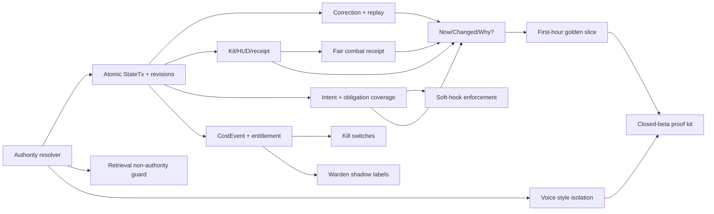

# E11 — Master Build Backlog Merge

**Merge boundary:** The request refers to prior “memory-cost Part G,” “vibe V10,” and “Warden MVP” P0s, but those source documents were not attached. This is therefore a **deduplicated reconstruction** from the supplied current-state list, product law, E1–E10 findings, and stated business decisions. It does not claim to reproduce undisclosed prior rankings. No WOF work is included.

## Ranking Rule

Rank is determined by the smallest number that can falsify the north-star promise. Work that prevents a false fact, lost correction, forced action, unsafe render, or unbounded spend outranks attractive content, voice breadth, images, GPU, and growth systems.

| Priority band | Meaning | Release treatment |
|---|---|---|
| **P0** | A failure breaks truth, agency, fairness, safety, or solvency. | Blocks closed-beta expansion; some block any invite. |
| **P1** | Makes the moat visible, understandable, or repeatable. | Ship immediately after all dependent P0s; measure in playtest. |
| **P2** | Adds polish, breadth, or leverage without repairing a core promise. | Deliberately defer until P0/P1 evidence is green. |
| **Gated research / GPU** | A conditional operating experiment. | Not a feature commitment; unlock only on specified evidence. |

## P0 — Truth, Agency, Safety, and Cost Integrity

| Rank | Backlog item | Why now | Dependencies | Done when | Evidence / fixture |
|---:|---|---|---|---|---|
| 1 | **Canonical authority resolver** | Nothing else is credible if draft/retrieval/prose can override correction/canon/state. | State schema; CampaignContract. | Resolver deterministically orders correction → invariant → accepted StateTx → manifest → evidence → invention; conflicts include trace. | RT01/05/11/14/16/39–41. |
| 2 | **Atomic StateTx commit + revision lineage** | Prevents duplicated/invisible/illegal state changes. | Authority resolver; persistence. | Every accepted action yields zero or one committed transaction with base/current revision, idempotency, source, delta, and hash. | RT15/17/30/34–38/54–55. |
| 3 | **Correction UX + replay/reconciliation** | Highest-value differentiator and largest trust liability. | 1–2; state dependency map. | Player can correct a fact; system shows scope; reload/recap/current HUD use new fact; dependent state either replays, forks, or presents explicit choice. | RT11–18; filmed proof clip. |
| 4 | **IntentContract and complete obligation coverage** | A GM that skips part of an action or forces a hook fails “it heard me.” | Intent parser; manifest. | Every meaningful clause is resolved/blocked/clarified/deferred with player-readable output; no unlogged omission. | RT19–23/57. |
| 5 | **HookArc soft-offer enforcement** | Prevents railroading under pressure. | 4; quest state. | Offer status has `soft/open/declined/accepted/expired`; ignored/declined offers cannot become accepted by narration. | RT19–23/33. |
| 6 | **Ledger-kit, HUD, and receipt reconciliation** | Inventory lies destroy credibility in one turn. | State schema; render layer. | Item ownership/count/condition/equipment is read from accepted state for scene, HUD, and receipt; no negative count. | RT03/24–29/53. |
| 7 | **Fair check/combat receipt** | Claims of fair consequences need direct proof. | 2, 6; rules policy/RNG. | Receipt lists action, legal inputs, roll/seed policy, modifiers, threshold, outcome, state delta, and why; UI matches state. | RT51–52; E4 S05. |
| 8 | **Retrieval/summarization non-authority guard** | RAG poison or stale summaries can silently erase product law. | 1; retrieval pipeline. | Source classes/tenant filtering; conflict loses to canonical state; injection treated inert; poison logged; no cross-campaign content. | RT39–42. |
| 9 | **Speculative retry + stale-render guard** | Prevents visible lies and double-spend from retries/concurrency. | 2; render queue. | Draft renders only if base revision=current; stale drafts discarded/reconciled; one committed StateTx per idempotency key. | RT30–38. |
| 10 | **Kid Mode boundary + history filter** | Filters must preempt render/state and preserve play. | Safety taxonomy; 2/6/8. | Mode applies to prompts, scene, HUD, history, images, ads, and outgoing render; blocked requests offer safe alternative. | RT07/43–46; E4 S10. |
| 11 | **Leak scanner on every render path** | System jargon turns product architecture into a trust failure. | Narration/repair templates; fallbacks. | Player-visible text never includes internal terms; scan covers normal, timeout, correction, safety, and error states. | RT56; screenshot gate. |
| 12 | **CostEvent and server entitlement ledger** | Free launch cannot be managed or made fair without attributable costs/rights. | 2; provider integrations; Stripe if live. | Every attempted/accepted/blocked/failed cost has work class, model/rate/usage, retry lineage, tier/mode, entitlement source, and outcome. | RT37/54/55/60; E5 formula population. |
| 13 | **Ops kill switches + drill** | Prevents one provider/media incident from becoming a total outage or charge. | 12; incident owner. | Image, retrieval, model route, voice, and ad/commerce switches are documented; test preserves text play and no allowance is consumed. | RT60; E6 drill log. |

## P1 — Visible Moat, Onboarding, and Evidence Loops

| Rank | Backlog item | Why now | Dependencies | Done when | Evidence / fixture |
|---:|---|---|---|---|---|
| 14 | **Now / Changed / Why? surfaces** | Translates ledger truth into player value. | P0 1–7. | Player sees compact current state, last deltas, and plain-language causal trace within first five turns. | E2 screenshot gate; E4 S03–S05. |
| 15 | **Correction affordance and provenance wording** | Makes the unique promise discoverable without developer jargon. | P0 3/11; E7 copy. | A tester finds correction and describes what persisted without help. | E4 S06/S11; E7 copy acceptance. |
| 16 | **First-hour golden slice** | Simplifies proof of intent/kit/fairness before content breadth. | P0 1–11, 14. | LitRPG opening supports first action, optional hook, kit use, fair check, correction, and return in ≤10 turns. | E4 LitRPG S01–S06. |
| 17 | **Contrast-engine parity slice** | Prevents core law being “LitRPG only.” | P0 stack; engine definition. | PYOA or Story RPG has same authority/correction/intent/safety assertions under a distinct opening. | E4 S07–S10; E8 engine matrix. |
| 18 | **GM voice sealed-style packet** | Enables personality while preventing fact mutation. | P0 1/7/10/11; E7. | Voice input cannot influence adjudication/state; profile A/B has same state/receipt and different validated diction. | RT47–50; E7. |
| 19 | **Repair/clarification copy bank** | Turns constraints into fair, playable communication. | P0 3–6/10/11; E7. | Kit/correction/stale/safety states use plain, non-blaming, action-oriented copy. | E7 copy tests; E4 quotes. |
| 20 | **Quest source / what-next clarity** | Makes open leads less rail-like and improves return. | P0 4/5; 14. | Threads distinguish accepted quest vs lead/rumor/offer and display provenance/urgency. | RT53; E4 S11. |
| 21 | **Memorable Moments Classic (text-first state-committed)** | Shareable delight without turning art into truth. | P0 2/10/12/13; 16. | Trigger happens only after accepted moment; image/splash never mutates canonical state; allowance preflight exists. | RT54/60; human playtest. |
| 22 | **Closed-beta evidence kit** | Converts internal correctness into substantiated public claims. | P0s + 14–21. | Six uncut proof clips, trace appendix, known-limits page, claim register, playtest scorecards. | E4/E6/appendix. |

## P2 — Defer Intentionally

| Rank | Backlog item | Why defer | Unlock condition |
|---:|---|---|---|
| 23 | **Additional engine breadth** | Every engine multiplies test matrix and content maintenance. | Two-engine parity and clean beta signal. |
| 24 | **Advanced player context/history explorer** | Risks teaching users that retrieval is truth. | Core Now/Changed/Why? is understood; authority labeling complete. |
| 25 | **Full comic mode** | Explicitly near-term no-go; high cost/storage/safety and low proof value. | Classic moment value, image cost/abuse, and safety gates pass. |
| 26 | **Deep theme/animation/social polish** | Cannot fix correction, fairness, or agency. | P0/P1 playtest scores consistently ≥3. |
| 27 | **Broad Shop/complex bundles** | Pricing/entitlement/refund needs evidence and counsel. | E5 inputs populated and E6 counsel review done. |
| 28 | **Community/multiplayer/MMO work** | Outside product law and multiplies state/safety complexity. | Explicit new product decision; separate project. |
| 29 | **WOF/hybrid climate/patent work** | Explicitly out of scope. | Not included in this roadmap. |

## Gated Warden MVP Path — Not a Current Build Commitment

| Gate rank | Step | Entry condition | Done when | Exit rule |
|---:|---|---|---|---|
| G1 | **Shadow labels on API path** | P0 fixtures green; CostEvent available. | Warden labels score saved traces without editing state; confusion matrix reviewed weekly. | Do not add GPU. |
| G2 | **Targeted benchmark** | 30 days of attributed workload; a named label/workload is material. | Compare API route vs candidate local/GPU route on quality, latency, effective cost, reliability, and ops burden. | No production traffic unless better on predeclared threshold. |
| G3 | **Canary fallback route** | Build-vs-buy model + on-call + kill switch approved. | Small reversible share with full fallback, alerting, and no canonical-authority change. | Roll back on quality/safety/latency/cost breach. |
| G4 | **Capacity decision** | Stable utilization and recurring advantage shown. | Fully loaded economics, security, model upkeep, incident plan, and commercial impact documented. | Buy/lease only if E5 GPU gate passes. |

## Dependency Spine

## Backlog Operating Rule

No new content/voice/image/GPU task may leapfrog a P0 because it makes a demo prettier. Every row closes only with its listed **done-when** evidence—test result, trace, screenshot, or playtest—not a code-review assertion. If a defect fails product law, reopen the highest relevant P0 and stop expanding scope.

[Back to project index](../README.md)
