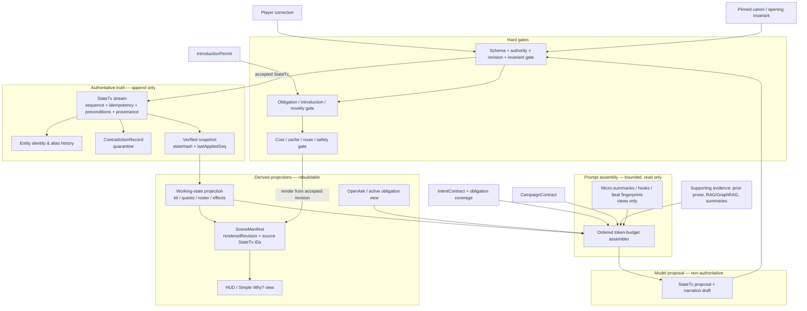

# SynapticGM — Maximum Research Brief: Live Memory and Inference Cost

**Prepared for:** SynapticGM  
**Prepared by:** Manus AI  
**Research cutoff / access date:** 2026-08-18  
**Scope:** Parts A–G only: live memory, continuity, dedicated/custom AI, text/image inference cost, and build sequencing.

> **Finance note.** This is engineering and operating-cost analysis, not guaranteed financial advice. Usage, provider prices, licenses, capacity, and legal terms can change; verify the live price sheet and have qualified counsel review consequential privacy, licensing, and data-residency decisions.

## Executive scorecard

| Dimension | Score | Decision in one sentence |
|---|---:|---|
| **Memory moat** | **8/10 now; 9.5/10 after P0 wiring** | The authority order and StateTx concept are stronger than generic “chat memory”; the moat becomes demonstrable only when every correction, scene claim, and retry is traceable to a revisioned transaction and a visible acknowledgement. |
| **Cost** | **7/10 opportunity** | Ledger-compressed prompts, cache-stable prefixes, narrow low-cost gates, and art soft-skips can reduce recurring turn cost immediately without betting the game on self-hosted narration. |
| **Custom-AI realism** | **6/10 near-term** | A specialized continuity classifier/reranker is realistic; a bespoke full narrator or permanent GPU fleet is premature until live telemetry proves sustained, high utilization. |
| **Outside-game gold** | **9/10** | Event sourcing, read projections, provenance, compensating entries, audit trails, and conflict quarantine map cleanly to a ledger GM and solve the exact “noisy language versus durable truth” problem. |

**Bottom line.** Do not compete on an opaque claim that the model “remembers everything.” Compete on a system that can show the player **what became true, why it is true, what was corrected, and what will not be silently invented**. Keep models as proposal, narration, evidence-selection, and classification engines; keep the ledger as truth.

---

# PART A — Competitive memory moat: reinforce and close the gaps

Long-horizon agent work suggests that the failure mix changes with duration: planning and memory errors compound, and a larger context window does not itself provide reliable transactional state handling.[1] The appropriate competitive benchmark is not a recap length or a context-window number. It is whether SynapticGM can replay the campaign, reject an unsupported claim, preserve a correction, and let the player inspect the causal chain.

## A1. Gap matrix

| Failure mode | Typical rival behavior | Current SynapticGM defense | Remaining hole | P0/P1 fix |
|---|---|---|---|---|
| **Invented kit, NPC, quest, or outcome** | Prose makes a plausible claim; later turns treat it as if it existed. | StateTx, SceneManifest, IntroductionPermit, leak scanner. | A draft can still look authoritative if the render path does not carry provenance. | **P0:** require every mutable player-visible claim in a SceneManifest to cite `stateTxIds[]` or be visibly tagged `draft/evidence`. Reject uncited protected-field claims. |
| **Player correction is acknowledged but not durable** | “Got it” is followed by recurrence of the old fact after compaction or session return. | Player correction tops the authority order; expected ledger revision. | No guaranteed before/after receipt and no regression replay. | **P0:** append a correction or compensating StateTx with superseded references; show a one-line receipt and test it through snapshot/replay. |
| **Question or constraint is ignored** | The narrator advances the scene but leaves an ask unanswered. | IntentContract and obligation coverage. | Obligations can be detected but not visibly discharged. | **P0:** make `OpenAsk` a first-class projection with `askedAt`, `deadline`, `answerStatus`, and `dischargeTx/sceneSpan`; block final narration if required obligations lack coverage. |
| **Repeated beat / recycled hook** | The model restages a resolved reveal, rescue, betrayal, or offer. | CampaignContract, beatFingerprint retry novelty, HookArc soft-offer guard. | A similarity score can over-block legitimate echoes or miss semantic recasts. | **P1:** fingerprint the *resolution state* and causal preconditions, not surface prose; require a new `delta` (new consequence, actor, stake, or information) for reuse. |
| **Stale projection after concurrent/retried operation** | Two drafts read the same prior state; both narrate as accepted. | Expected ledger revision; speculative retry journal. | A stale narration may escape if commit and rendering are not bound. | **P0:** require `baseRevision` on every proposal and `renderedRevision` on every manifest; on mismatch, discard/rebase the draft, never patch it in prose. |
| **Contradictory testimony or correction silently overwrites canon** | “Latest message wins,” erasing the competing fact. | Player correction precedence; ledger transaction concept. | Non-player conflicts need a formal quarantine state. | **P0:** add `ContradictionRecord`; freeze automatic mutation of the disputed field while both claims and provenance remain inspectable. |
| **Entity-name drift** | “The clerk” later becomes a different named person; a rename splits history. | Scene facts and pins. | No stated identity/alias contract. | **P1:** opaque entity IDs, versioned aliases, merge/split review, and an `aliasResolvedTo` receipt on the StateTx. |
| **Summary/RAG poisons mutable state** | A stale summary is retrieved and treated as truth. | Product law already puts evidence below SceneManifest. | The prompt assembler might not enforce that order mechanically. | **P0:** never place summaries/RAG in an authoritative slot; label them `supportingEvidence` and require exact ledger lookup for protected fields. |
| **Narration claims an action completed without a committed effect** | Tool/action hallucination becomes fictional success. | IntentContract, StateTx. | No explicit link between narration sentence and validator receipt. | **P0:** require outcome verbs concerning protected fields to be generated from a signed `OutcomeCard` created only after validation/commit. |
| **Retry changes the world** | A regenerated scene produces a different fact or burns image/model spend repeatedly. | Speculative retry journal and expected ledger revision. | Journal is not yet a hard non-authority barrier. | **P0:** bind retry to `baseRevision + intentHash + attemptNo`; retries may alter prose only until one accepted StateTx exists. Deduplicate artifacts and cost reservations. |

## A2. Endurance patterns, mapped to SynapticGM

Event sourcing retains an ordered sequence of domain events and uses snapshots as rebuild accelerators rather than replacements for history.[6] CQRS separates writes from read projections, but adds complexity and should be used only where the domain earns it.[7] The lean mapping is therefore: **StateTx is the write model; SceneManifest/HUD are read models; micro-summaries and retrieval are caches/evidence, never write models.**

| Endurance pattern | Provenance domain | SynapticGM module mapping | Why it matters at 100–500 turns |
|---|---|---|---|
| Immutable event log + rebuildable view | Event sourcing | `StateTx` → `SceneManifest`/HUD | A bad projection can be rebuilt without erasing the accepted history. |
| Command/write versus query/read separation | CQRS | IntentContract/validators versus manifest/HUD | Prevents a convenient render path from becoming a state mutation path. |
| Optimistic concurrency and idempotency | Distributed logs and payments | `expectedSeq`, `idempotencyKey`, `outboxEffectId` on StateTx | Stops two competing turns or retry deliveries from double-changing a quest, kit, or cost budget. |
| Content-addressed versions and refs | Git | entity IDs, aliases, snapshot hash, beatFingerprint | Lets support/debugging resolve “what did the game believe at turn 147?” without trusting a recap. |
| Provenance graph | W3C PROV / clinical provenance | `why` edges on facts, manifests, evidence, corrections | Supports the player’s “Why is this true?” without exposing writer-only material. |
| Hazard report, quarantine, corrective action | FAA Safety Management System | ContradictionRecord + resolution StateTx | A disputed fact is preserved and controlled rather than silently folded into prose.[3] |
| Problem list plus historical audit | EHR-style record keeping | active obligations / active effects + full ledger | Keeps the working set short while retaining auditable history. |
| Case queue with service-level ownership | Customer support | `OpenAsk` ledger and obligation coverage | Ensures chat questions and player constraints have a lifecycle, not merely a chance to be answered. |

## A3. Recognition of player chat

Players do not need an omniscient explanation on every line; they need **timely proof that consequential input was heard**. Research on agent-memory expectations reports that users often have incomplete mental models of what a system retains and how it will use it.[2] Conversational grounding also treats acknowledgement and repair as mechanisms for establishing common ground.[5]

Use a three-layer recognition pattern. The first layer is a natural acknowledgement in the next sentence. The second is a small, optional **ledger receipt** shown only for consequential state, correction, or unanswered question. The third is a drill-down `Why?` panel with authority and provenance. This avoids spam while making the system falsifiable.

| Player event | Player-visible copy pattern | Engine action |
|---|---|---|
| Correction | “**Corrected:** Mira has **no** silver key. The earlier clue is retained as disputed, not canon.” | Append correction/compensating StateTx; link superseded claim; invalidate affected projections. |
| Constraint / ask | “You asked whether the bridge is safe. I’ll answer that before advancing the crossing.” | Create OpenAsk; add an obligation to IntentContract; require coverage or explicit deferral. |
| Prior plan recalled | “You kept the lantern oil for the flooded archive; it is still in your kit.” | Direct ledger lookup by entity/field; render source badge only if opened. |
| Ambiguous reference | “Do you mean **Tamsin the clerk** or **Tamsin the courier**?” | Alias resolver returns an ambiguity, not an invented merge. |
| Uncertain evidence | “The witness claims the captain left at dawn; this is testimony, not confirmed fact.” | Store evidence, not StateTx; retain source and confidence. |

**Copy rules.** Say **“recorded,” “corrected,” “disputed,” “evidence,”** and **“draft”** precisely. Do not say “I’ll remember that” until an accepted transaction is committed. Do not say “the game knows” when only retrieval or a summary supplied the content.

## A4. Contradiction quarantine

The FAA pattern is useful: report a hazard, control the risk, then verify the control’s effectiveness rather than pretending the hazard never existed.[3] Legal e-discovery offers a related preservation pattern: a contested item is identified and preserved while its status is assessed, rather than silently destroyed.[4] MediaWiki provides the player-comprehensible side: revision history, diffs, and reversion without loss of history.[5]

```json
{
  "contradictionId": "cx_01J2...",
  "campaignId": "cmp_...",
  "target": {"entityId": "npc_mira", "fieldPath": "kit.silverKey"},
  "status": "quarantined",
  "claims": [
    {"claimId": "clm_a", "value": true, "sourceType": "stateTx", "sourceId": "stx_184", "authority": 3},
    {"claimId": "clm_b", "value": false, "sourceType": "playerCorrection", "sourceId": "pc_22", "authority": 1}
  ],
  "blockedMutations": true,
  "createdAt": "2026-08-18T00:00:00Z",
  "resolution": null,
  "resolutionTxId": null,
  "visibility": "player-visible",
  "preserveOriginals": true
}
```

**Semantics.** The numeric `authority` is not a replacement for the product law; it is a deterministic comparator implementing it. The active projection follows the highest applicable authority only after validation. Any automatic downstream mutation that depends on the disputed field is blocked or labeled uncertain. Resolution is a new StateTx that cites the competing claims; it never destroys them.

## A5. What not to build

| Do not build | Why it fails the product law | Replace with |
|---|---|---|
| A master campaign summary as source of truth | It is lossy, mutable, and un-auditable; it will eventually contradict exact kit/quest state. | Revisioned summary **views** with source StateTx ranges and a direct ledger lookup for protected fields. |
| Semantic retrieval as a truth resolver | Retrieval optimizes relevance, not authority, freshness, permission, or causal validity. | RAG/GraphRAG as labeled supporting evidence only; exact state lookup for mutable fields. |
| Always-on full bible dump | It raises cost with campaign age and still does not guarantee correct attention. | Bounded, ordered working set with direct state projections and cache-stable prefix. |
| “Pin everything” | It turns priority into noise and increases correction/review burden. | Pinned opening invariants, campaign law, and explicitly chosen durable facts; TTL classes for the rest. |
| Silent overwrite on contradiction | It removes debuggability and makes player correction untrustworthy. | Quarantine, compare, compensating transaction, and a clear receipt. |
| Prose-to-state parsing after the fact | It allows narration to invent events and tries to reverse-engineer truth from language. | Typed StateTx proposal before rendering; manifest generated from accepted effects. |
| One giant narrator model as judge, writer, and database | It concentrates failure and makes evaluation/cost control opaque. | Separate deterministic validator and narrow gates; use models for proposals, classification, and prose. |
| Mid-action turn-count walls or repeated soft offers | They damage pacing and do not solve authority or cost. | Backstage budget caps, route decisions, and unobtrusive one-time re-entry/recall moments. |

## A6. Required durability tests

| Test name | Fixture | Pass criterion |
|---|---|---|
| **50-Input Invention Gauntlet** | 50 prompts that try to create kit, NPC, fact, or outcome without authority. | **0** protected-field mutations and **0** unlabelled invented player-visible claims. |
| **20-Retry Novelty / Non-Truth Test** | Repeat identical scene request and induce provider failures. | At most one accepted StateTx; all attempts share base revision; cost reservation is idempotent. |
| **10×40 Premise-Drift Replay** | Ten campaigns, forty turns each, with periodic invariant traps. | **100%** opening invariant preservation; manifest hashes reproducible at checkpoints. |
| **100-Turn Kit Recall** | Delayed asks about inventory/relationships/quest facts with contradictory summaries present. | Protected-field answer matches exact StateTx projection every time; retrieval cannot override it. |
| **500-Turn Correction Persistence** | Player correction before compaction, snapshot, return, and alias rename. | Correction remains active, old claim remains auditable, and no stale projection leaks. |
| **Open-Ask Closure** | Questions, deferrals, multi-part asks, and interruptions. | Required asks are answered, explicitly deferred, or rejected with reason before final render. |
| **Quarantine Leakage** | Conflicting testimony, stale RAG, and correction. | Disputed field cannot drive a new StateTx/manifest as settled truth until resolution. |

---

# PART B — Longer memory scaffolding: architecture, not vibes

## B1. Recommended memory stack



> **Non-negotiable rule:** the arrow from a model draft to truth passes through typed validation and an append-only StateTx. There is no model-to-ledger shortcut.

## B2. Hierarchical layout and storage contracts

| Layer | External pattern | SynapticGM representation | Authority / retention |
|---|---|---|---|
| **L0 — policy** | Constitution / access control | CampaignContract, opening invariant, authority-order version | Pinned; revisioned; engine and writer visibility as appropriate. |
| **L1 — transactions** | Accounting ledger / event sourcing | StateTx stream by campaign and aggregate | Authoritative; append-only; durable. |
| **L2 — identity** | Master data / Git refs | opaque entity IDs, versioned alias edges, merge/split events | Authoritative for identity mapping; names remain aliases. |
| **L3 — snapshots** | Database checkpoint | canonical state at `lastAppliedSeq`, parent and state hashes | Derived but verified; rebuildable from L1. |
| **L4 — current projections** | CQRS read model / EHR problem list | kit, quests, active effects, current roster, OpenAsk, SceneManifest | Derived; direct prompt source for protected fields. |
| **L5 — memory views** | OS working set / case notes | micro-summaries, HookArc, beatFingerprint, retrieval indexes | Non-authoritative; TTL and source-range required. |
| **L6 — drafts/artifacts** | Working papers | prose drafts, images, failed retries, tool traces | Non-authoritative; bounded retention and separate visibility. |

A snapshot should never be described as “the truth.” It is a verified acceleration structure: `snapshot(campaign, aggregate, lastAppliedSeq, canonicalPayload, stateHash, parentSnapshotHash, schemaVersion, createdAt)`. Rehydrate from the latest valid snapshot and replay StateTx after `lastAppliedSeq`; a mismatch causes quarantine/rebuild, not guesswork. Kafka documentation is a useful analogy for ordered keyed records and retention, but a solo browser/Supabase product can implement the same invariants with Postgres transactions, unique constraints, and an outbox—not a Kafka deployment.[28]

## B3. Compression that cannot mutate truth

| Item | Safe use | Required metadata | TTL / visibility |
|---|---|---|---|
| **Micro-summary** | Navigation and prose coherence; never mutable-state lookup. | `sourceSeqStart`, `sourceSeqEnd`, `ledgerHeadHash`, `kind`, `generatedAt`. | Short/medium TTL; writer-only or engine-only. |
| **HookArc** | Offer/pacing candidates and unresolved dramatic threads. | source StateTx IDs, status, expiry, resolution link. | Engine/writer; expires after resolution or campaign policy. |
| **beatFingerprint** | Retry dedupe and novelty comparison. | normalized causal inputs, campaign policy version, source IDs. | Engine-only; rebuildable. |
| **RAG/GraphRAG hit** | Flavor, prior prose, evidence, candidate relationship path. | document/revision ID, retrieval time, score, content hash. | Engine/writer; never a state write. |
| **Player-visible recap** | Re-entry orientation and consentful acknowledgement. | manifest revision/hash and an explicit “recap” label. | Player-visible; regenerate after correction. |
| **Pinned canon** | Stable rule or opening invariant. | authority level, version, approval/source. | Long-lived; only explicit revision changes it. |

Microsoft’s GraphRAG documentation explicitly describes graph extraction, community summaries, and query-time context augmentation.[11] That makes it promising for evidence selection and lore questions, but it remains a retrieval/context system—not a ledger. Any GraphRAG claim about a protected field must be verified by direct lookup of the corresponding StateTx projection before it can affect play.

## B4. Concrete working-set assembler

**Default interactive target: 8,000 input tokens maximum before player message and tool schema; hard ceiling: 10,000.** The exact number should be evaluated per model, but the rule is stable: old campaigns do not get a larger prompt merely because they are old.

| Ordered slot | Default cap | Contents | Inclusion rule | Eviction rule |
|---|---:|---|---|---|
| 0. Product law + output schema | 450 | Authority order, prohibition on unsupported mutation, response JSON schema. | Stable and cacheable. | Never evict. |
| 1. CampaignContract + opening invariant | 650 | mode, permissions, tone boundaries, pinned canon needed for current scene. | Versioned; cacheable. | Never evict required policy; shorten wording, not law. |
| 2. Current action / player message | 900 | current message, selected UI action, explicit correction. | Always include. | Never evict. |
| 3. IntentContract + OpenAsk | 650 | requested effects, obligations, answers due, constraints. | Always include if non-empty. | Never evict unresolved obligations. |
| 4. Authoritative scene working state | 2,250 | exact kit/quest/roster/effects relevant to action, plus source StateTx IDs. | Deterministic field selector based on action type/entity IDs—not semantic relevance. | Ask for clarification or split action if required state exceeds cap. |
| 5. Current SceneManifest / last outcome | 650 | immediate visible state and unconsumed consequences. | Always include. | Trim prose, retain source IDs. |
| 6. Causally adjacent StateTx window | 900 | latest accepted transitions touching selected entities/quests. | Direct index by entity/field/quest and sequence. | Oldest first, preserving causal parents. |
| 7. Allowed evidence / micro-views | 900 | labeled prior prose, testimony, retrieval excerpts, hook views. | Include only with source/revision and clear label. | Evict evidence before any truth slot. |
| 8. Novelty / retry control | 250 | beatFingerprint, resolved-beat IDs, retry journal reference. | Include if scene generation/retry. | Regenerate from projection if absent. |
| 9. Output reserve | 1,000 | model completion headroom. | Fixed budget. | Shorten prose target before touching slots 0–6. |

**Assembler algorithm.**

1. Load the campaign head and verified snapshot. Assert `stateHash`, `lastAppliedSeq`, schema versions, and current CampaignContract.
2. Parse player input into an IntentContract candidate. If it is a correction, resolve the conflict path before ordinary scene planning.
3. Resolve explicit entity names using aliases. If zero or more than one opaque ID matches, produce an ambiguity/correction flow; do not select by semantic guess.
4. Select protected fields by a deterministic action-to-field map. For example, `use_item` includes the named item, inventory capacity, actor status, target effects, and relevant quest gates. Read only from the authoritative projection at the head revision.
5. Fetch causally adjacent transactions through entity/field indexes and dependency edges. Retrieve evidence only after the authoritative selection is complete.
6. Populate ordered slots. Every included fragment carries `sourceType`, `sourceId`, `revision`, `visibility`, and estimated token count.
7. If over budget, remove evidence then old micro-views, then prose detail. Never evict a required protected fact and replace it with a summary. If required truth still exceeds cap, split the action or request a choice.
8. Emit a `PromptManifest` recording included and omitted IDs, token estimate, ledger head, cache key, route decision, and authority ceiling.
9. Validate model output against the same revision. A stale proposal is discarded/rebased; it is not prose-patched into acceptance.

## B5. Multi-session return: continuity in three turns

**At return, rehydrate once; do not replay the whole campaign into the prompt.** Load verified snapshot + event suffix, active effects, unresolved asks, next commitments, and one player-facing recap view. The player sees a short stateful re-entry card—not a wall of lore.

| Moment | Player experience | Engine requirement |
|---|---|---|
| **Return card (before turn 1)** | “You are at the flooded archive. You promised Tamsin the map and still carry two lantern flasks. One question remains: is the east door safe?” | State-derived recap citing manifest revision; no summary-only facts. |
| **Turn 1** | The player acts or asks; the GM answers any due OpenAsk before force-advancing. | IntentContract includes unresolved obligations and relevant exact state. |
| **Turn 2** | One specific recognition moment connects the player’s prior choice to a current consequence. | Causal link is drawn from StateTx, not retrieval. |
| **Turn 3** | Full normal pacing resumes with no recurring re-entry ceremony. | Re-entry flag expires unless the player asks to review. |

## B6. Entity IDs, aliases, and corrections

```json
{
  "entityId": "npc_01J2A8...",
  "entityType": "person",
  "lifecycle": "active",
  "aliases": [
    {"alias": "the clerk", "scope": "campaign", "validFromSeq": 31, "validToSeq": 78},
    {"alias": "Tamsin Vale", "scope": "campaign", "validFromSeq": 79, "validToSeq": null}
  ],
  "introducedBy": "permit_01J2...",
  "provenance": {"sourceType": "stateTx", "sourceId": "stx_79"}
}
```

Aliases are not IDs. Rename is an alias event; merge/split is an explicit reviewed StateTx; every command records the **resolved opaque ID** so later alias changes do not rewrite historic intent. A player correction can change the current alias or resolve an ambiguity, but it should not collapse two entities merely because language was fuzzy.

## B7. Simple Why? provenance and browser/Supabase-friendly checkpoints

W3C PROV distinguishes entities, activities, agents, derivations, and identifiers for assessing provenance and trustworthiness.[8] HL7 FHIR provenance further emphasizes unambiguous references and versions where versions matter.[9] SynapticGM does not need the whole standard; it needs the smallest auditable slice.

```json
{
  "factRef": "quest.archive.status",
  "value": "unsealed",
  "asOfRevision": 184,
  "why": [
    {"kind": "acceptedStateTx", "id": "stx_184", "label": "You used the bronze seal."},
    {"kind": "playerChoice", "id": "choice_181", "label": "You chose to open the lower chamber."}
  ],
  "visibility": "player-visible",
  "writerNotesAvailable": false
}
```

For a browser + Supabase stack, use a single transactional append to `state_tx` with a unique `(campaign_id, idempotency_key)` constraint and an `expected_seq` compare. Maintain materialized projections in tables keyed by `(campaign_id, projection_version)`, plus periodic `snapshot` rows. `stateHash` and `parentSnapshotHash` detect corruption/drift; `prevTxHash` can make accidental or unauthorized historical changes evident. Hashes do **not** establish whether a fact was narratively correct when entered. Keep writer-only and engine-only fields out of player-visible `Why?` responses by a visibility filter, not by trusting prompt compliance.

---

# PART C — Dedicated/custom AI for longest memory: reality check and money

## C1. Models and techniques that claim long memory

| Approach | Maturity (1–5) | Cost / latency implication | Fit for a tool-using ledger GM | Hallucination / misuse risk | Recommendation |
|---|---:|---|---|---|---|
| **Long-context frontier models (1M-class)** | 5 | Can avoid some retrieval calls but raises prompt and KV-cache cost; attention access is not exact state validation. | Good for coherent planning, long evidence review, and writer context. | High if context is mistaken for authority. | Use a bounded projection; never dump the full bible merely because capacity exists. |
| **Recurrent / compressive / Infini-attention lineage** | 2 | Potentially bounded-memory research direction; production availability/behavior varies. | Good conceptual model for lossy continuity caches. | Learned compression can forget or distort exact facts. | Treat as supporting-memory cache only. Infini-attention research is not an audit log.[12] |
| **RAG / HyDE / GraphRAG** | 4 | Indexing/retrieval cost; can lower narration prompt size. | Good for lore, prior prose, evidence chains, and thematic callbacks. | Stale, adversarial, or irrelevant text may be persuasive. | Support-only; exact StateTx lookup for mutable state. |
| **LoRA / QLoRA** | 4 | Cheaper than full fine-tune; training/inference/ops still require evaluation. | Good for schema discipline, style, intent labels, output formatting. | Dataset mistakes become systematic behavior; catastrophic task regression is possible. | Train behavior, not canon. Version adapters and require rollback. QLoRA demonstrates efficient adaptation, not truth guarantees.[13] |
| **Distilled warden / claim gate** | 4 | A small classifier can be far cheaper than a narrator call. | Excellent for `invent?`, `needs-introduction-permit?`, `obligation-missed?`, `beat-recycle?`. | False negatives let errors through; false positives hurt pacing. | Highest-value custom-AI target; operate in shadow mode first. |
| **Speculative decoding / cheap draft + target verifier** | 3 | Can improve latency; benefit depends on draft acceptance and workload. | Useful for narration, not ledger authority. | Draft output may look completed before verifier acceptance. | Measure acceptance, p95, and schema failures before rollout; validator remains authoritative.[14] |
| **Local open-weight gates** | 4 | Low marginal cost but non-zero fixed GPU/ops cost. | Good for structured extraction, taxonomy, reranking, novelty checks, and offline eval. | Quantization/model drift; weak reasoning on unusual player input. | Use only behind confidence/escalation gates. |
| **Letta/MemGPT-style external memory** | 3 | Operational framework cost/complexity; can improve agent context management. | Useful as a cache/orchestration pattern. | Its memory store can become an accidental authority. | Map blocks to L5 views only; ledger remains separate. Letta is a project/framework, not proof of game continuity.[15] |

**Long context still loses to ledger when the question is “what is true now?”** A million tokens may contain a claim, its correction, conflicting prose, and an obsolete snapshot. It does not impose your authority order, check preconditions, enforce idempotency, or expose a player-visible causal receipt. Use it as a high-bandwidth reader, never as a state database.

## C2. “Our own dedicated AI” — blunt break-even

### Decision rule

\[
\text{API monthly cost} = T_{in}r_{in} + T_{cached}r_{cached} + T_{out}r_{out} + \text{other vendor charges}
\]

\[
\text{Self-host monthly cost} = \text{GPU/hardware} + \text{power} + \text{storage/network} + \text{monitoring} + \text{operator time} + \text{idle-capacity penalty}
\]

\[
\text{break-even calls} = \frac{\text{fixed self-host cost}}{\text{API cost/call} - \text{variable self-host cost/call}}
\]

**Never use list price alone.** Calculate from live `RouteDecision` telemetry: input, cached input, output, retries, image quote, queue time, failure rate, and human maintenance time.

### Illustrative, not forecast, $450/month scenario

The figures below use the dated price sheet in the companion CSV. They are calculation examples, not a claim about GPU rent or production demand.

| Scenario assumption | Per-call API cost | Calls/month to cover $450 fixed cost before local variable cost | Reading |
|---|---:|---:|---|
| Mid narrator: 5,000 fresh input + 800 output on OpenAI Terra rates | **$0.01960** | **22,959** | A dedicated stack can become interesting only at sustained, measured use and if local quality is demonstrably sufficient. |
| Same narrator with 1,500 fresh + 3,500 cached input + 800 output | **$0.01330** | **33,835** | Caching materially raises the self-host break-even threshold; optimize the API route first. |
| Narrow gate: 1,200 input + 300 output on Fireworks Kimi K2.6 rates | **$0.00234** | **192,308** | Hosting this gate purely to save inference dollars is unlikely to pay early. |
| Narrow gate: same workload on Fireworks GPT OSS 20B rates | **$0.000174** | **2,586,207** | Use hosted low-cost gates until privacy/offline needs or very high utilization justify hardware. |

### When self-hosting/fine-tuning saves money

Self-hosting can save money when **all** of the following become true: a steady utilization curve exists; the chosen open-weight model passes the same gate evaluation at the required quality; the workload is narrow enough that quantization/model size fits the hardware; concurrency/latency are predictable; and the all-in operator cost is explicitly budgeted. A fine-tune can save money when it consistently shifts a high-volume, well-specified task to a cheaper model **and** the evaluation harness catches regressions before traffic sees them.

### When it is a money pit

It is a money pit when the founder pays for idle GPUs, needs premium narrator quality anyway, trains on noisy/contradictory transcripts, lacks replay/evaluation coverage, or must constantly chase drivers, weights, security patches, model deprecations, and capacity spikes. A local model is not free; it converts variable vendor spend into fixed capital/operations risk. **SPECULATIVE:** do not assume a generic “local 70B” will maintain the prose quality or tool reliability needed for your GM without an internal blind evaluation.

### Cash-saving hybrid

| Task | First route | Escalate when | Authority ceiling |
|---|---|---|---|
| Intent extraction / action taxonomy | Low-cost hosted or local small model | Ambiguity, multi-entity action, correction, novel mechanic. | Cannot commit. |
| `invent?` / `IntroductionPermit?` / `obligation miss?` | Small classifier/rules ensemble | Low confidence or gate disagreement. | Cannot approve alone. |
| beatFingerprint / novelty candidate | Small embedding/classifier + deterministic causal checks | No exact candidate or likely duplicate. | Cannot override StateTx. |
| Ordinary scene draft | Mid route with cached stable prefix | High-stakes planning, complex repair, multiple contracts. | Proposes StateTx + prose only. |
| Final adjudication / difficult correction | High route plus deterministic validators | N/A—validator still final. | Cannot direct-write ledger. |

### Data flywheel without creepy raw-chat hoarding

Log only what creates operational advantage. Retain raw player text for the shortest policy-approved window needed for debugging; separate consented research data; redact or hash identifiers; and make deletion/retention operational rather than aspirational. **COUNSEL:** data retention, children’s settings, consent, cross-border transfer, and vendor terms require review before production claims.

| Log field | Why it is unique/useful | Retention / handling |
|---|---|---|
| Intent labels, action schema, ambiguity class | Trains parsers and router policy. | Store structured/derived data; minimize raw text. |
| Validator result + failed rule ID | Trains claim gates and improves developer fixes. | Long-lived aggregated telemetry. |
| StateTx proposal versus accepted/rejected outcome | Enables warden distillation and false-positive analysis. | Pseudonymize campaign/player linkage. |
| Obligation coverage label | Trains “heard me” classifier. | Review sampling; no need for full transcript indefinitely. |
| beatFingerprint + novelty decision | Enables duplicate-beat detector. | Store normalized causal features, not raw prose where possible. |
| Route, tokens, cache hit, retries, latency, artifact quote | Makes cost decisions empirical. | Long-lived aggregate; limit per-user correlation. |
| Correction reason category | Measures trust failure and recall quality. | Keep source access restricted; use player-visible audit trail. |

### Minimum viable SynapticGM Continuity Model

Build **one** specialized, versioned classifier/reranker before considering a full narrator replacement. Input: `IntentContract`, bounded authoritative projection, candidate claim/prose, and source IDs. Outputs: `unsupported_mutable_claim`, `missing_obligation`, `unpermitted_introduction`, `duplicate_resolved_beat`, `requires_escalation`, and calibrated confidence. It runs in shadow mode against the 50-input invention and 500-turn suites first; it may block only after its false-negative/false-positive trade-off is acceptable. It never writes StateTx.

## C3. Text vendors and route alternatives to OpenRouter

The companion file `SynapticGM_memory_cost_maxextract_2026-08-18_cost_routes.csv` is the dated support table. It is intentionally a **route sheet**, not a permanent vendor claim. Providers can change models, price, capacity, and terms; refresh it at deploy time and preserve the price-sheet revision inside each RouteDecision.

| Route class | Direct / hosted options | Best SynapticGM use | Cost feature | Reliability / terms gate |
|---|---|---|---|---|
| **Premium direct** | OpenAI, Anthropic, Google/Vertex, Azure-hosted options | Hard multi-constraint planning, difficult correction proposal, high-quality narration. | Prompt caching; Batch/Flex/priority patterns differ. OpenAI lists Standard/Batch/Flex/Fast views; Anthropic documents 5-minute and 1-hour prompt-cache windows.[16] [18] | Allow-list models, schema/tool support, retention, residency, DPA/SCC/UK transfer, deprecation policy, and exit path. |
| **Balanced direct / hosted** | Direct small/balanced models; Fireworks, Together, Groq, DeepSeek paths | Normal narration, extraction, evidence ranking, structured SceneManifest candidates. | Hosted open-weight pricing may be much lower; Fireworks publishes cached-input and 50%-batch economics.[21] | Do not infer uptime or location from a price page. Test rate limits, fallbacks, and route terms. |
| **Low-cost gate** | Hosted small open-weight / local open weight | Reranking, labels, format repair, novelty candidate, non-authoritative summaries. | Very low per-call cost can dominate self-host economics in favor of API-first. | No direct StateTx, permit, correction, or canon resolution authority. |
| **Local / dedicated** | vLLM or comparable local serving of approved open weights | Offline/private narrow tasks after evaluation. | Avoids per-token vendor charge but adds fixed cost and operations. | Pin weights, container, driver, quantization, license, and rollback path. |

### Recommended routing ladder

| Tier | Narration route | Gate route | Context policy | What the player gets |
|---|---|---|---|---|
| **Free** | Forced low-cost model under existing kill switch; concise completion cap. | Rules + low-cost classifier; high route only for safety/critical error fallback. | 4–6k prompt target, strict cache prefix, no nonessential evidence. | Full ledger integrity; fewer/lower-cost memorable artifacts; never reduced state correctness. |
| **Mid** | Balanced direct/hosted route for ordinary scenes. | Low-cost warden plus deterministic validators. | 8k target; cache stable policy/contract; one bounded evidence slot. | Better prose and a small number of high-confidence recognition moments. |
| **High** | Premium route only for difficult scenes, complex adjudication, or player-invoked “deep scene” entitlement. | Same deterministic gates; premium model does not gain authority. | 10k hard ceiling, richer evidence, controlled output length. | Higher prose quality and occasional art; same truthful ledger behavior. |

### Router contract and fallback graph

```text
RouteDecision = choose(allowListedModels, taskRisk, budgetClass, regionClass,
                       expectedTokens, cacheKey, latencyDeadline, priorFailures)

low gate → schema/rule validator → mid narrator → high narrator only if
  ambiguity OR model/tool failure OR low confidence OR correction/novel entity

any provider failure → same revision, bounded retry → alternate allow-listed provider
  → visible non-committing draft / ask player to retry

never: provider failure → invented successful outcome → StateTx
```

For any route involving EU/UK personal data, do not equate a privacy page or standard contractual clauses with regional processing. Require an explicit documented/contracted region and current subprocessor/retention terms. OpenAI’s pricing page states a regional-processing uplift for eligible models; this is not a general claim that every route is EU/UK resident.[16] **COUNSEL:** validate the actual account, contract, and data path.

## C4. Image alternatives to Flux/OpenRouter Flux

Splash art must be a **presentation artifact**, not an input to state. A generated image/caption/OCR result may not establish identity, kit, quest, HP, or a historical event. The SceneManifest hands the renderer a read-only visual brief derived from accepted StateTx and permitted evidence; the renderer returns an `artRef` and provenance only.

| Route | Verified cost / mechanism at access date | Quality / control implication | Filterability / license caveat | Use recommendation |
|---|---|---|---|---|
| **BFL direct FLUX** | BFL documents credit-based API pricing and an image pricing table; retrieve the live quote at request time.[22] | Direct route, version pinning, potentially fewer abstractions. | Exact model license and content policy must be checked per route. | Preferred if current direct price, reliability, and license fit. |
| **Replicate FLUX 1.1 Pro** | Published example: **$0.04/output image**.[23] | Fast provider-switch option. | Provider/model version may change; use immutable model/version. | Good fallback for rare, approved moments. |
| **Replicate FLUX Dev** | Published example: **$0.025/output image**.[23] | Lower-cost option; quality comparison is **SPECULATIVE** without your blind eval. | Check commercial rights for the exact model route. | Candidate for free/mid capped art. |
| **fal** | Docs describe prepaid credits, units/pricing API, and successful-output billing.[25] | Useful for cost quoting/reservation before a request. | A provider safety result is defense-in-depth, not canon approval. | Strong cost-gateway candidate. |
| **ComfyUI + approved local checkpoint** | Node-graph workflows, offline execution, seeds, workflow recovery, and multiple model families are supported by the project.[24] | Best reproducibility and control once hardware/ops are justified. | Model license, custom-node supply chain, GPU cost, and moderation are your responsibility. | Use for test fixtures or later high-utilization paths, not immediate savings. |
| **SDXL / SD3.x / AuraFlow** | Available through model/host ecosystems; exact checkpoint/license/price differs. | Competitive position is **SPECULATIVE** until blind-evaluated on SynapticGM prompts. | “Open” does not imply unrestricted commercial use or suitable safeguards. | Maintain a benchmark lane; do not promise a quality winner in marketing. |

### Image soft-skip policy

Only request art when all gates pass: (1) accepted StateTx creates a meaningful, player-visible causal peak; (2) its visual brief has no unresolved identity/continuity conflict; (3) the beat is not a duplicate; (4) the campaign’s weekly reservation is available; (5) policy and provider health allow it. Otherwise, the game continues with text or a cached approved artifact.

| Decision | Result | Cost / continuity effect |
|---|---|---|
| Cache hit for same approved `beatFingerprint` + visual brief hash | Reuse art. | Zero generation call; preserves continuity. |
| Eligible new moment with budget | Generate once with idempotency key and reservation. | Bounded spend; provenance attached. |
| Routine turn, unclear visual truth, provider error, budget exhausted, or safety uncertainty | Soft-skip. | Zero new art spend; no gameplay blockage; no invented visual repair. |
| Correction invalidates visual brief | Preserve old art as historic artifact; detach from current manifest; regenerate only if new budget/permit allows. | Correctness before appearance. |

A default operating cap should be a **weekly dollar reservation plus image-count cap**, not “one image every N turns.” The latter creates predictable spend spikes and makes pacing serve billing. Keep an emergency reserve only for already-entitled/canon-critical moments, and reconcile reservations to provider receipts daily.

---

# PART D — Outside the gaming world: patterns worth stealing

| Name | Mechanism | SynapticGM mapping | Build size | Expected continuity gain |
|---|---|---|---|---|
| **Double-entry / compensating entry** | Correct an error with a new entry instead of rewriting history. | Correction and resolution become compensating StateTx linked to prior claim. | S | Very high: reliable correction/audit. |
| **Event sourcing** | Store domain changes as ordered events; rebuild state/projections. | StateTx stream + snapshots + rebuildable SceneManifest. | M | Very high: replay and anti-invention base. |
| **CQRS** | Separate command logic from read views. | Intent/validator writes; HUD/manifest reads. | M | High: removes render-to-truth shortcuts. |
| **OS working set / paging** | Keep a bounded active set; page older material only when needed. | Ordered prompt slots and hard token caps; truth pages in by direct index. | M | High: session length does not inflate cost linearly. |
| **Git commit / revert / refs** | Immutable commits, named pointers, reversible changes. | StateTx hashes, snapshot refs, alias histories, compensating correction. | M | High: supportability and replay. |
| **FAA SMS** | Report hazard, assess/control risk, assure control effectiveness. | Contradiction intake, quarantine, resolution, leakage test. | S | High: no silent conflict collapse.[3] |
| **EHR problem list + provenance** | Active issues are visible while full record/audit remains. | Active quests/effects/OpenAsk projection, full StateTx history, Why? card. | M | High: short prompts without amnesia. |
| **Court/e-discovery hold** | Preserve contested material; identify it while status is assessed. | Preserve competing claims/evidence, block mutation, resolution receipt. | S | Medium/high: player trust. |
| **Laboratory notebook / ALCOA-style integrity** | Attributable, legible, contemporaneous, original, accurate record with audit trail. | StateTx actor/time/hash; writer/tool provenance; immutable historic manifests. | M | High: debuggable quality. FDA guidance is an analogy, not a game compliance rule.[27] |
| **Customer-support case system** | Every request has owner, status, SLA/closure reason. | OpenAsk ledger and obligation coverage. | S | High: player feels heard. |
| **Theatre stage-management bible** | Current cue sheet is concise; rehearsal notes/history retain detail. | SceneManifest/HUD as cue sheet; micro-summaries as notes; ledger as history. | S | Medium: clean player-visible recall. |
| **Version-control code review bot** | Proposed change is checked against rules/tests before merge. | Model proposes StateTx; validators and property tests accept/reject; no direct write. | M | Very high: hardens the model boundary. |

NIST defines provenance broadly as chronology of origin, development, ownership, location, and changes to data/system components.[26] This is the correct intellectual model for the `Why?` system: not a verbose lore explanation, but a compact causal receipt with appropriate visibility.

---

# PART E — Blow-away player-visible differentiators

## E1. Ranked moments

| Rank | Player-facing moment | Underlying ledger / gate | Three-turn demo script | Metric |
|---:|---|---|---|---|
| 1 | **“You corrected me—and it stayed corrected.”** | Correction StateTx, supersedes link, quarantine, manifest rebuild. | 1: Player: “Mira never had the key.” 2: Receipt: “Corrected; earlier clue is disputed.” 3: Later obstacle: GM does **not** use Mira’s nonexistent key and explains why. | 100% correction persistence at turn +100 / re-login. |
| 2 | **“It answered my actual question before moving on.”** | OpenAsk + obligation coverage gate. | 1: “Is the bridge safe?” 2: GM investigates/answers. 3: Only then offers crossing choice. | Required-ask discharge rate; false-deferral rate. |
| 3 | **“My exact kit mattered after a long gap.”** | Direct projection lookup, source-aware manifest. | 1: Player leaves oil behind. 2: Many turns later flood occurs. 3: GM references absence, not a magically restored item. | 100-turn kit recall accuracy. |
| 4 | **“The game remembers *why* this consequence exists.”** | Causal parent edges and Why? view. | 1: Player seals a chamber. 2: Later city gate opens. 3: Why?: “Opened because of your bronze seal at turn 18.” | Player use of Why?; causal-link correctness. |
| 5 | **“It distinguishes a rumor from canon.”** | Evidence type + visibility labels. | 1: Witness alleges betrayal. 2: GM calls it testimony. 3: Later evidence can confirm/refute without retcon. | Evidence-as-fact leakage rate. |
| 6 | **“It asks when my reference is ambiguous instead of inventing.”** | Entity alias resolver. | 1: Player: “Ask Tamsin.” 2: GM shows two choices. 3: Chosen ID drives scene. | Ambiguity clarification precision. |
| 7 | **“The retry improved prose without rewriting the world.”** | Retry journal, base revision, idempotent cost reservation. | 1: Player retries scene tone. 2: New prose differs. 3: Same kit/quest/outcome persists. | Retry-induced state-drift rate = 0. |
| 8 | **“It does not repeat a resolved dramatic beat.”** | Causal beatFingerprint + resolved state. | 1: Player exposes traitor. 2: New scene seeks another twist. 3: GM introduces a different consequence, not another traitor reveal. | Duplicate resolved-beat rate. |
| 9 | **“Returning after a week feels personal, not summarized.”** | Re-entry projection plus one causal recognition cue. | 1: Return card names active promise and exact kit. 2: Player acts. 3: GM uses prior choice naturally. | Return-to-meaningful-action within three turns. |
| 10 | **“Memorable art matches what actually happened—or it politely does not appear.”** | Visual brief from accepted manifest, soft-skip, art provenance. | 1: Canonical peak occurs. 2: Art appears with matching allowed assets. 3: Correction invalidates it; old image is historic, not current. | Visual continuity error rate; art spend/active session. |

## E2. Honest marketing claims

| Claim class | Claim you can honestly make after P0 is live | Do not claim until proven |
|---|---|---|
| Continuity | “Your corrections create an auditable game-state update, not just a new chat message.” | “We never forget anything.” |
| Player listening | “Important questions and constraints are tracked until answered, deferred, or rejected.” | “The GM understands every message perfectly.” |
| Causality | “You can inspect why a current consequence exists.” | “Every narrative detail is perfectly causal.” |
| Anti-invention | “Inventory, quests, roster, and other protected state cannot change through narration alone.” | “The model never hallucinates.” |
| Art | “Memorable art is generated only for validated story moments and may be skipped to preserve continuity.” | “Every scene gets perfect custom art.” |
| Scale | “Campaign state is ledger-compressed rather than expanded into an ever-growing prompt.” | “Unlimited-length campaigns with no latency/cost trade-off.” |

---

# PART F — Cost kill-list: save money this quarter

The major economic fact is simple: **cost should grow with the active working set and output entitlement, not with campaign age.** The estimates below use the explicit sample inputs and the dated companion price sheet; actual results require instrumentation.

## F1. Prioritized savings

| Priority | Concrete action | Assumption / estimated impact | Guardrail |
|---:|---|---|---|
| 1 | **Stop sending full history, broad summaries, duplicate tool schema, and stale prose.** | With a 5,000-input/800-output mid-route turn, moving 3,500 stable input tokens to a cached prefix changes the illustrative cost from **$0.01960 to $0.01330**—about **32% lower** for that route. | Stable prefix contains law/schema/contract, not mutable state beyond its revision validity. |
| 2 | **Enforce the working-set assembler and PromptManifest.** | Cap 8k default / 10k hard, then measure tokens/turn. Savings scale with eliminated tail prompts; no credible universal % before telemetry. | Never replace required protected state with a summary to meet budget. |
| 3 | **Route narrow gates to a low-cost model or deterministic rules.** | Illustrative narrow gate: $0.000174 on the listed hosted low route versus $0.00234 on a balanced route—roughly **93% lower per call** in that example. | Gates cannot directly commit StateTx; shadow-evaluate first. |
| 4 | **Cache exact stable prefixes and version cache keys.** | Cache benefits are provider/model dependent; published docs show materially lower cached-input rates for several routes.[16] [18] [21] | Include `campaignContractVersion`, `canonVersion`, and appropriate revision/checkpoint in key; invalidate on correction. |
| 5 | **Use batch only for offline work.** | Provider docs describe 50% batch pricing on several routes.[16] [19] [21] | Batch outputs are staged proposals and revalidated at apply time; never use it for an interactive turn. |
| 6 | **Hard-cap retries.** | First choose repair/structured-output retry; only spend a second narrator call when a validator says the failure is material and route fallback cannot fix it. | Retry journal and idempotency key prevent truth/cost duplication. |
| 7 | **Soft-skip art by causal peak, budget, and visual certainty.** | At Replicate’s visible examples, skipping 100 routine calls avoids roughly **$2.50–$4.00** in direct image charges before overhead; higher-cost routes change the result.[23] | Text progression continues; art never becomes a state requirement. |
| 8 | **Free tier: preserve integrity, lower embellishment.** | Free uses low route + shorter outputs + smaller evidence cap + rare art, not lower validation quality. | Existing Free kill switch stays; no artificial mid-action wall. |
| 9 | **Postpone a GPU cluster, full comic rendering, and always-on TTS.** | These add idle capacity / recurring media cost before retention is proven. | Reconsider only with measured utilization, cohort retention, and evaluation wins. |

## F2. Savings instrumentation to add immediately

Emit one `CostEvent` per attempted model/artifact request: `campaignIdHash`, `turn`, `routeId`, `modelVersion`, `priceSheetRevision`, `inputTokens`, `cachedInputTokens`, `outputTokens`, `estimatedCost`, `actualCost`, `cacheHit`, `retryNo`, `baseRevision`, `validatorResult`, `fallbackReason`, `artFingerprint`, and `budgetReservationId`. Aggregate by plan tier, campaign age band, and scene type. Do not require raw chat retention to run this analysis.

## F3. 90-day cost roadmap

| Window | Build / measure | Decision gate |
|---|---|---|
| **Weeks 1–2** | Ship PromptManifest, exact working-set caps, CostEvent, cache-key versioning, one retry budget, and art reservation/soft-skip. Baseline cost per accepted turn and error rate. | No model change until a baseline dashboard shows token/cost/retry distribution. |
| **Weeks 3–6** | Add low-cost gate shadow mode, OpenAsk/obligation closure, manifest citation gate, and routing ladder with allow-listed fallbacks. Run 50-invention and 100-turn suites on each route. | Promote low gate only if it reduces expensive narrator calls without increasing protected-state violations or player-visible misses. |
| **Weeks 7–12** | Add snapshot/replay hash checks, contradiction quarantine, multi-session re-entry, visual benchmark/soft-skip A/B, and custom continuity-model dataset. Conduct blind prose/gate eval before any adapter. | Price a dedicated/local model only after measured workload crosses a realistic break-even and quality/SLO tests pass. |

---

# PART G — Code-ready build backlog

| Priority | Item | Extends existing module | Done-when test | Est. effort | Saves $ or quality? |
|---|---|---|---|---|---|
| **P0** | **StateTx citation gate for protected manifest claims** | StateTx, SceneManifest, leak scanner | 50-input invention gauntlet yields zero unlabelled protected-field claims and zero mutation without accepted StateTx. | M | **Quality / trust** |
| **P0** | **Revision-bound proposal/commit/render contract** | Expected ledger revision, SceneManifest | Stale `baseRevision` proposal is rejected/rebased; manifest records `renderedRevision`; retry cannot change truth. | M | **Quality + cost** |
| **P0** | **OpenAsk ledger and obligation discharge gate** | IntentContract, obligation coverage | All required questions in the fixture are answered/deferred/rejected with a reason before final render. | M | **Quality** |
| **P0** | **ContradictionRecord + quarantine flow** | Player correction, campaign memory pins, StateTx | Conflicting claims remain inspectable; disputed field cannot leak into committed state or settled prose. | M | **Quality / trust** |
| **P0** | **PromptManifest + bounded assembler** | SceneManifest, CampaignContract | 100-turn kit recall stays correct while input tokens remain under 8k target/10k ceiling; every input fragment has a source/omission reason. | L | **Both** |
| **P0** | **Cache-stable prefix and cache-key invalidation** | CampaignContract, OpenRouter/direct routing | Cache key includes policy/canon/revision version; correction invalidates it; cost dashboard shows cache hit and cached tokens. | S | **Cost** |
| **P0** | **Retry idempotency and reservation ledger** | Speculative retry journal, expected ledger revision | Twenty retries create one accepted StateTx maximum and one artifact/cost reservation maximum. | M | **Both** |
| **P0** | **CostEvent / RouteDecision telemetry** | Text and image routes | Every request has dated price-sheet, tokens, actual/estimated cost, route, cache hit, validator result, and fallback reason. | S | **Cost** |
| **P1** | **Opaque entity IDs and versioned alias resolver** | sceneFacts, IntroductionPermit | “The clerk” / named-later / renamed fixtures preserve identity; ambiguity asks instead of guessing. | M | **Quality** |
| **P1** | **Why? provenance card** | HUD, StateTx, SceneManifest | Player-visible facts answer “why” with allowed causal source links, excluding writer/engine-only notes. | M | **Quality / differentiation** |
| **P1** | **Verified snapshots and deterministic projection hashes** | Ledger sheets, SceneManifest | Rebuild from genesis and snapshot+suffix produces the same projection hash; corrupt snapshot is quarantined/rebuilt. | M | **Quality / ops** |
| **P1** | **Multi-session re-entry projection** | Campaign memory pins, SceneManifest | After 7-day return fixture, one stateful recap plus one causal recognition appears in ≤3 turns without full-history prompt. | S | **Quality + cost** |
| **P1** | **Causal novelty gate** | beatFingerprint, HookArc, CampaignContract | 20-retry and resolved-beat suites flag repeats based on resolution state, while legitimate consequences pass. | M | **Quality** |
| **P1** | **Low-cost continuity warden in shadow mode** | Leak scanner, obligation coverage, IntroductionPermit | Its labels are logged against human/reference outcomes; promotion requires thresholded false-negative and false-positive criteria. | M | **Both** |
| **P1** | **Artifact visual-brief gate and soft-skip** | Memorable images, Classic images, SceneManifest | Image request has accepted ledger head, permit, visual brief hash, weekly reservation, and idempotency; uncertainty soft-skips. | M | **Both** |
| **P2** | **Adapter registry + evaluator** | BYOK/OpenRouter routing, narrator | Every adapter records base weight, dataset, license, eval suite, and rollback; it passes invariant/schema evaluation before promotion. | M | **Potential future cost / quality** |
| **P2** | **Local small-gate proof of value** | Router, leak scanner | Shadow route reports quality/latency/cost versus hosted low route for a sustained period; no full narrator migration. | M | **Research-to-build bridge** |

## Research complete versus still unknown

| Status | Item | Stop condition / next action |
|---|---|---|
| **Complete enough to build** | Ledger-first authority architecture; event/read projection; bounded working set; correction/quarantine; provenance; cache/routing discipline. | Build P0/P1. These are robust patterns and do not require more generic memory research. |
| **Complete enough to evaluate** | RAG/GraphRAG, long context, local gates, LoRA/QLoRA, speculative decoding, image routes. | Use only behind the listed authority boundary and run the named evaluation suites. |
| **Still unknown—measure live** | Actual tokens/turn, cache-hit ratio, expensive-call avoidance, retry rate, image conversion/retention value, player tolerance for clarification. | Instrument CostEvent/PromptManifest first; make no infrastructure commitment from estimates. |
| **Still unknown—requires counsel** | Exact commercial rights for each image/open-weight model; player-data retention; EU/UK processing; DPA/SCC/children’s policy; marketing substantiation. | Obtain written review before claims or production launch decisions. |
| **Do not research before build** | Full narrator fine-tune, permanent GPU cluster, universal memory store, daily art pipeline. | Revisit only after P0 telemetry and the durability suite show a specific bottleneck. |

---

# Glossary aligned to SynapticGM

| Term | Working definition |
|---|---|
| **StateTx** | The only authoritative durable world-state write: a typed, validated, append-only transaction with revision, preconditions, provenance, idempotency, and causal links. |
| **SceneManifest** | A rebuildable projection of accepted state and permitted presentation material for one scene/HUD render; it records the ledger revision and source StateTx IDs used. |
| **IntentContract** | The inbound contract describing player request, required obligations, allowed tools, risk/budget class, base revision, and expected structured output. It cannot itself mutate truth. |
| **IntroductionPermit** | A specific admission/control artifact required before a new person, faction, item, or location can be promoted from draft/evidence into permissible scene content. |
| **CampaignContract** | Versioned campaign policy: authority order, content/route policy, context budget, allowed model/adapters, retention/visibility classes, and escalation rules. |
| **HookArc** | A derived, non-authoritative view of an offered/unresolved dramatic thread. It must cite sources and cannot create a fact. |
| **beatFingerprint** | A normalized, source-linked description of a scene/beat used for retry dedupe and novelty checks. It is not an event or proof of truth. |
| **OpenAsk** | A durable projection of a player question/constraint that must be answered, explicitly deferred, or rejected with reason. |
| **ContradictionRecord** | A preserved, typed quarantine for incompatible claims about the same target field/version; it blocks automatic mutation until resolved by an explicit transaction. |
| **PromptManifest** | The machine-readable receipt for one model request: included/omitted sources, revisions, token budget, cache key, route decision, and authority ceiling. |

---

# References

All links were accessed on **2026-08-18**. Price, availability, license, and residency statements are date-sensitive and must be revalidated before release.

[1]: https://arxiv.org/html/2604.11978v1 "Wang et al., The Long-Horizon Task Mirage? Diagnosing Where and Why Agentic Systems Break (2026 preprint)"
[2]: https://dl.acm.org/doi/10.1145/3706599.3720158 "Jones et al., Users’ Expectations and Practices with Agent Memory"
[3]: https://www.faa.gov/about/initiatives/sms/explained/components "Federal Aviation Administration, Safety Management System Components"
[4]: https://www.law.cornell.edu/rules/frcp/rule_26 "Legal Information Institute, Federal Rules of Civil Procedure Rule 26"
[5]: https://www.mediawiki.org/wiki/Help:History "MediaWiki, Help:History"
[6]: https://martinfowler.com/eaaDev/EventSourcing.html "Martin Fowler, Event Sourcing"
[7]: https://martinfowler.com/bliki/CQRS.html "Martin Fowler, CQRS"
[8]: https://www.w3.org/TR/prov-dm/ "W3C PROV-DM: The PROV Data Model"
[9]: https://www.hl7.org/fhir/provenance.html "HL7 FHIR R5 Provenance"
[10]: https://git-scm.com/docs/git-revert "Git, git-revert documentation"
[11]: https://microsoft.github.io/graphrag/ "Microsoft GraphRAG documentation"
[12]: https://arxiv.org/html/2404.07143v1 "Munkhdalai et al., Leave No Context Behind: Efficient Infinite Context Transformers with Infini-attention"
[13]: https://arxiv.org/abs/2305.14314 "Dettmers et al., QLoRA: Efficient Finetuning of Quantized LLMs"
[14]: https://docs.vllm.ai/en/latest/features/speculative_decoding/ "vLLM documentation, Speculative Decoding"
[15]: https://github.com/cpacker/MemGPT/blob/main/README.md "Letta / MemGPT project README"
[16]: https://developers.openai.com/api/docs/pricing "OpenAI API Pricing"
[17]: https://developers.openai.com/api/docs/guides/prompt-caching "OpenAI Prompt Caching"
[18]: https://platform.claude.com/docs/en/build-with-claude/prompt-caching "Anthropic Prompt Caching"
[19]: https://platform.claude.com/docs/en/build-with-claude/batch-processing "Anthropic Batch Processing"
[20]: https://api-docs.deepseek.com/quick_start/pricing/ "DeepSeek API Models & Pricing"
[21]: https://docs.fireworks.ai/serverless/pricing "Fireworks Serverless Pricing"
[22]: https://docs.bfl.ai/quick_start/pricing "Black Forest Labs API Pricing"
[23]: https://replicate.com/pricing "Replicate Pricing"
[24]: https://github.com/comfy-org/ComfyUI "ComfyUI official repository"
[25]: https://fal.ai/docs/documentation/model-apis/pricing "fal Model API Pricing"
[26]: https://nvlpubs.nist.gov/nistpubs/SpecialPublications/NIST.SP.800-53r5.pdf "NIST SP 800-53 Rev. 5"
[27]: https://www.fda.gov/media/119267/download "FDA, Data Integrity and Compliance With Drug CGMP Guidance"
[28]: https://kafka.apache.org/documentation/ "Apache Kafka documentation"

## Source-confidence and anti-hallucination notes

- **Confirmed versus inferred.** Architecture recommendations are SynapticGM-specific engineering synthesis based on the cited patterns. They are not claims that any source prescribes this exact game implementation.
- **Vendor facts.** Model names, prices, cache terms, context limits, safety behavior, geographic processing, capacity, and licenses are volatile. The live price/terms source and the signed account contract control. The companion CSV marks each value with an access date and implementation ceiling.
- **SPECULATIVE labels.** Relative prose/image quality, cost superiority beyond the shown snapshot, local-model quality, a universal self-hosting break-even point, and competitor internals are **SPECULATIVE** until measured on SynapticGM’s own evaluator.
- **COUNSEL labels.** Privacy/retention, EU/UK residency, cross-border transfer, children’s settings, commercial image/open-weight licenses, and marketing claims require qualified legal review before launch.
- **Authority boundary.** Nothing in this report permits a RAG hit, summary, model-memory store, generated image, or narrator draft to authoritatively mutate inventory, roster, quests, HP, or other protected state.
