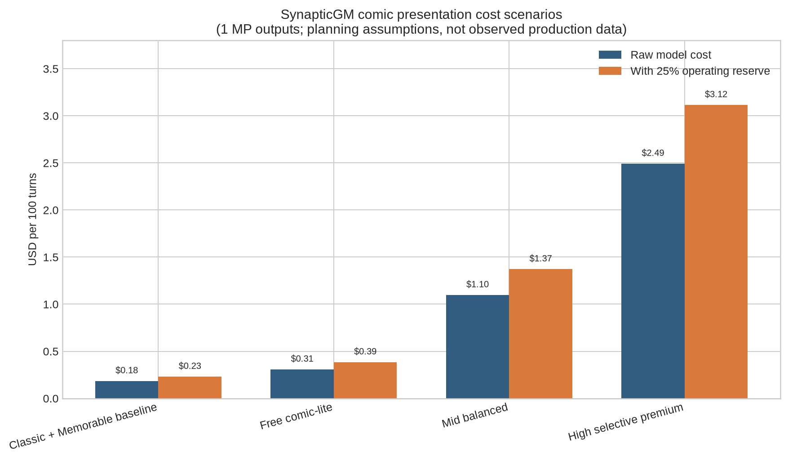

# Draft E — Cost model and tier recommendations

> This is a planning model, not observed production telemetry. It uses current public OpenRouter endpoint prices and explicit assumptions so engineering can replace each assumption with live data.

## E) Cost model — Free, Mid, and High

### E.1 Price basis and formula

The current OpenRouter endpoint records list **FLUX.2 Klein 4B at $0.014 per output megapixel** and **FLUX.2 Pro at $0.030 per output megapixel**. Both endpoints return one image per request. For a standard approximately one-megapixel panel, define:

> **Raw model COGS per turn** = eligible-turn rate × average panels per eligible turn × (1 + paid retry rate) × blended price per one-megapixel panel.

This excludes storage, egress, moderation, orchestration, taxes, support, and unexpected provider changes. Product planning should therefore apply a **25% operating reserve** until telemetry identifies a better factor. That reserve is not a vendor fee; it is a risk allowance.

For an individual eligible turn with `p` panels, model price `m`, and paid retry probability `r`:

> **Eligible-turn image COGS** = `p × m × (1 + r)`.

At a 10% paid retry rate, one Klein panel costs $0.0154 on average, two cost $0.0308, and three cost $0.0462. At a 20% retry rate, the same cases cost $0.0168, $0.0336, and $0.0504. A Pro panel at a 15% paid retry rate costs $0.0345. Every silent semantic reroll therefore matters more than minor prompt or layout compute.

### E.2 Planning scenarios

| Scenario | Eligible turns | Panels per eligible turn | Model mix | Paid retry rate | Raw cost / turn | Raw cost / 25-turn session | Raw cost / 100 turns | With 25% reserve / 100 turns |
|---|---:|---:|---|---:|---:|---:|---:|---:|
| Classic + Memorable baseline | 12% | 1.0 | 100% Klein | 10% | $0.00185 | $0.046 | $0.185 | $0.231 |
| **Free comic-lite** | 20% | 1.0 | 100% Klein | 10% | $0.00308 | $0.077 | $0.308 | $0.385 |
| **Mid balanced** | 50% | 1.4 | 100% Klein | 12% | $0.01098 | $0.274 | $1.098 | $1.372 |
| **High selective premium** | 70% | 1.8 | 80% Klein / 20% Pro | 15% | $0.02492 | $0.623 | $2.492 | $3.115 |

The Classic/Memorable scenario assumes one opener plus two rare plates in a 25-turn session, not generation on every turn. Under these assumptions, Free comic-lite costs roughly **1.67×** the raw Classic/Memorable image model baseline, Mid roughly **5.94×**, and High roughly **13.49×**. Those ratios are acceptable only if opt-in engagement and retention justify them; they are not a reason to reduce story quality or make images mandatory.

### E.3 Generation choice by beat and tier

| Choice | Use when | Tier policy | Do not use when |
|---|---|---|---|
| **One splash** | One high-salience committed beat, place reveal, character entrance, aftermath, emotional landing, or player-triggered illustration | Free default generated form; also common on Mid/High | Info-only turn, repeated look-around, same beat already illustrated, unsafe Kid framing, or no reliable focal subject |
| **Two-panel strip** | Both boundary states matter: action/reaction, approach/reveal, statement/response | Mid default for eligible paired beats; High common; Free only as scarce event reward or cached/composite pair | Action outcome is not committed, more than two required characters, or webtoon would exceed its current cap |
| **Three-panel strip/page** | Establish/action/aftermath or statement/counter/decision is already committed and visually separable | Mid experiment after P1 gates; High selective | Free included default, Kid safety uncertainty, long latency queue, crowded scenes, or weak middle panel |
| **Four/six-panel composition** | Async chapter recap using validated existing images, Memorable plates, and perhaps a small number of new jobs | P2 recap/export only | Live turn; current panel budget; every-turn webtoon; unresolved continuity |
| **Skip generation** | Thin story, pure information, inventory/settings, repeated inspection, no meaningful state change, capacity empty, kill switch, same-beat duplicate, unsafe Kid result, stale/corrected beat, or provider degradation | All tiers; render text/chrome/composite instead | Never hide or delay required story text because art skipped |

### E.4 Recommended defaults

| Tier | Recommended `panelFrequency` intent | Effective eligible-turn target | Live panel ceiling | Default model policy | Player-facing default |
|---|---|---:|---:|---|---|
| **Free** | `sparse` / **comic-lite** | 20%, measured after all skips | 1 generated panel | Klein 4B only; deterministic fallback | One illustration plus overlay on selected beats; Memorable-only chrome between them |
| **Mid** | `balanced` | 45–50% | Usually 1; validated 2; rare 3 after gate | Klein 4B; focal reference when eligible | One-panel rhythm with occasional two-panel strip |
| **High** | `rich`, not “every turn” | 65–70% | Usually 1–2; selective 3 | Klein for routine panels; Pro for hero/reveal/repair | Frequent illustrated beats with selective premium treatment |

The word “frequency” must refer to **eligible committed beats after skips**, not raw turns. A 50% Mid setting should not spend on half of inventory views or repeated look-around actions; those are removed before the probability/frequency rule.

### E.5 Capacity and caps

Capacity should be denominated in **Klein-equivalent panel units** rather than “turns.” Recommend one Klein one-megapixel request = 1 unit and one Pro one-megapixel request = 3 units. The Pro price ratio is about 2.14×, but rounding to three units creates room for premium latency, retries, and operating overhead. A failed preflight or skipped beat uses zero units. A transport retry uses the same idempotency record and consumes a second unit only if a second billable provider job actually begins.

| Tier | Session cap | Daily cap | Weekly cap | Premium use | Exhaustion behavior |
|---|---:|---:|---:|---|---|
| Free | 6 units | 8 units | 32 units | None included | Continue story with comic chrome, cached Memorable plates, or deterministic composite |
| Mid | 18 units | 24 units | 120 units | Normally Klein; Pro not default | Degrade 3→2→1 panels, then composite/chrome |
| High | 40 units | 60 units | 300 units | Selective Pro at 3 units | Degrade Pro→Klein, then panel count, then composite/chrome |

These are launch guardrails, not final entitlements. Engineering should additionally enforce a global hourly budget, per-model circuit breaker, queue-depth kill switch, and account/session abuse controls. Caps must be remotely configurable without a client release.

### E.6 Included capacity and packs

Included capacity is the default. Optional paid packs may add **illustration capacity**, not story access. A pack can fund player-triggered “illustrate this beat,” recap rendering, or extra repair attempts, but accepted text, choices, outcomes, and required clues remain available without art. Kid Mode does not show “watch ad to see the panel,” and an unsafe or skipped Kid panel cannot convert into an ad-gated retry.

The capacity receipt should show requested panel count, chosen model class, units reserved, units spent, retry state, and refund/release state. Double charging is prevented by an idempotency key spanning `gameId + turnId + beatRevision + panelIndex + attemptClass`. A late stale result can still cost the service, but it cannot attach to the turn or trigger another debit.

### E.7 Retry policy and stop-loss rules

A **transport retry** is allowed once for timeouts, 5xx responses, or malformed transport, subject to idempotency and global health. A **semantic repair** is deliberate: simplify roster, reduce camera complexity, remove a weak reference, or switch model. Free receives no automatic paid semantic loop; Mid receives at most one within cap; High may escalate one hero/reveal panel from Klein to Pro. No tier silently rerolls until a pleasing image appears.

| Metric | Warning threshold | Kill/downgrade action |
|---|---:|---|
| Billable retry rate | >12% Free/Mid or >15% High over 500 jobs | Disable semantic auto-retry; inspect provider/timeout classes |
| Wrong roster/place/major kit | >5% in sampled simple panels | Reduce panel complexity and reference count; pause strip rollout |
| P95 pending duration | >15 s for Klein live plate or >25 s for Pro hero plate, measured end-to-end | Reduce frequency; turn off Pro in live turns; use async-only |
| Stale attachment attempt | Any successful attach | Immediate incident; enforce revision guard before render |
| Double debit | Any confirmed case | Stop generation and repair accounting before resuming |
| Global image COGS per 100 turns | >25% above tier model for seven days | Tighten eligibility/frequency/caps before changing story experience |

Latency telemetry must measure the complete user path—queue, moderation, upload/reference retrieval, provider processing, storage, and tile replacement—not the model page's live benchmark alone.

### E.8 Recommendation

Ship **Free comic-lite at one generated Klein panel on roughly one in five eligible committed turns**, bounded by 6 session / 8 daily / 32 weekly units, plus zero-cost Memorable chrome and deterministic composite fallback. Mid adds validated two-panel strips and focal references. High uses Pro selectively, not universally. The economics should be managed primarily through eligibility and panel count, because those controls preserve story quality while directly reducing paid jobs.
