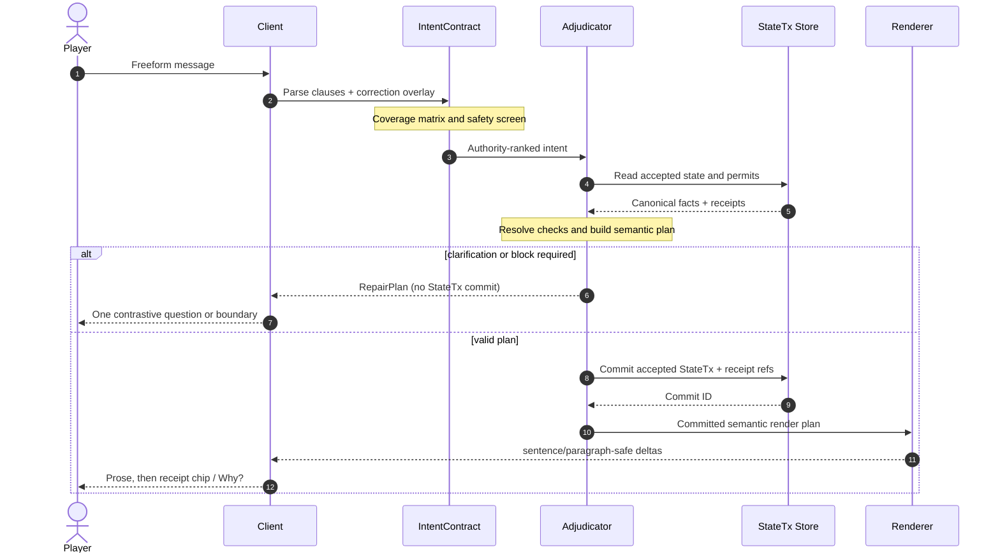

# F3 — Turn protocol specification

## Purpose and boundary

This protocol turns one player message into **one committed GM turn**. It extends the shipped `IntentContract`, `StateTx`, `SceneManifest`, `IntroductionPermit`, `CampaignContract`, `HookArc`, `beatFingerprint`, and receipt system. It does **not** propose a second memory, game, or authority engine.

> **Invariant:** Nothing is player-visible as a completed fact until it is permitted by authority-ranked inputs and represented by accepted state or an explicitly noncanonical narrative observation.

## 1. Input classes

A message can hold several classes simultaneously. Classification is an aid to obligation coverage; it never collapses the original text.

| Class | Detect | Required disposition | Example handling |
|---|---|---|---|
| `action` | Attempt to do/change something | adjudicate, clarify, or block | “I vault the rail and grab the bell.” |
| `speech` | In-world addressed language | render reply / record material promise | “Tell her I know about the tunnel.” |
| `question` | Fact, rule, motive, or affordance ask | answer, qualify, or say unknown | “Does the guard know me?” |
| `correction` | Player revises interpretation/canon | apply correction first | “No, the key is brass, not silver.” |
| `protest` | Player disputes fairness/reading | paraphrase and confirm or show receipt | “That wasn’t what I meant.” |
| `meta_safety` | Intensity, boundaries, Kid Mode, OOC request | apply safety contract and explain boundary | “Make this less intense.” |
| `joke_or_banter` | Nonliteral/social play | acknowledge as social act without literalizing | “My plan is to bribe the moon.” |
| `compound` | ≥2 independently material clauses | make a coverage matrix | “I ask why he lied, hide the map, and leave.” |

## 2. IntentContract and coverage matrix

The interpreter returns a clause-preserving contract. Every material clause must receive one of four visible or internally auditable dispositions: `addressed`, `clarified`, `deferred`, or `blocked`.

| Obligation type | Must do | Can defer only when | Player-visible evidence |
|---|---|---|---|
| Direct question | Answer first or state uncertainty | Answer requires pending adjudication | Answer sentence, `Why?`, or single clarification |
| Action attempt | Validate permits, resolve dice if needed, narrate consequence | Compound action must sequence | Consequence plus receipt when material |
| Correction | Update correction layer before all other interpretation | Never; correction has priority | Natural acknowledgement or corrected fact chip |
| Protest | Show interpretation / decisive rule / correction route | If the player asks to continue before review | “I read that as X; did you mean Y?” |
| Safety request | Adjust boundary before scene continuation | Never | Plain boundary confirmation, especially in Kid Mode |
| Joke / social styling | Preserve nonliteral intent unless player marks action | Can remain ephemeral | NPC reaction; no unwanted StateTx |
| Unsupported request | Offer in-world boundary / legal alternative | Only if one immediate path remains | “That bridge is gone; the ford is still open.” |

### Canonical obligation object

```ts
export type Disposition = 'addressed' | 'clarified' | 'deferred' | 'blocked';
export type InputClass =
  | 'action' | 'speech' | 'question' | 'correction' | 'protest'
  | 'meta_safety' | 'joke_or_banter' | 'compound';

export interface Obligation {
  id: string;
  sourceSpan: { start: number; end: number; text: string };
  class: InputClass;
  material: boolean;
  intent: string;
  target?: string;
  requestedFact?: string;
  disposition?: Disposition;
  reason?: string;
  dependsOn: string[];
}

export interface IntentContract {
  turnId: string;
  rawPlayerText: string;
  obligations: Obligation[];
  correctionOverlay: CanonCorrection[];
  playerMode: 'standard' | 'kid';
  coverageRequired: string[];
}
```

## 3. Adjudication before prose

The adjudicator consumes the contract in this order: corrections; pinned canon/opening invariants; already accepted `StateTx`; current `SceneManifest`; admissible supporting evidence; bounded draft invention. It produces a **semantic render plan** with only permitted facts, resolved checks, exact deltas, and acknowledged unresolved points. Voice receives this plan as read-only input.

| Condition | Result | Receipt policy |
|---|---|---|
| No consequential state change | Narrative observation only | Silent |
| Low-salience, reversible state change | Accepted `StateTx` | Chip available |
| Material consequence: harm, kit, roster, quest, relationship, clock, location | Accepted `StateTx` plus evidence | Chip default; expandable `Why?` |
| Pending ambiguity | No commit | Contrastive clarification |
| Safety boundary | Safety contract change, no world fact unless explicitly agreed | Plain confirmation |
| Contradiction with accepted state | No silent overwrite | Correction path + provenance |

## 4. Render-plan templates

| Engine | Default render order | Length band | Chrome |
|---|---|---|---|
| LitRPG | answer/impact → embodied scene → consequence → System notice after prose → playable pressure | 120–260 words; 60–110 for simple ack | System is diegetic, not the body of the turn |
| Story RPG | answer/impact → sensory anchor → character response → pressure | 110–240 words | Receipts silent or `Why?` |
| Tabletop | ruling/answer → concise fiction → options/stakes | 70–180 words | Check/die receipt when used |
| PYOA | consequence → authored texture → 1–3 honest lenses + freeform opening | 90–190 words | Choice lenses never hide freeform |
| Repair / safety | direct answer → one contrast → preserved scene position | 20–70 words | No prose flourish needed |

A render plan must contain **one primary beat change** by default: advance, resistance, reveal, reversal, cost, or release. It may contain multiple changes only when the player supplied material compound intent, a check cascades legitimately, or the scene is a declared set-piece.

## 5. Receipt policy

| Receipt mode | Use when | Placement | Example |
|---|---|---|---|
| `silent` | No material state changed or prose fully explains it | None | The innkeeper’s suspicion is only inferred, not committed. |
| `chip` | A player-beneficial or understandable material update occurs | Immediately below prose | `Trust +1 · Because you returned the seal` |
| `expanded_why` | A player disputes, asks why, or impact is non-obvious | Collapsible detail | `Why? Guard heard the bell; SceneManifest §threat` |
| `combat` | A roll, damage, resource, or condition changes | Combat receipt strip | `Check 14 vs 12 · 2 strain · cover gained` |

## 6. Streaming and cancellation

`StateTx` acceptance and semantic-plan validation happen **before** any text is eligible for stream. The renderer may stream after a server-generated `turn.committed` event. Client rendering groups deltas into sentence-safe or paragraph-safe chunks; it does not show raw token fragments.

| Lifecycle | Client language | State rule |
|---|---|---|
| `submitted` | “Your move is held.” | Original bubble persists; no mutation |
| `interpreting` | “Reading your move…” | No invented progress story |
| `adjudicating` | “Resolving the scene…” | Pending only |
| `committed` | no status needed; prose begins | Accepted StateTx immutable for this version |
| `streaming` | caret / subtle indicator | Only committed render plan can appear |
| `cancel_requested` | “Stopping this draft…” | Do not accept uncommitted draft changes |
| `aborted` | “That turn didn’t land. Your move is still here.” | Preserve bubble and original contract |
| `failed` | “The scene paused before it committed.” | No hidden state; offer retry / report / simplify |

**Closed-beta default:** stream only after `turn.committed`, buffer until a sentence boundary, and permit cancellation until the first visible committed sentence. After visible prose starts, cancellation stops remaining display but preserves the committed turn as a resumable draft, never a half-hidden alternate world. This is a **SPECULATIVE TRANSFER** motivated by typed streaming lifecycles and the documented difficulty of moderating partial output. [R05]

## 7. Failure paths and player copy

| Failure | Detection | Player-facing copy | Recovery |
|---|---|---|---|
| Timeout before commit | adjudication budget exceeded | “I haven’t settled that scene yet. Your move is saved.” | Retry; simplify; cancel |
| Empty render | valid plan but zero body | “The scene held its breath. Try that again, or say what you want emphasized.” | Regenerate body from same plan |
| Partial obligation | coverage audit misses a material clause | “I answered part of that, not all of it. I still owe: **[clause]**.” | Continue with owed clause; no state reset |
| Contradiction | proposed fact conflicts with authority | “I have **[fact]** pinned from earlier. Want to correct it, treat this as rumor, or keep it?” | Local correction route |
| Unsupported action | no permit/affordance | “That exact move isn’t open here—the gate is barred—but the loose grate is.” | In-world alternative, never menu coercion |
| Kid block | violates stricter interaction contract | “I can’t take the scene that way. We can keep it safer, fade out, or change course.” | Safe rewrites; no pressure |

## 8. Sequence diagram



The standalone source is [turn_pipeline.mermaid](turn_pipeline.mermaid).

## 9. TypeScript-ish interfaces

```ts
export interface SemanticRenderPlan {
  turnId: string;
  authorityTrace: AuthorityRef[];
  obligationCoverage: Record<string, Disposition>;
  answerFirst?: string;
  beat: {
    beforePressure: string;
    change: 'advance' | 'resistance' | 'reveal' | 'reversal' | 'cost' | 'release';
    afterPressure: string;
  };
  npcActs: Array<{ npcId: string; permittedKnowledge: string[]; speechAct: string }>;
  stateTransactions: StateTxRef[];
  receiptMode: 'silent' | 'chip' | 'expanded_why' | 'combat';
  engine: 'litrpg' | 'story_rpg' | 'tabletop' | 'pyoa';
  constraints: { playerAgency: true; noSoftOfferMidAction: true; kidMode: boolean };
}

export interface CommittedTurn {
  turnId: string;
  planHash: string;
  stateTxIds: string[];
  bodyVersion: number;
  status: 'committed' | 'streaming' | 'complete' | 'display_aborted';
}

export function assertCoverage(c: IntentContract, p: SemanticRenderPlan): void {
  for (const obligation of c.obligations.filter(o => o.material)) {
    if (!p.obligationCoverage[obligation.id]) throw new Error(`uncovered:${obligation.id}`);
  }
}
```

## References

The evidence supporting relevance, repair, context, stateful interactive flow, and streaming lifecycle is in [citations.md](citations.md). [R01] [R04] [R05] [R08] [R09] [R13] [R18]
