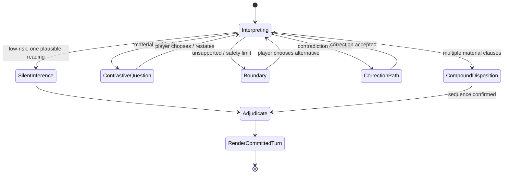

# F6 — Repair and clarification UX

## State machine

## When to infer silently

Silent inference is acceptable when the action is low impact, context makes one reading overwhelming, and a mistaken reading can be repaired without state loss. Example: “I open it” immediately after the player has named one unopened letter. Silent inference is **not** acceptable for target choice, violence, consent, expenditure, travel, an irreversible rule, a safety boundary, a contradiction, or a message containing two plausible material actions.

## When not to ask

Do not ask a clarification merely because the parser can name a small uncertainty. If the scene permits a fair, reversible reading, move forward and let the consequence prove it. Do not use a question to offload routine adjudication. Do not ask a player to translate their natural language into commands. Do not say “I hear you” as a ritual before a contrast; show the specific hinge instead.

## Player-facing policy

One repair turn asks **one contrastive question**. It preserves the player’s original bubble, names only the decision that changes outcome, and offers a local path: correct fact, choose target, reorder clauses, accept an in-world boundary, or fade/redirect. A repair never silently consumes a resource, starts a combat, changes a relationship, or erases the player’s original text.

The downloadable bank [F6_repair_copy_bank.csv](F6_repair_copy_bank.csv) contains 144 engine × personality × situation entries. It is intentionally concise and designed for variation, not a repetitive ritual.

## References

Public conversation and repair sources emphasize context, concise recovery, and shared understanding. The state machine and copy are **SPECULATIVE SynapticGM design**. [R01] [R13] [R14] [R16] [R18]
