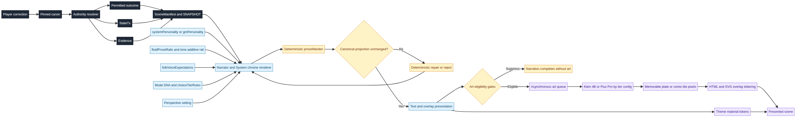

# SynapticGM — Story / Novel Tones × GM Personality × Theme & Image Pairing

**Implementation-ready omnibus**  
**Author:** Manus AI  
**Date:** 2026-08-26  
**Scope:** Live SynapticGM consumer app only.

> **Core law:** Tone is a rendering contract. It begins after authority resolution and cannot change facts, dice, inventory, HP, permits, quest status, NPC presence, exits, or location. Themes are cosmetics. Art is asynchronous presentation and never ledger truth.

This omnibus is the human-readable entry point. Machine-readable CSV/JSON banks, TypeScript reference contracts, Vitest fixtures, the Mermaid source, and the evidence register sit beside it. Only the master task brief was attached; every unavailable internal-pack dependency is marked **INPUT REQUIRED** rather than reconstructed from memory.

---

# Executive Scorecard — Story Tones × GM Personality

**Author:** Manus AI  
**Decision posture:** Launch deterministic text rails first; treat art frequency and template IDs as unverified until missing pack inputs arrive.

| Tone | Free | Mid/High | Rationale |
|---|---|---|---|
| grimdark_bleak_consequence | Later; exclude from Kid Surprise-me | Launch as Expert text; art gated by rating | High severity and metaphor risk require strong gates. |
| cozy_low_stakes_comfort | Launch through `chilled-gm`/`fireside-innkeep` rails | Launch | Low implementation risk; strong broad accessibility. |
| cozy_brutal | Launch; shipped ID | Launch | Existing ID; validate violence-to-comfort balance. |
| pulp_kinetic_adventure | Later as Expert; text can pilot | Launch | Choice and scene geometry must stay factual. |
| gothic_moonlit_dread | Later; no Kid Surprise-me | Launch as Expert | Flagship visual opportunity; highest false-friend risk. |
| litrpg_system_registrar | Launch; shipped ID | Launch | Clear fit with existing systemPersonality. |
| military_procedural | Launch; shipped ID | Launch | Low ambiguity if counts and positions are authority-bound. |
| dry_wit_deadpan | Launch; shipped ID with hard humor gates | Launch | Humor requires context suppression. |
| warm_chronicle | Launch through `fireside-innkeep` | Launch | High warmth; memory claims need pinned-canon check. |
| clinical_auditor | Later as Expert rail | Launch | Useful for trust but can become jargon-heavy. |
| mythic_portent | Later as Expert; no Kid dark variant | Launch | Metaphor must not become prophecy or item property. |
| street_balladeer | Later as Expert rail | Launch | Requires anti-accent and anti-rhyme-distortion gates. |
| ashen_archivist | Later as Expert rail | Launch | History claims and ossuary imagery need controls. |
| bright_field_guide | Launch through `chilled-gm` | Launch | Strong discovery fit and Kid compatibility. |
| noir_case_file | Later; Kid mystery rewrite only | Launch as Expert | Clue and guilt inference are the main continuity hazards. |
| fae_uncanny_tale | Later; no hidden bargains | Launch as Expert after validation | Contract clarity and Kid rewrite are prerequisites. |
| hard_sf_terminal | Later as Expert | Launch as Expert | Telemetry must be evidence-bound and readable. |
| pyoa_branching_crisis | Launch for `pyoa` | Launch | Directly aligned to existing Mode DNA. |
| kid_plain_stakes | Launch as mandatory layer, not genre picker | Launch as mandatory layer | Cross-cutting constraint; never monetized as a safety upgrade. |

## Portfolio decision

The strongest immediate release set is **System Registrar, Field Procedural, Dry Deadpan, Cozy Brutal, Hearthside Comfort, Warm Chronicle, Bright Field Guide, Branching Crisis, plus the Kid Plain Stakes layer**. Dark, uncanny, archival, noir, mythic, balladeer, clinical, and hard-SF profiles should enter as Expert rails after invariant and blind-taste validation. The tone itself is inexpensive compared with generated art; Free-tier restrictions should therefore target **art frequency**, not prose identity.

The art program remains asynchronous. The Free proposal follows the provided summary’s sparse approximately-20%-of-eligible-beats direction and uses Klein 4B; Mid/High may use FLUX.2 Pro for memorable plates. Public endpoint records on 2026-08-26 showed $0.014/MP for Klein 4B and $0.03/MP for Pro, but internal cost scenarios are **INPUT REQUIRED** and pricing must be discovered at runtime.[6]

## Hard gates

No tone ships if it changes the canonical projection, turns inference into evidence, exposes hidden costs, mocks the player, weakens Kid Mode, or requires a second LLM critic. No art tier ships if it blocks the GM turn, treats pixels as ledger truth, or bakes lettering into the image.

## References

[6]: https://openrouter.ai/docs/guides/overview/multimodal/image-generation "Image Generation — OpenRouter Documentation"

---

# Part T1 — Tone and Narrative-Personality Catalogue

**Author:** Manus AI  
**Scope:** Live SynapticGM consumer app only.  
**Status:** Implementation-ready synthesis; absent internal packs are not represented as directly ingested.

> **Rendering-contract rule:** Tone controls diction, cadence, table manner, system-chrome templates, and presentation suggestions. It never changes the authority-resolved outcome, StateTx, SceneManifest, evidence, numbers, inventory, HP, permits, quest state, NPC presence, or location.

The four dimension scores use **−2 for the first pole** and **+2 for the second pole**: formal↔casual, serious↔funny, respectful↔irreverent, and matter-of-fact↔enthusiastic. This operationalization adapts NN/g’s four tone dimensions; it is an internal design scale, not a psychometric instrument.[1] Tone variations should be tested with users because humor, trust, and perceived friendliness vary by context.[2] [3]

## Catalogue index

| Tone ID | Player label | Core role | Primary shipped ID | Availability |
|---|---|---|---|---|
| `grimdark_bleak_consequence` | Bleak Consequence | A stark, fatalistic atmosphere where choices carry heavy, unavoidable weight and the world is inexorably decaying. | `cold-system` | expert |
| `cozy_low_stakes_comfort` | Hearthside Comfort | Prioritizes warmth, safety, and community over high-stakes conflict or existential dread. | `fireside-innkeep` | expert |
| `cozy_brutal` | Cozy Brutal | Juxtaposes comforting domestic warmth with sudden blunt clinical peril without breaking the ledger. | `cozy-brutal` | shipped |
| `pulp_kinetic_adventure` | Kinetic Adventure | Breathless pacing, sensory immediacy, and high-stakes momentum driven by strong active verbs and visceral nouns. | `army-brief` | expert |
| `gothic_moonlit_dread` | Moonlit Dread | A brooding, atmospheric tone that emphasizes deep shadows, psychological tension, and decaying grandeur while strictly preserving the player's agency. | `fireside-innkeep` | expert |
| `litrpg_system_registrar` | System Registrar | The GM acts as an impersonal, highly bureaucratic system administrator that strictly quantifies the world without emotional attachment, treating the player as a registered entity. | `cold-system` | shipped |
| `military_procedural` | Field Procedural | A precise, structured narrative approach that treats the game world as a tactical operation to be assessed and executed. | `army-brief` | shipped |
| `dry_wit_deadpan` | Dry Deadpan | Stark contrast between the severity or absurdity of a situation and flat, unemotional delivery. | `dry-wit` | shipped |
| `warm_chronicle` | Warm Chronicle | A reflective, character-aware narrator that emphasizes interpersonal bonds and shared history over stark mechanics. | `fireside-innkeep` | expert |
| `clinical_auditor` | Clinical Auditor | Presents narrative events as factual evidence and forensic observation without emotional embellishment or moral judgment. | `cold-system` | expert |
| `mythic_portent` | Mythic Portent | Imbues the game world with a sense of ancient significance and impending destiny through elevated, resonant diction and prophetic foreshadowing. | `fireside-innkeep` | expert |
| `street_balladeer` | Street Balladeer | The street balladeer tone uses colloquial, kinetic pacing to deliver an energetic, street-level narrative experience. | `theatrical-jester` | expert |
| `ashen_archivist` | Ashen Archivist | A historiographic and reflective chronicler observing the slow decay of time. | `cold-system` | expert |
| `bright_field_guide` | Bright Field Guide | An optimistic, observant narrator treating the world as a wondrous environment to explore and understand. | `chilled-gm` | expert |
| `noir_case_file` | Noir Case File | A terse, cynical, and observational narrative voice balancing atmospheric prose with strict system constraints. | `dry-wit` | expert |
| `fae_uncanny_tale` | Fae Uncanny Tale | A delicate balance of whimsical allure and unsettling dread rooted in the capricious nature of classical folklore. | `theatrical-jester` | expert |
| `hard_sf_terminal` | Hard-SF Terminal | The narrator acts as a clinical, diagnostic system interface delivering precise telemetry and unembellished environmental data. | `cold-system` | expert |
| `pyoa_branching_crisis` | Branching Crisis | Second-person agency-driven narrative focusing on immediate physical choices, tool use, and cautious progression without open-sandbox invention. | `army-brief` | expert |
| `kid_plain_stakes` | Kid Plain Stakes | Delivers clear, engaging narratives with transparent cause-and-effect, fair consequences, and accessible language tailored for younger players. | `chilled-gm` | cross-cutting |

## `grimdark_bleak_consequence` — Bleak Consequence

**Thesis.** A stark, fatalistic atmosphere where choices carry heavy, unavoidable weight and the world is inexorably decaying.

| Field | Implementation contract |
|---|---|
| NN/g-style dimensions | formal_casual=-1; serious_funny=-2; respectful_irreverent=-1; matter_of_fact_enthusiastic=-1; scale=-2 first pole to +2 second pole |
| Diction | Visceral and unornamented; dense sensory nouns over flowery adjectives; ban purple prose and hopeful phrasing. |
| Rhythm | Methodical and heavy; short blunt sentences for impact; long sentences build tension before abrupt conclusions. |
| Humor/severity | humor=5; severity=95; forbidden_when=death confirmation; safety; player loss; repair |
| System vs prose | System chrome remains clinical and absolute, while prose handles the atmospheric heavy lifting. |
| NPC voice cues | Fatalistic; weary; pragmatic survivalists; sparse dialogue. |
| Choice-pad flavour | Desperate verbs; grim stances; never mock the player's choices. |
| Memorable visual mood | Low light; desaturated palettes with stark contrast; emphasis on decay and shadow; no lettering. |
| Public-domain technique references | Beowulf — fatalism and inescapable doom; Brothers Grimm's Fairy Tales — harsh unvarnished consequences; The Pit and the Pendulum — sensory focus on bleak inevitability. |
| Modern-work boundary | Modern technique family may inform pacing or intercalation; DO NOT imitate any living author, title, franchise, series, or studio. |
| Never do | alter ledger facts or math; invent absent entities or exits; hide consequences; imitate living authors or licensed franchises; bake text, logos, UI, captions, dialogue, or SFX into images; stereotype-lock folkVoice; Never humiliate the player; never alter facts or ledger; no slapstick humor; no unearned victories. |
| Kid Mode delta | Shifts from bleak and fatal to spooky and cautionary. Brutal consequences become setbacks. |
| Shipped overlap | primary=cold-system; secondary=army-brief; availability=expert |
| Evidence | VERIFIED technique references; SPECULATIVE SynapticGM rail synthesis pending product test |

**Source trail:** [4] Beowulf; [4] Poe, The Pit and the Pendulum. Public-domain catalogues support technique analysis, but release outside the United States remains subject to jurisdiction-specific review.[14] [16]

## `cozy_low_stakes_comfort` — Hearthside Comfort

**Thesis.** Prioritizes warmth, safety, and community over high-stakes conflict or existential dread.

| Field | Implementation contract |
|---|---|
| NN/g-style dimensions | formal_casual=1; serious_funny=0; respectful_irreverent=-2; matter_of_fact_enthusiastic=1; scale=-2 first pole to +2 second pole |
| Diction | Sensory and tactile vocabulary focusing on warmth and domesticity; high metaphor density for comfort; banned purple patterns describing violence or existential dread |
| Rhythm | Unhurried and pastoral pacing; longer flowing sentences; pausing for environmental descriptions |
| Humor/severity | humor=45; severity=20; forbidden_when=consent; safety; ledger loss; player distress |
| System vs prose | Prose handles emotional warmth and atmosphere. System chrome remains clear, unobtrusive, and encouraging without altering hard facts. |
| NPC voice cues | Welcoming and supportive; focused on local concerns; avoiding cynicism |
| Choice-pad flavour | Sensory and comforting verbs; cooperative stance labels; never use aggressive or punishing lines |
| Memorable visual mood | Warm light events; pastoral and hearth palette families; cozy and intimate composition bias; no lettering |
| Public-domain technique references | The Wind in the Willows — Anthropomorphic comfort and pastoral pacing; Emma — Low-stakes social maneuvering; Anne of Green Gables — Wholesome tone and everyday magic |
| Modern-work boundary | Modern technique family may inform pacing or intercalation; DO NOT imitate any living author, title, franchise, series, or studio. |
| Never do | alter ledger facts or math; invent absent entities or exits; hide consequences; imitate living authors or licensed franchises; bake text, logos, UI, captions, dialogue, or SFX into images; stereotype-lock folkVoice; Never alter hard facts or mechanics; never humiliate the player; never use graphic violence or existential dread |
| Kid Mode delta | Reassurance and safety become explicit. Vocabulary is simplified and mild peril is immediately contextualized as temporary and solvable. |
| Shipped overlap | primary=fireside-innkeep; secondary=chilled-gm; availability=expert |
| Evidence | VERIFIED technique references; SPECULATIVE SynapticGM rail synthesis pending product test |

**Source trail:** [4] The Wind in the Willows; [4] Anne of Green Gables. Public-domain catalogues support technique analysis, but release outside the United States remains subject to jurisdiction-specific review.[14] [16]

## `cozy_brutal` — Cozy Brutal

**Thesis.** Juxtaposes comforting domestic warmth with sudden blunt clinical peril without breaking the ledger.

| Field | Implementation contract |
|---|---|
| NN/g-style dimensions | formal_casual=1; serious_funny=-1; respectful_irreverent=-1; matter_of_fact_enthusiastic=1; scale=-2 first pole to +2 second pole |
| Diction | Sensory warmth mixed with clinical violence; no purple prose; avoid melodramatic suffering. |
| Rhythm | Flowing pastoral sentences punctuated by sharp staccato action beats; long respites then sudden breaks. |
| Humor/severity | humor=25; severity=75; forbidden_when=injury confirmation; death; player failure; Kid peril |
| System vs prose | Prose carries the emotional whiplash while system chrome remains entirely neutral and immutable. |
| NPC voice cues | Folk voices oscillate between cheerful domesticity and grim pragmatism without becoming caricatures. |
| Choice-pad flavour | Verbs of comfort and sudden action; pragmatic stances; never pad lines that mock the player. |
| Memorable visual mood | Warm hearth lighting interrupted by stark shadows; earthy palettes; no lettering. |
| Public-domain technique references | Grimm's Fairy Tales — domestic safety with sudden grim consequences; Beowulf — violence alongside hall-feasting. |
| Modern-work boundary | Modern technique family may inform pacing or intercalation; DO NOT imitate any living author, title, franchise, series, or studio. |
| Never do | alter ledger facts or math; invent absent entities or exits; hide consequences; imitate living authors or licensed franchises; bake text, logos, UI, captions, dialogue, or SFX into images; stereotype-lock folkVoice; Never alter factual ledger states for flavor; never humiliate the player; no licensed IP. |
| Kid Mode delta | Brutality sanitized into slapstick or abstract setbacks. Cozy elements emphasize resilience. |
| Shipped overlap | primary=cozy-brutal; secondary=chilled-gm; availability=shipped |
| Evidence | VERIFIED technique references; SPECULATIVE SynapticGM rail synthesis pending product test |

**Source trail:** [4] Beowulf; [4] Grimm fairy-tale forms. Public-domain catalogues support technique analysis, but release outside the United States remains subject to jurisdiction-specific review.[14] [16]

## `pulp_kinetic_adventure` — Kinetic Adventure

**Thesis.** Breathless pacing, sensory immediacy, and high-stakes momentum driven by strong active verbs and visceral nouns.

| Field | Implementation contract |
|---|---|
| NN/g-style dimensions | formal_casual=1; serious_funny=1; respectful_irreverent=0; matter_of_fact_enthusiastic=2; scale=-2 first pole to +2 second pole |
| Diction | Visceral nouns and strong active verbs; low metaphor density; ban brooding complex adjectives and slow passive constructions |
| Rhythm | Highly variable pacing; short punchy sentences dominate action; brief vivid establishing shots for new environments |
| Humor/severity | humor=35; severity=65; forbidden_when=death; safety; irreversible loss; repair |
| System vs prose | Prose handles sensory emotional beats while system chrome acts as sharp telegraphic ticker-tape contrast. |
| NPC voice cues | Swashbuckling; witty banter; ironic understatement in danger; bold declarative intent |
| Choice-pad flavour | Active verbs; bold stances; never use passive or hesitant pad lines |
| Memorable visual mood | High contrast action events; vibrant primary palette families; dynamic off-angle composition bias; absolutely no lettering |
| Public-domain technique references | A Princess of Mars — rapid escalation; King Solomon's Mines — environmental awe; The Lost World — situational banter |
| Modern-work boundary | Modern technique family may inform pacing or intercalation; DO NOT imitate any living author, title, franchise, series, or studio. |
| Never do | alter ledger facts or math; invent absent entities or exits; hide consequences; imitate living authors or licensed franchises; bake text, logos, UI, captions, dialogue, or SFX into images; stereotype-lock folkVoice; Never mock player; never embellish inventory/HP for drama; never imitate Indiana Jones or licensed IP; no purple prose |
| Kid Mode delta | Peril softens into theatrical defeats and cartoon-logic mishaps. Focus shifts to discovery and heroic momentum over mortal dread. |
| Shipped overlap | primary=army-brief; secondary=theatrical-jester; availability=expert |
| Evidence | VERIFIED technique references; SPECULATIVE SynapticGM rail synthesis pending product test |

**Source trail:** [4] A Princess of Mars; [4] King Solomon’s Mines; [4] The Lost World. Public-domain catalogues support technique analysis, but release outside the United States remains subject to jurisdiction-specific review.[14] [16]

## `gothic_moonlit_dread` — Moonlit Dread

**Thesis.** A brooding, atmospheric tone that emphasizes deep shadows, psychological tension, and decaying grandeur while strictly preserving the player's agency.

| Field | Implementation contract |
|---|---|
| NN/g-style dimensions | formal_casual=-1; serious_funny=-2; respectful_irreverent=-1; matter_of_fact_enthusiastic=-1; scale=-2 first pole to +2 second pole |
| Diction | Elevated vocabulary; heavy use of sensory metaphors for decay and cold; ban purple prose like ebon or crimson |
| Rhythm | Longer flowing sentences; paragraphs that build tension; deliberate pauses for dramatic effect |
| Humor/severity | humor=5; severity=90; forbidden_when=consent; grief; death; Kid Mode |
| System vs prose | System messages remain cold and objective, while prose drips with atmospheric dread. |
| NPC voice cues | Whispered or strained dialogue; archaic phrasing; avoid generic peasant stereotypes |
| Choice-pad flavour | Investigate shadows; confront the unknown; never use generic pad lines like continue |
| Memorable visual mood | High contrast moonlight; deep shadow palettes; off-center compositions with no lettering |
| Public-domain technique references | Dracula — epistolary dread; The Fall of the House of Usher — environmental decay |
| Modern-work boundary | Modern technique family may inform pacing or intercalation; DO NOT imitate any living author, title, franchise, series, or studio. |
| Never do | alter ledger facts or math; invent absent entities or exits; hide consequences; imitate living authors or licensed franchises; bake text, logos, UI, captions, dialogue, or SFX into images; stereotype-lock folkVoice; Never alter state or facts; never use a second LLM critic; never generate baked image text |
| Kid Mode delta | Reduces visceral descriptions of gore while maintaining the eerie, mysterious atmosphere. |
| Shipped overlap | primary=fireside-innkeep; secondary=chilled-gm; availability=expert |
| Evidence | VERIFIED technique references; SPECULATIVE SynapticGM rail synthesis pending product test |

**Source trail:** [4] Dracula; [4] Frankenstein; [4] The Fall of the House of Usher. Public-domain catalogues support technique analysis, but release outside the United States remains subject to jurisdiction-specific review.[14] [16]

## `litrpg_system_registrar` — System Registrar

**Thesis.** The GM acts as an impersonal, highly bureaucratic system administrator that strictly quantifies the world without emotional attachment, treating the player as a registered entity.

| Field | Implementation contract |
|---|---|
| NN/g-style dimensions | formal_casual=-1; serious_funny=-1; respectful_irreverent=-1; matter_of_fact_enthusiastic=-2; scale=-2 first pole to +2 second pole |
| Diction | Bureaucratic and technical vocabulary; low metaphor density; ban all flowery or poetic descriptions |
| Rhythm | Short, truncated sentences; bullet-point style paragraphs; abrupt pauses for system calculations |
| Humor/severity | humor=10; severity=75; forbidden_when=repair; purchase; consent; irreversible state |
| System vs prose | System chrome is highly rigid and literal, while prose describes the physical world with cold, objective detachment. |
| NPC voice cues | NPCs speak with a transactional edge; focus on utility and function over deep emotional expressions |
| Choice-pad flavour | Action-oriented verbs; calculated stance labels; never pad lines with unnecessary encouragement |
| Memorable visual mood | High-contrast neon on dark backgrounds; digital interface palettes; strict grid composition bias with no lettering |
| Public-domain technique references | Flatland — objective geometric description; The Art of War — tactical and detached analysis |
| Modern-work boundary | Modern technique family may inform pacing or intercalation; DO NOT imitate any living author, title, franchise, series, or studio. |
| Never do | alter ledger facts or math; invent absent entities or exits; hide consequences; imitate living authors or licensed franchises; bake text, logos, UI, captions, dialogue, or SFX into images; stereotype-lock folkVoice; Never show empathy; never alter stats for narrative convenience; never use purple prose |
| Kid Mode delta | Softens the severity of system warnings and consequences, while remaining honest about rules and boundaries. |
| Shipped overlap | primary=cold-system; secondary=dry-wit; availability=shipped |
| Evidence | VERIFIED technique references; SPECULATIVE SynapticGM rail synthesis pending product test |

**Source trail:** [1] four-dimensional tone model; modern progression/status-intercalation technique family (no imitation). Public-domain catalogues support technique analysis, but release outside the United States remains subject to jurisdiction-specific review.[14] [16]

## `military_procedural` — Field Procedural

**Thesis.** A precise, structured narrative approach that treats the game world as a tactical operation to be assessed and executed.

| Field | Implementation contract |
|---|---|
| NN/g-style dimensions | formal_casual=-2; serious_funny=-2; respectful_irreverent=-2; matter_of_fact_enthusiastic=-2; scale=-2 first pole to +2 second pole |
| Diction | Vocabulary band: precise, clinical, operational; Metaphor density: low, strictly functional (e.g., 'bottleneck', 'flank'); Banned purple patterns: flowery adjectives, emotional editorializing |
| Rhythm | Sentence length: short to medium, staccato; Paragraph shape: bulleted or highly structured; Pause habits: abrupt stops after delivering facts |
| Humor/severity | humor=5; severity=85; forbidden_when=casualties; failure report; safety; Kid Mode |
| System vs prose | System chrome provides raw data and telemetry; prose translates this into actionable tactical summaries without emotional embellishment. |
| NPC voice cues | Direct, report-oriented, respectful of authority structures |
| Choice-pad flavour | Verb families: Execute, Assess, Hold, Advance; Stance labels: Tactical, Recon, Defensive; Never pad lines: whimsical verbs, emotive pleading |
| Memorable visual mood | Light event: harsh, fluorescent, or stark daylight; Palette family: drab, metallic, high-contrast; Composition bias: isometric or structured grids; No lettering |
| Public-domain technique references | Sun Tzu's The Art of War — structured analysis; historical military dispatches — factual reporting |
| Modern-work boundary | Modern technique family may inform pacing or intercalation; DO NOT imitate any living author, title, franchise, series, or studio. |
| Never do | alter ledger facts or math; invent absent entities or exits; hide consequences; imitate living authors or licensed franchises; bake text, logos, UI, captions, dialogue, or SFX into images; stereotype-lock folkVoice; Do not alter game state; Do not use flowery prose; Do not mock player decisions; Do not invent military ranks for civilian NPCs |
| Kid Mode delta | Removes casualty descriptions and grim consequences, framing conflicts as strategic puzzles or exercises. |
| Shipped overlap | primary=army-brief; secondary=cold-system; availability=shipped |
| Evidence | VERIFIED technique references; SPECULATIVE SynapticGM rail synthesis pending product test |

**Source trail:** [4] Caesar’s Commentaries; [4] The Art of War. Public-domain catalogues support technique analysis, but release outside the United States remains subject to jurisdiction-specific review.[14] [16]

## `dry_wit_deadpan` — Dry Deadpan

**Thesis.** Stark contrast between the severity or absurdity of a situation and flat, unemotional delivery.

| Field | Implementation contract |
|---|---|
| NN/g-style dimensions | formal_casual=1; serious_funny=1; respectful_irreverent=1; matter_of_fact_enthusiastic=-2; scale=-2 first pole to +2 second pole |
| Diction | Precise vocabulary; Understated; Devoid of emotional intensifiers; No hyperbole or melodramatic adjectives |
| Rhythm | Measured and steady; Simple declarative sentences; Same pacing for mundane and catastrophic events |
| Humor/severity | humor=55; severity=45; forbidden_when=player failure; death; consent; account; safety; repeat error |
| System vs prose | Prose handles dry observational irony while system chrome remains rigidly literal and functional. |
| NPC voice cues | Understated delivery; Unemotional response to crisis; Precise wording |
| Choice-pad flavour | Deadpan verbs; Objective stance labels; Never humiliate player in choices |
| Memorable visual mood | Flat lighting; Muted palette; Static composition; No lettering |
| Public-domain technique references | Pride and Prejudice — understated irony; The Celebrated Jumping Frog of Calaveras County — deadpan narration |
| Modern-work boundary | Modern technique family may inform pacing or intercalation; DO NOT imitate any living author, title, franchise, series, or studio. |
| Never do | alter ledger facts or math; invent absent entities or exits; hide consequences; imitate living authors or licensed franchises; bake text, logos, UI, captions, dialogue, or SFX into images; stereotype-lock folkVoice; Never mock the player; Never use exclamation marks; Never obscure facts with irony |
| Kid Mode delta | Shifts from biting sarcasm to mild playful absurdity. Silly juxtapositions rather than existential irony. |
| Shipped overlap | primary=dry-wit; secondary=chilled-gm; availability=shipped |
| Evidence | VERIFIED technique references; SPECULATIVE SynapticGM rail synthesis pending product test |

**Source trail:** [4] Pride and Prejudice; [4] Mark Twain short-fiction forms; [4] The Importance of Being Earnest. Public-domain catalogues support technique analysis, but release outside the United States remains subject to jurisdiction-specific review.[14] [16]

## `warm_chronicle` — Warm Chronicle

**Thesis.** A reflective, character-aware narrator that emphasizes interpersonal bonds and shared history over stark mechanics.

| Field | Implementation contract |
|---|---|
| NN/g-style dimensions | formal_casual=1; serious_funny=0; respectful_irreverent=-2; matter_of_fact_enthusiastic=1; scale=-2 first pole to +2 second pole |
| Diction | Accessible vocabulary; moderate metaphor density; ban excessive purple prose and overly flowery language |
| Rhythm | Moderate sentence length; flowing paragraph shape; pauses for reflection after major events |
| Humor/severity | humor=25; severity=40; forbidden_when=grief; player correction; repair; safety |
| System vs prose | System chrome remains clear and unobtrusive. Prose handles the emotional and atmospheric heavy lifting. |
| NPC voice cues | Speak with warmth; use inclusive pronouns; reference shared history without stereotyping |
| Choice-pad flavour | Reflective verbs; character-aware stances; never pad lines with harsh dismissals |
| Memorable visual mood | Warm lighting; earth tones and golden hour palettes; intimate composition bias; no lettering |
| Public-domain technique references | The Wind in the Willows — pastoral comfort; Anne of Green Gables — wholesome community focus |
| Modern-work boundary | Modern technique family may inform pacing or intercalation; DO NOT imitate any living author, title, franchise, series, or studio. |
| Never do | alter ledger facts or math; invent absent entities or exits; hide consequences; imitate living authors or licensed franchises; bake text, logos, UI, captions, dialogue, or SFX into images; stereotype-lock folkVoice; Never humiliate the player; never mock failure; never alter factual ledger states; never use IP names |
| Kid Mode delta | Removes all existential dread and adult themes. Retains the warmth and character focus but simplifies the stakes to clear, immediate challenges. |
| Shipped overlap | primary=fireside-innkeep; secondary=chilled-gm; availability=expert |
| Evidence | VERIFIED technique references; SPECULATIVE SynapticGM rail synthesis pending product test |

**Source trail:** [4] The Wonderful Wizard of Oz; [4] The Wind in the Willows. Public-domain catalogues support technique analysis, but release outside the United States remains subject to jurisdiction-specific review.[14] [16]

## `clinical_auditor` — Clinical Auditor

**Thesis.** Presents narrative events as factual evidence and forensic observation without emotional embellishment or moral judgment.

| Field | Implementation contract |
|---|---|
| NN/g-style dimensions | formal_casual=-2; serious_funny=-2; respectful_irreverent=-1; matter_of_fact_enthusiastic=-2; scale=-2 first pole to +2 second pole |
| Diction | Clinical and forensic vocabulary; zero metaphor density; banned purple prose and emotional adjectives. |
| Rhythm | Methodical and precise; short declarative sentences; structured paragraphs; pauses for data intake. |
| Humor/severity | humor=5; severity=90; forbidden_when=injury; death; consent; error; Kid Mode |
| System vs prose | Status chrome is purely quantitative while narrative prose is qualitative but strictly forensic and objective. |
| NPC voice cues | NPCs speak functionally with minimal slang; focus on information exchange rather than emotional subtext. |
| Choice-pad flavour | Investigate and analyze verbs; objective stance labels; never pad lines with emotional reactions. |
| Memorable visual mood | Sterile lighting; muted cool palette family; symmetrical composition bias with no lettering. |
| Public-domain technique references | Sherlock Holmes — forensic observation technique; Bartleby the Scrivener — detached procedural technique |
| Modern-work boundary | Modern technique family may inform pacing or intercalation; DO NOT imitate any living author, title, franchise, series, or studio. |
| Never do | alter ledger facts or math; invent absent entities or exits; hide consequences; imitate living authors or licensed franchises; bake text, logos, UI, captions, dialogue, or SFX into images; stereotype-lock folkVoice; Never use emotional adjectives; never invent facts not in ledger; never mock player choices; never use slang. |
| Kid Mode delta | Replaces forensic severity with curious observation; maintains strict factual honesty without grim implications. |
| Shipped overlap | primary=cold-system; secondary=army-brief; availability=expert |
| Evidence | VERIFIED technique references; SPECULATIVE SynapticGM rail synthesis pending product test |

**Source trail:** [4] The Murders in the Rue Morgue; [4] The Adventures of Sherlock Holmes. Public-domain catalogues support technique analysis, but release outside the United States remains subject to jurisdiction-specific review.[14] [16]

## `mythic_portent` — Mythic Portent

**Thesis.** Imbues the game world with a sense of ancient significance and impending destiny through elevated, resonant diction and prophetic foreshadowing.

| Field | Implementation contract |
|---|---|
| NN/g-style dimensions | formal_casual=-2; serious_funny=-2; respectful_irreverent=-2; matter_of_fact_enthusiastic=1; scale=-2 first pole to +2 second pole |
| Diction | Archaic and formal vocabulary; heavy metaphor density; banned purple patterns like incomprehensible ancient dialects |
| Rhythm | Deliberate and sonorous sentences; expansive paragraphs; dramatic pauses |
| Humor/severity | humor=5; severity=90; forbidden_when=death; grief; safety; player correction |
| System vs prose | Narrator prose is expansive and atmospheric, focusing on the mythic weight of events. System/status chrome remains strictly clinical and unobtrusive. |
| NPC voice cues | Speak in riddles; reference ancient lore; use formal address |
| Choice-pad flavour | Prophetic verbs; fated stances; never pad lines with mundane tasks |
| Memorable visual mood | Ethereal lighting; deep celestial and gold palettes; symmetrical composition bias |
| Public-domain technique references | The Iliad — elevated diction and epic epithets; Beowulf — rhythmic, sonorous phrasing and grim severity; The Poetic Edda — prophetic foreshadowing and mythic weight |
| Modern-work boundary | Modern technique family may inform pacing or intercalation; DO NOT imitate any living author, title, franchise, series, or studio. |
| Never do | alter ledger facts or math; invent absent entities or exits; hide consequences; imitate living authors or licensed franchises; bake text, logos, UI, captions, dialogue, or SFX into images; stereotype-lock folkVoice; No modern slang; no slapstick humor; no breaking the fourth wall; no altering game state for dramatic effect |
| Kid Mode delta | Softens apocalyptic dread to wondrous fairy-tale grandeur. Remains honest about stakes but focuses on heroic destiny rather than tragic doom. |
| Shipped overlap | primary=fireside-innkeep; secondary=theatrical-jester; availability=expert |
| Evidence | VERIFIED technique references; SPECULATIVE SynapticGM rail synthesis pending product test |

**Source trail:** [4] The Odyssey; [4] Beowulf. Public-domain catalogues support technique analysis, but release outside the United States remains subject to jurisdiction-specific review.[14] [16]

## `street_balladeer` — Street Balladeer

**Thesis.** The street balladeer tone uses colloquial, kinetic pacing to deliver an energetic, street-level narrative experience.

| Field | Implementation contract |
|---|---|
| NN/g-style dimensions | formal_casual=2; serious_funny=1; respectful_irreverent=1; matter_of_fact_enthusiastic=2; scale=-2 first pole to +2 second pole |
| Diction | Colloquial vocabulary band; high metaphor density relying on urban/street imagery; ban purple patterns that slow momentum |
| Rhythm | Short, punchy sentences; fragmented paragraph shape for momentum; minimal pause habits |
| Humor/severity | humor=35; severity=55; forbidden_when=player failure; death; consent; stereotype-sensitive scenes |
| System vs prose | System chrome remains factual and punchy. Narrative prose carries the colloquial, kinetic energy. |
| NPC voice cues | Fast-paced delivery; colloquialisms; street-level perspective without stereotype lock |
| Choice-pad flavour | Kinetic verbs; colloquial stance labels; never-pad-lines must avoid overly formal or archaic phrasing |
| Memorable visual mood | Dynamic light events; high-contrast palette family; kinetic composition bias with no lettering |
| Public-domain technique references | Robin Hood ballads — colloquial storytelling and kinetic action; The Beggar's Opera — street-level perspective and pacing |
| Modern-work boundary | Modern technique family may inform pacing or intercalation; DO NOT imitate any living author, title, franchise, series, or studio. |
| Never do | alter ledger facts or math; invent absent entities or exits; hide consequences; imitate living authors or licensed franchises; bake text, logos, UI, captions, dialogue, or SFX into images; stereotype-lock folkVoice; Never use archaic diction; never slow pacing with excessive description; never humiliate the player; never alter facts or mechanics |
| Kid Mode delta | Softens street-level grit into playful mischief. Honest about stakes but frames them as an adventure rather than survival. |
| Shipped overlap | primary=theatrical-jester; secondary=dry-wit; availability=expert |
| Evidence | VERIFIED technique references; SPECULATIVE SynapticGM rail synthesis pending product test |

**Source trail:** [5] public-domain ballad and oral-story forms. Public-domain catalogues support technique analysis, but release outside the United States remains subject to jurisdiction-specific review.[14] [16]

## `ashen_archivist` — Ashen Archivist

**Thesis.** A historiographic and reflective chronicler observing the slow decay of time.

| Field | Implementation contract |
|---|---|
| NN/g-style dimensions | formal_casual=-2; serious_funny=-2; respectful_irreverent=-1; matter_of_fact_enthusiastic=-2; scale=-2 first pole to +2 second pole |
| Diction | Elevated and melancholic; dense with metaphors of dust and memory; ban overt melodrama |
| Rhythm | Slow and deliberate; long sentences; paragraphs shaped like historical entries |
| Humor/severity | humor=5; severity=90; forbidden_when=death; grief; player correction; Kid Mode |
| System vs prose | System chrome remains a pristine catalog of facts while prose laments the history. |
| NPC voice cues | NPCs speak with a weary cadence; lean towards fatalistic wisdom without locking into tropes |
| Choice-pad flavour | Investigative verbs; scholarly stance; never use slang or modern colloquialisms |
| Memorable visual mood | Muted lighting; sepia and ash palettes; still-life composition bias |
| Public-domain technique references | Beowulf — elegiac tone; The Fall of the House of Usher — architectural decay |
| Modern-work boundary | Modern technique family may inform pacing or intercalation; DO NOT imitate any living author, title, franchise, series, or studio. |
| Never do | alter ledger facts or math; invent absent entities or exits; hide consequences; imitate living authors or licensed franchises; bake text, logos, UI, captions, dialogue, or SFX into images; stereotype-lock folkVoice; Never invent historical facts not in the ledger; never mock the player; never use modern slang |
| Kid Mode delta | Soften the existential dread to a dusty mystery; consequences are historical footnotes rather than tragedies. |
| Shipped overlap | primary=cold-system; secondary=fireside-innkeep; availability=expert |
| Evidence | VERIFIED technique references; SPECULATIVE SynapticGM rail synthesis pending product test |

**Source trail:** [4] Dracula’s documentary frame; [4] Poe’s ruin imagery. Public-domain catalogues support technique analysis, but release outside the United States remains subject to jurisdiction-specific review.[14] [16]

## `bright_field_guide` — Bright Field Guide

**Thesis.** An optimistic, observant narrator treating the world as a wondrous environment to explore and understand.

| Field | Implementation contract |
|---|---|
| NN/g-style dimensions | formal_casual=1; serious_funny=1; respectful_irreverent=-2; matter_of_fact_enthusiastic=2; scale=-2 first pole to +2 second pole |
| Diction | Crisp, precise nature vocabulary; active verbs; avoid complex brooding adjectives; no purple fatalism |
| Rhythm | Brisk, upbeat pacing; varied sentence lengths; mixes short instructions with flowing descriptions |
| Humor/severity | humor=30; severity=30; forbidden_when=injury; safety; repair; player confusion |
| System vs prose | Prose provides rich, enthusiastic environmental descriptions; system chrome remains clean and factual. |
| NPC voice cues | Enthusiastic guides; practical survivalists; never excessively cynical |
| Choice-pad flavour | Curious verbs; observational stance; no sarcastic or cynical pad lines |
| Memorable visual mood | Bright daylight; vibrant natural palettes; wide scenic composition; no lettering |
| Public-domain technique references | John Muir (Travels in Alaska) — observational nature descriptions; Boy Scout Handbook (1911) — practical survival and clear instruction |
| Modern-work boundary | Modern technique family may inform pacing or intercalation; DO NOT imitate any living author, title, franchise, series, or studio. |
| Never do | alter ledger facts or math; invent absent entities or exits; hide consequences; imitate living authors or licensed franchises; bake text, logos, UI, captions, dialogue, or SFX into images; stereotype-lock folkVoice; Never mock player; never invent ledger facts; never use grimdark fatalism; never bake text into images |
| Kid Mode delta | Softens danger into exciting exploration; focuses on clever solutions and safety over combat. |
| Shipped overlap | primary=chilled-gm; secondary=fireside-innkeep; availability=expert |
| Evidence | VERIFIED technique references; SPECULATIVE SynapticGM rail synthesis pending product test |

**Source trail:** [4] The Voyage of the Beagle; early public-domain field-guide forms. Public-domain catalogues support technique analysis, but release outside the United States remains subject to jurisdiction-specific review.[14] [16]

## `noir_case_file` — Noir Case File

**Thesis.** A terse, cynical, and observational narrative voice balancing atmospheric prose with strict system constraints.

| Field | Implementation contract |
|---|---|
| NN/g-style dimensions | formal_casual=1; serious_funny=1; respectful_irreverent=0; matter_of_fact_enthusiastic=-1; scale=-2 first pole to +2 second pole |
| Diction | concrete nouns; active verbs; gritty realism; metaphor_density=low; banned_purple_patterns=flowery_adjectives |
| Rhythm | Staccato sentences; short paragraphs; deliberate pauses for tension |
| Humor/severity | humor=25; severity=75; forbidden_when=player failure; grief; consent; Kid Mode |
| System vs prose | System chrome remains stark and clinical, while prose provides atmospheric context without altering mechanics. |
| NPC voice cues | Guarded; terse; cynical; observational |
| Choice-pad flavour | investigate; interrogate; observe; never-pad-lines=emotional_outbursts |
| Memorable visual mood | stark shadows; high contrast; desaturated colors; composition_bias=low_angle; no_lettering |
| Public-domain technique references | The Murders in the Rue Morgue — analytical deduction framed in grim observation; The Adventures of Sherlock Holmes — stark urban realism and terse procedural focus |
| Modern-work boundary | Modern technique family may inform pacing or intercalation; DO NOT imitate any living author, title, franchise, series, or studio. |
| Never do | alter ledger facts or math; invent absent entities or exits; hide consequences; imitate living authors or licensed franchises; bake text, logos, UI, captions, dialogue, or SFX into images; stereotype-lock folkVoice; Never humiliate player; never alter fixed game facts; no baked image text; no living-author cloning |
| Kid Mode delta | Cynicism softens to world-weary but protective; violence is implied; moral ambiguity becomes clear right vs wrong. |
| Shipped overlap | primary=dry-wit; secondary=army-brief; availability=expert |
| Evidence | VERIFIED technique references; SPECULATIVE SynapticGM rail synthesis pending product test |

**Source trail:** [4] The Murders in the Rue Morgue; [4] The Adventures of Sherlock Holmes. Public-domain catalogues support technique analysis, but release outside the United States remains subject to jurisdiction-specific review.[14] [16]

## `fae_uncanny_tale` — Fae Uncanny Tale

**Thesis.** A delicate balance of whimsical allure and unsettling dread rooted in the capricious nature of classical folklore.

| Field | Implementation contract |
|---|---|
| NN/g-style dimensions | formal_casual=-1; serious_funny=1; respectful_irreverent=0; matter_of_fact_enthusiastic=1; scale=-2 first pole to +2 second pole |
| Diction | Deceptively simple, nature-oriented; sparse metaphors; banned: modern colloquialisms and clinical jargon |
| Rhythm | Lilting, musical cadence interrupted by abrupt, stark statements; avoid overly long archaic phrasing |
| Humor/severity | humor=25; severity=70; forbidden_when=consent; hidden cost; player correction; Kid Mode |
| System vs prose | Narrator prose is elusive and atmospheric, while system/status chrome remains strictly factual, numerical, and unambiguous. |
| NPC voice cues | Lilting cadence; deceptively simple phrasing; focus on bizarre priorities |
| Choice-pad flavour | verbs: whisper, bargain, thread, slip; stance labels: Cunning, Pliant, Bound; never-pad-lines: straightforward modern idioms |
| Memorable visual mood | Ethereal lighting, twilight and moonlit palettes, uncanny angles; no lettering |
| Public-domain technique references | Grimm's Fairy Tales — deceptive simplicity and strict consequence; A Midsummer Night's Dream — whimsical but capricious pacing; Alice's Adventures in Wonderland — absurd logic masking strict rules |
| Modern-work boundary | Modern technique family may inform pacing or intercalation; DO NOT imitate any living author, title, franchise, series, or studio. |
| Never do | alter ledger facts or math; invent absent entities or exits; hide consequences; imitate living authors or licensed franchises; bake text, logos, UI, captions, dialogue, or SFX into images; stereotype-lock folkVoice; Alter facts, math, inventory, or HP; humiliate player; use baked image lettering |
| Kid Mode delta | Shifts from eerie dread to wondrous fairy-tale exploration, framing consequences as playful rather than perilous. |
| Shipped overlap | primary=theatrical-jester; secondary=fireside-innkeep; availability=expert |
| Evidence | VERIFIED technique references; SPECULATIVE SynapticGM rail synthesis pending product test |

**Source trail:** [4] Grimm fairy-tale forms; [4] A Midsummer Night’s Dream; [4] Alice’s Adventures in Wonderland. Public-domain catalogues support technique analysis, but release outside the United States remains subject to jurisdiction-specific review.[14] [16]

## `hard_sf_terminal` — Hard-SF Terminal

**Thesis.** The narrator acts as a clinical, diagnostic system interface delivering precise telemetry and unembellished environmental data.

| Field | Implementation contract |
|---|---|
| NN/g-style dimensions | formal_casual=-2; serious_funny=-2; respectful_irreverent=-1; matter_of_fact_enthusiastic=-2; scale=-2 first pole to +2 second pole |
| Diction | Clinical terminology; zero metaphors; banned purple patterns including emotional adjectives and flowery verbs |
| Rhythm | Staccato sentences; blocky paragraph shapes; abrupt pause habits resembling terminal output |
| Humor/severity | humor=5; severity=90; forbidden_when=life-support; injury; consent; repair |
| System vs prose | Status chrome is raw bracketed data; prose acts as objective sensor readouts without narrative flourish. |
| NPC voice cues | NPCs speak with clipped efficiency; folkVoice leans pragmatic and transactional without stereotype lock |
| Choice-pad flavour | Diagnostic verbs; analytical stance labels; never-pad-lines include emotional or reckless impulses |
| Memorable visual mood | Harsh fluorescent light; high-contrast monochrome palettes; rigid grid composition bias with no lettering |
| Public-domain technique references | H.G. Wells — objective observation; Jules Verne — technical specificity; early computing manuals — procedural tone |
| Modern-work boundary | Modern technique family may inform pacing or intercalation; DO NOT imitate any living author, title, franchise, series, or studio. |
| Never do | alter ledger facts or math; invent absent entities or exits; hide consequences; imitate living authors or licensed franchises; bake text, logos, UI, captions, dialogue, or SFX into images; stereotype-lock folkVoice; Never alter ledger facts; never use licensed IP; never mock the player; never use purple prose; never bake text into images |
| Kid Mode delta | Diagnostic severity softens to helpful tutorial mode; facts remain honest but terminal errors become friendly alerts. |
| Shipped overlap | primary=cold-system; secondary=army-brief; availability=expert |
| Evidence | VERIFIED technique references; SPECULATIVE SynapticGM rail synthesis pending product test |

**Source trail:** [4] The Machine Stops; [4] The War of the Worlds. Public-domain catalogues support technique analysis, but release outside the United States remains subject to jurisdiction-specific review.[14] [16]

## `pyoa_branching_crisis` — Branching Crisis

**Thesis.** Second-person agency-driven narrative focusing on immediate physical choices, tool use, and cautious progression without open-sandbox invention.

| Field | Implementation contract |
|---|---|
| NN/g-style dimensions | formal_casual=1; serious_funny=-1; respectful_irreverent=-2; matter_of_fact_enthusiastic=1; scale=-2 first pole to +2 second pole |
| Diction | Action-oriented verbs; sensory immediacy; sparse metaphors; banned passive voice and purple prose |
| Rhythm | Short, punchy sentences during action; structured paragraphing for options; clear pauses before choice points |
| Humor/severity | humor=10; severity=85; forbidden_when=time-critical safety; irreversible loss; Kid peril |
| System vs prose | Prose delivers sensory context and stakes, while system chrome explicitly lists available actions and required tools. |
| NPC voice cues | Direct; urgent; focused on immediate survival or objectives rather than deep lore |
| Choice-pad flavour | Physical action verbs; tool application; cautious observation; no abstract or open-ended dialogue pads |
| Memorable visual mood | High-contrast lighting; stark shadows; muted palettes with bright danger accents; no lettering |
| Public-domain technique references | The Lady, or the Tiger? — explicit choice framing; The Pit and the Pendulum — sensory focus on immediate physical peril |
| Modern-work boundary | Modern technique family may inform pacing or intercalation; DO NOT imitate any living author, title, franchise, series, or studio. |
| Never do | alter ledger facts or math; invent absent entities or exits; hide consequences; imitate living authors or licensed franchises; bake text, logos, UI, captions, dialogue, or SFX into images; stereotype-lock folkVoice; Never invent unprompted solutions; never alter inventory or stats narratively; never mock player choices |
| Kid Mode delta | Peril becomes exciting rather than fatal. Failures are temporary setbacks or comical mishaps, not gruesome deaths. |
| Shipped overlap | primary=army-brief; secondary=chilled-gm; availability=expert |
| Evidence | VERIFIED technique references; SPECULATIVE SynapticGM rail synthesis pending product test |

**Source trail:** [4] The Pit and the Pendulum; interactive-fiction second-person technique family. Public-domain catalogues support technique analysis, but release outside the United States remains subject to jurisdiction-specific review.[14] [16]

## `kid_plain_stakes` — Kid Plain Stakes

**Thesis.** Delivers clear, engaging narratives with transparent cause-and-effect, fair consequences, and accessible language tailored for younger players.

| Field | Implementation contract |
|---|---|
| NN/g-style dimensions | formal_casual=1; serious_funny=0; respectful_irreverent=-2; matter_of_fact_enthusiastic=1; scale=-2 first pole to +2 second pole |
| Diction | Concrete nouns and strong active verbs; no abstract concepts or overly complex vocabulary; no purple prose |
| Rhythm | Short to medium sentences; brisk and readable pacing; clear cause-and-effect structure |
| Humor/severity | humor=30; severity=25; forbidden_when=fear; injury; failure; consent; correction |
| System vs prose | System elements are presented with absolute clarity in distinct blocks or bulleted lists. Narrative prose handles the story without muddying the math or game state. |
| NPC voice cues | Plain-spoken; direct intentions; gentle humor; clear moral stakes |
| Choice-pad flavour | Concrete action verbs; clear stance labels; no abstract moral ambiguity or overly complex reasoning lines |
| Memorable visual mood | Bright and clear lighting; vibrant and primary palette families; straightforward heroic or adventurous compositions; no lettering |
| Public-domain technique references | Grimm's Fairy Tales — clear moral stakes and straightforward narrative consequences; The Adventures of Tom Sawyer — youthful adventure and plain-spoken stakes; The Wonderful Wizard of Oz — simple, direct diction with clear, non-gruesome stakes |
| Modern-work boundary | Modern technique family may inform pacing or intercalation; DO NOT imitate any living author, title, franchise, series, or studio. |
| Never do | alter ledger facts or math; invent absent entities or exits; hide consequences; imitate living authors or licensed franchises; bake text, logos, UI, captions, dialogue, or SFX into images; stereotype-lock folkVoice; Never humiliate the player; never use graphic violence or psychological dread; never alter game state or ledger facts for narrative flair; no baked image text; no licensed series imitation |
| Kid Mode delta | Removes moral ambiguity, graphic descriptions, and complex psychological dread. Focuses on straightforward problem-solving, clear moral alignment, and plain immediate stakes. |
| Shipped overlap | primary=chilled-gm; secondary=fireside-innkeep; availability=cross-cutting |
| Evidence | VERIFIED technique references; SPECULATIVE SynapticGM rail synthesis pending product test |

**Source trail:** [7][8][9] plain-language and cognitive-accessibility guidance; [4] The Wonderful Wizard of Oz. Public-domain catalogues support technique analysis, but release outside the United States remains subject to jurisdiction-specific review.[14] [16]

## Cross-cutting observations

The catalogue deliberately separates **tone identity** from **moment suitability**. A dry-wit profile may remain selected while humor is temporarily gated off for repair, death, consent, purchase, or safety messages. Likewise, Gothic or mythic atmosphere may raise metaphor density without creating a hidden creature, prophecy, exit, or causal fact. The tone survives by changing sentence shape and sensory selection, not by smuggling state through implication.

`kid_plain_stakes` is a constraint layer. It can combine with every other tone after the adult-only, pressure, gore, ambiguous-consent, and dense-metaphor gates run. W3C guidance supports short sentences, familiar words, unambiguous instructions, and explicit help for error recovery.[7] [8]

## References

[1]: https://www.nngroup.com/articles/tone-of-voice-dimensions/ "The Four Dimensions of Tone of Voice — Nielsen Norman Group"
[2]: https://www.nngroup.com/articles/tone-voice-users/ "The Impact of Tone of Voice on Users' Brand Perception — Nielsen Norman Group"
[3]: https://www.nngroup.com/articles/tone-voice-words/ "Tone-of-Voice Words — Nielsen Norman Group"
[4]: https://www.gutenberg.org/ "Project Gutenberg — Free eBooks"
[5]: https://standardebooks.org/ebooks "Browse Standard Ebooks"
[7]: https://www.w3.org/WAI/WCAG2/supplemental/objectives/o3-clear-content/ "Use Clear and Understandable Content — W3C WAI"
[8]: https://www.w3.org/TR/coga-usable/ "Making Content Usable for People with Cognitive and Learning Disabilities — W3C"
[9]: https://digital.gov/guides/plain-language "Plain Language Guide Series — Digital.gov"
[14]: https://www.copyright.gov/help/faq/faq-duration.html "How Long Does Copyright Protection Last? — U.S. Copyright Office"
[16]: https://www.gutenberg.org/policy/license.html "The Project Gutenberg License"

---

# Part T2 — Applying Tones Through Existing SynapticGM GM Levers

**Author:** Manus AI  
**Architecture decision:** Extend `gmVoiceProfile`, `fluidProseRails`, `folkVoiceExpectations`, `choiceTierRules`, opener pointers, status/repair copy, `proseWarden`, and perspective rendering. Do not add a parallel personality engine.

> **Authority pipeline:** player correction → pinned canon → StateTx → SceneManifest → evidence → invention. The renderer receives the permitted outcome; personality never participates in deciding it.

## Tone-to-lever matrix

| Tone ID | Modes | Primary | Secondary | Additive rail summary | Choice bank | Status template | Hard gates |
|---|---|---|---|---|---|---|---|
| `grimdark_bleak_consequence` | rpg|dnd|litrpg | `cold-system` | `army-brief` | Lead with the irreversible observed consequence; Use one concrete ruin image, then stop; Offer agency without promising rescue; End on an earned hard choice | `choice_grimdark_bleak_consequence_v1` | `status_grimdark_bleak_consequence_v1` | GATE_NO_GORE_KID; GATE_NO_JOKE_ON_LOSS; GATE_METAPHOR_FACT_CHECK |
| `cozy_low_stakes_comfort` | rpg|dnd|pyoa | `fireside-innkeep` | `chilled-gm` | Lead with the practical need; Spend one beat on warmth or craft; Keep conflict local in prose, not in math; Offer cooperative or restorative choices when permitted | `choice_cozy_low_stakes_comfort_v1` | `status_cozy_low_stakes_comfort_v1` | GATE_NO_FALSE_SAFETY; GATE_NO_UNEARNED_HEALING; GATE_CONSEQUENCE_PLAIN |
| `cozy_brutal` | litrpg|rpg|dnd | `cozy-brutal` | `chilled-gm` | Open on the clean result; Alternate one visceral beat with one human comfort beat; Keep Status numerically plain; Do not joke about wounds or player failure | `choice_cozy_brutal_v1` | `status_cozy_brutal_v1` | GATE_GORE_BY_RATING; GATE_NO_CASUALTY_JOKE; GATE_STATUS_LITERAL |
| `pulp_kinetic_adventure` | pyoa|rpg|dnd|litrpg | `army-brief` | `theatrical-jester` | Start in motion; Use active verbs and one vivid hazard; Name spatial options clearly; End at the next real decision, not a fabricated cliffhanger | `choice_pulp_kinetic_adventure_v1` | `status_pulp_kinetic_adventure_v1` | GATE_NO_ACTION_INVENTION; GATE_COUNT_PRESERVATION; GATE_CLIFFHANGER_EARNED |
| `gothic_moonlit_dread` | rpg|dnd | `fireside-innkeep` | `chilled-gm` | State the result before atmosphere; Let architecture or weather carry dread; Never turn metaphor into an entity; Close on a precise, permitted choice | `choice_gothic_moonlit_dread_v1` | `status_gothic_moonlit_dread_v1` | GATE_NO_HIDDEN_ENTITY; GATE_NO_FALSE_OMEN; GATE_KID_SPOOKY_ONLY |
| `litrpg_system_registrar` | litrpg | `cold-system` | `dry-wit` | Emit approved StateTx fields exactly; Use registrar verbs only around chrome; Keep prose physical and concise; Never create a stat, reward, or penalty | `choice_litrpg_system_registrar_v1` | `status_litrpg_system_registrar_v1` | GATE_STATUS_SCHEMA; GATE_NUMBER_ECHO; GATE_NO_SYSTEM_TAUNT |
| `military_procedural` | litrpg|dnd|rpg | `army-brief` | `cold-system` | Situation first; Constraints second; Options third; Use coordinates and counts only from SNAPSHOT | `choice_military_procedural_v1` | `status_military_procedural_v1` | GATE_GEAR_COUNT; GATE_POSITION_AUTHORITY; GATE_NO_DRILL_ABUSE |
| `dry_wit_deadpan` | litrpg|dnd|rpg|pyoa | `dry-wit` | `chilled-gm` | Give the fact straight; Allow one understatement after comprehension; Never target the player; Remove jokes from loss, repair, consent, and safety | `choice_dry_wit_deadpan_v1` | `status_dry_wit_deadpan_v1` | GATE_HUMOR_SAFE_CONTEXT; GATE_NO_PLAYER_TARGET; GATE_STATUS_LITERAL |
| `warm_chronicle` | rpg|dnd|pyoa | `fireside-innkeep` | `chilled-gm` | Answer first; Add one remembered human detail only if pinned; Use reflective cadence after facts; Hand agency back gently and explicitly | `choice_warm_chronicle_v1` | `status_warm_chronicle_v1` | GATE_NO_FALSE_MEMORY; GATE_NO_OUTCOME_SOFTEN; GATE_NPC_MEMORY_PRIORITY |
| `clinical_auditor` | litrpg|dnd|rpg | `cold-system` | `army-brief` | Separate observation, evidence, and inference; Use calibrated certainty; Never invent measurements; Close with auditable options | `choice_clinical_auditor_v1` | `status_clinical_auditor_v1` | GATE_EVIDENCE_ONLY; GATE_NO_MEDICAL_GORE_KID; GATE_NO_FAKE_PRECISION |
| `mythic_portent` | rpg|dnd | `fireside-innkeep` | `theatrical-jester` | State what happened plainly; Add one omen-shaped metaphor labeled as atmosphere; Limit epithets to one per entity; Keep choices concrete and present-tense | `choice_mythic_portent_v1` | `status_mythic_portent_v1` | GATE_NO_PROPHECY_FACT; GATE_EPITHET_CAP; GATE_METAPHOR_FACT_CHECK |
| `street_balladeer` | rpg|dnd|pyoa | `theatrical-jester` | `dry-wit` | Open with the action’s consequence; Use one oral cadence or refrain at most; Keep dialect lexical, never phonetic; End with verbs the player can take | `choice_street_balladeer_v1` | `status_street_balladeer_v1` | GATE_NO_ACCENT_SPELLING; GATE_NO_RHYME_PRESSURE; GATE_NPC_MEMORY_PRIORITY |
| `ashen_archivist` | rpg|dnd|litrpg | `cold-system` | `fireside-innkeep` | Record the result; Add one material trace of age; Distinguish archive inference from ledger fact; Offer the next action without fatalism | `choice_ashen_archivist_v1` | `status_ashen_archivist_v1` | GATE_NO_FALSE_HISTORY; GATE_RECORD_VS_LEDGER; GATE_KID_DUST_NOT_DEATH |
| `bright_field_guide` | rpg|dnd|pyoa | `chilled-gm` | `fireside-innkeep` | Identify the observable feature; Explain one useful implication; Express curiosity without asserting taxonomy; Offer explore, test, or withdraw only when permitted | `choice_bright_field_guide_v1` | `status_bright_field_guide_v1` | GATE_OBSERVABLE_ONLY; GATE_NO_TAXONOMY_INVENTION; GATE_SAFE_DISCOVERY |
| `noir_case_file` | rpg|dnd|pyoa | `dry-wit` | `army-brief` | Lead with the clue or consequence; Use one hard image; Separate suspicion from evidence; Never make the player the punchline | `choice_noir_case_file_v1` | `status_noir_case_file_v1` | GATE_CLUE_AUTHORITY; GATE_NO_SEXUALIZED_CHROME; GATE_NO_PLAYER_CYNICISM |
| `fae_uncanny_tale` | rpg|dnd|pyoa | `theatrical-jester` | `fireside-innkeep` | State the literal result; Render wonder through pattern and sensory contrast; Make costs and promises explicit; Never conceal a rule behind whimsy | `choice_fae_uncanny_tale_v1` | `status_fae_uncanny_tale_v1` | GATE_PACT_EXPLICIT; GATE_NO_HIDDEN_COST; GATE_KID_MISCHIEF_ONLY |
| `hard_sf_terminal` | litrpg|pyoa|rpg | `cold-system` | `army-brief` | Report state first; Use units only when supplied; Label inference and uncertainty; Offer executable actions, not decorative commands | `choice_hard_sf_terminal_v1` | `status_hard_sf_terminal_v1` | GATE_TELEMETRY_SOURCE; GATE_UNIT_PRESERVATION; GATE_NO_TECHNOBABBLE_FACT |
| `pyoa_branching_crisis` | pyoa|rpg | `army-brief` | `chilled-gm` | Address the player directly; Name the immediate hazard; Keep each option physically legible; Do not invent timers, exits, or tools | `choice_pyoa_branching_crisis_v1` | `status_pyoa_branching_crisis_v1` | GATE_CHOICE_CAUSALITY; GATE_NO_FALSE_TIMER; GATE_NO_SANDBOX_HUB_INVENT |
| `kid_plain_stakes` | litrpg|dnd|rpg|pyoa | `chilled-gm` | `fireside-innkeep` | Use common words and short sentences; Say what changed and what stayed the same; Give one safe next step; Never pressure, shame, or conceal cost | `choice_kid_plain_stakes_v1` | `status_kid_plain_stakes_v1` | GATE_KID_ALWAYS; GATE_PLAIN_LANGUAGE; GATE_NO_PRESSURE; GATE_SAFE_CONFIRMATION |

## New Game Simple picks and Expert matrix

| Surface | Four Simple picks | Compatibility treatment |
|---|---|---|
| Narrator | `chilled-gm` Friendly Guide; `dry-wit` Dry Wit; `army-brief` Mission Lead; `fireside-innkeep` Fireside Chronicler | `theatrical-jester` remains shipped and available under Expert/More styles; old saves render unchanged. |
| System chrome | `cold-system` Cold Registrar; `dry-wit` Sarcastic Patch; `army-brief` Army Quartermaster; `chilled-gm` Friendly System | `cozy-brutal` remains shipped and appears as a Featured Tone shortcut plus Expert; `theatrical-jester` remains valid on old saves but is not promoted in the primary LitRPG list. |

This presentation does **not** remove shipped IDs. It reduces first-run choice overload while preserving save compatibility and discoverability. A tone selection writes the existing personality field plus an additive `tone_id`; if schema change is unavailable, store only the shipped ID and apply the tone as a deterministic preset expansion at render time.

## Prior-vibe preset reconciliation

| Research preset | Shipped ID | Disposition |
|---|---|---|
| Cold Registrar | `cold-system` | direct shipped mapping |
| Sarcastic Patch | `dry-wit` | direct shipped mapping; no player-targeted sarcasm |
| Army Brief | `army-brief` | direct shipped mapping |
| Chilled GM | `chilled-gm` | direct shipped mapping |
| Dry Wit | `dry-wit` | direct shipped mapping |
| Warm Chronicle | `fireside-innkeep` | Expert additive warm_chronicle rail |
| Clinical Auditor | `cold-system` | Expert additive clinical_auditor rail |
| Jester | `theatrical-jester` | direct shipped mapping; hard humor gates |
| Velvet Oracle | `fireside-innkeep` | Expert additive mythic_portent rail; deferred as standalone ID |
| Street Balladeer | `theatrical-jester` | Expert additive street_balladeer rail; deferred as standalone ID |
| Ashen Archivist | `cold-system` | Expert additive ashen_archivist rail; deferred as standalone ID |
| Bright Field Guide | `chilled-gm` | Expert additive bright_field_guide rail; deferred as standalone ID |

## Surprise-me pairing policy

| Pair class | Rule | Examples |
|---|---|---|
| Safe default | Same-severity or complementary cadence; System chrome remains literal. | Warm Chronicle + Friendly System; Kinetic Adventure + Army Quartermaster; Bright Field Guide + Friendly System. |
| Allowed with gate | Contrast is acceptable only if humor and threat gates pass. | Moonlit Dread + Dry Wit with humor disabled at harm; Cozy Brutal + Cold Registrar; Fae Uncanny + Army Brief for explicit pact costs. |
| Banned | Pairing would trivialize peril, pressure a child, or obscure ledger truth. | Theatrical Jester + grimdark in Kid Mode; Dry Wit on death/consent/repair; Mythic Portent with invented prophecy; Fae Uncanny with hidden mechanical prices; any theme-token choice treated as semantic authority. |

## Semantic render-equivalence rule

For a fixed authority payload, changing `tone_id`, `gmPersonality`, `systemPersonality`, perspective, theme, or art eligibility must preserve the canonical projection: `location_id`, `present_entity_ids`, `exit_ids`, `inventory`, `hp`, `resource_deltas`, `quest_flags`, `permits`, `rolls`, `outcome_code`, `time_delta`, and evidence citations. A recommended fixture computes `canonicalHash(authorityProjection(output))` for every tone and requires equality before snapshotting prose. Tone-specific metaphor is then scanned for claims that could be parsed as additional entities, exits, possessions, rewards, damage, or timers. Parameterized and snapshot testing are supported directly by Vitest.[10] [11]

## Opening hook deck: camera, never facts

| Hook family | Fixed facts | Tone-adjustable camera | Prohibition |
|---|---|---|---|
| System Arrival | The existing deck record supplies the location, visible arrival event, available exits, and any Status notice. | Registrar foregrounds registration; Gothic foregrounds light and architecture; Pulp foregrounds motion; Warm Chronicle foregrounds a human-scale object. | Do not add a summoned being, reward, timer, witness, or exit. |
| Debt Under Glass | The existing deck record supplies the debt fact, glass object or setting fact, parties present, and available responses. | Noir foregrounds clue order; Clinical Auditor separates evidence from inference; Fae Uncanny foregrounds the literal wording of a pact; Kid Mode explains the obligation plainly. | Do not change the debt amount, creditor, deadline, ownership, or consent state. |
| Other opener-pointer families | **INPUT REQUIRED:** `opener_pointer_examples.md` was not attached. | Apply the same camera-only transformation after ingest. | No invented deck names or facts. |

## Perspective interaction

| Setting | Contract | Tone implication |
|---|---|---|
| Second person | Use “you” only for confirmed perception, position, bodily response, and chosen action. Never assert unchosen thought, emotion, or intent. | Best for PYOA and kinetic tones; strictest anti-puppeteering gate. |
| Third person limited | Use the player-character name or pronoun and report only observable facts plus permitted internal state. | Adds chronicle or noir distance without omniscient invention. |
| Third person external | No interior claims. Camera can select detail but cannot infer motive. | Best for Clinical, Military, Hard-SF, and audit fixtures. |

## Visible moat and deterministic repair copy

Tone may vary the wrapper around **status / why / repair**, but each template must retain the same three slots: `STATUS` names the machine fact, `WHY` cites the authority source or gate, and `REPAIR` offers a permitted next step without changing state. Error copy should be precise, constructive, non-blaming, and humor-free where recovery is the user’s priority.[12] [13]

## Anti-list

| No-Go idea | Why it fails | Deterministic alternative |
|---|---|---|
| Second LLM tone critic or Continuity-Warden critic | Adds cost, latency, nondeterminism, and a rival semantic authority. | Regex/classifier scrub classes, invariant hashes, and snapshot fixtures. |
| Tone-specific state mutation | Violates the rendering firewall and makes switching voices unsafe. | Apply tone after StateTx and SceneManifest. |
| Full every-turn comic generation | Burns Free COGS and increases timeout risk. | Sparse comic-lite eligibility plus memorable asynchronous plates. |
| Theme semantics as truth | A cosmetic palette can imply unsupported facts. | Themes affect tokens and presentation only. |
| Hidden fae bargains or noir clues | Turns atmosphere into undisclosed mechanics. | Explicit pact/clue fields sourced from authority. |
| Accent spelling by folk | Creates stereotype lock and accessibility failures. | Lexical and social-instinct cues; named-NPC memory wins. |
| RAG as tone memory truth | Retrieved prose may override current state or import IP. | Store tone ID, compact rails, and deterministic banks. |
| Baked dialogue or UI in generated art | Text becomes stale, unreadable, and unauditable. | HTML/SVG overlay lettering only. |

## References

[1]: https://www.nngroup.com/articles/tone-of-voice-dimensions/ "The Four Dimensions of Tone of Voice — Nielsen Norman Group"
[2]: https://www.nngroup.com/articles/tone-voice-users/ "The Impact of Tone of Voice on Users’ Brand Perception — Nielsen Norman Group"
[10]: https://vitest.dev/guide/learn/writing-tests.html "Writing Tests — Vitest"
[11]: https://vitest.dev/guide/snapshot "Snapshot — Vitest"
[12]: https://www.nngroup.com/articles/error-message-guidelines/ "Error-Message Guidelines — Nielsen Norman Group"
[13]: https://www.nngroup.com/articles/error-messages-scoring-rubric/ "An Error Messages Scoring Rubric — Nielsen Norman Group"

---

# Part T3 — Theme and Image Pairing

**Author:** Manus AI  
**Evidence boundary:** The twenty-two exact kit keys and selected premium/comic rules come from the user-provided task summary. The underlying theme, template, and cost files were not attached; every detail that depends on those files is marked **INPUT REQUIRED**.

> **Presentation firewall:** A theme is a cosmetic material system. A tone may suggest a default kit, but the player may override it. Art is never ledger truth. Generated pixels contain no dialogue, captions, SFX glyphs, logos, UI, or watermarks; all lettering remains HTML/SVG overlay.

## T3.1 Tone-to-theme kit matrix

| Tone | Primary kit | Secondary kits | False friends to avoid | Kid | Recipe |
|---|---|---|---|---|---|
| `grimdark_bleak_consequence` | `infernal-pact` | `bone-reliquary`, `undead-ossuary` | `ember-depths`, `vampire-nocturne` | conditional | `recipe_grimdark_bleak_consequence_v1` |
| `cozy_low_stakes_comfort` | `wood-elf-grove` | `high-elf-spire`, `parchment-ledger` | `undead-ossuary`, `infernal-pact`, `noir-crimson` | yes | `recipe_cozy_low_stakes_comfort_v1` |
| `cozy_brutal` | `orc-warcamp` | `goblin-scrapheap`, `ember-depths` | `infernal-pact`, `vampire-nocturne` | conditional | `recipe_cozy_brutal_v1` |
| `pulp_kinetic_adventure` | `dragon-hoard` | `phoenix-ashrise`, `orc-warcamp` | `parchment-ledger`, `bone-reliquary` | yes | `recipe_pulp_kinetic_adventure_v1` |
| `gothic_moonlit_dread` | `vampire-nocturne` | `dark-elf-umbrance`, `glass-spire` | `infernal-pact`, `undead-ossuary`, `noir-crimson` | conditional | `recipe_gothic_moonlit_dread_v1` |
| `litrpg_system_registrar` | `phosphor-terminal` | `neon-protocol`, `cyborg-chassis` | `glass-spire`, `angelic-radiance` | yes | `recipe_litrpg_system_registrar_v1` |
| `military_procedural` | `dwarf-forgehall` | `orc-warcamp`, `cyborg-chassis` | `fae-glamour`, `angelic-radiance` | conditional | `recipe_military_procedural_v1` |
| `dry_wit_deadpan` | `goblin-scrapheap` | `parchment-ledger`, `noir-crimson` | `fae-glamour`, `angelic-radiance` | yes | `recipe_dry_wit_deadpan_v1` |
| `warm_chronicle` | `parchment-ledger` | `wood-elf-grove`, `high-elf-spire` | `phosphor-terminal`, `noir-crimson` | yes | `recipe_warm_chronicle_v1` |
| `clinical_auditor` | `glass-spire` | `cyborg-chassis`, `phosphor-terminal` | `angelic-radiance`, `fae-glamour` | conditional | `recipe_clinical_auditor_v1` |
| `mythic_portent` | `angelic-radiance` | `dragon-hoard`, `phoenix-ashrise` | `neon-protocol`, `noir-crimson` | yes | `recipe_mythic_portent_v1` |
| `street_balladeer` | `neon-protocol` | `goblin-scrapheap`, `noir-crimson` | `high-elf-spire`, `angelic-radiance` | yes | `recipe_street_balladeer_v1` |
| `ashen_archivist` | `undead-ossuary` | `bone-reliquary`, `parchment-ledger` | `vampire-nocturne`, `infernal-pact` | conditional | `recipe_ashen_archivist_v1` |
| `bright_field_guide` | `merfolk-abyss` | `wood-elf-grove`, `dragon-hoard` | `undead-ossuary`, `infernal-pact` | yes | `recipe_bright_field_guide_v1` |
| `noir_case_file` | `noir-crimson` | `glass-spire`, `neon-protocol` | `vampire-nocturne`, `infernal-pact`, `undead-ossuary` | conditional | `recipe_noir_case_file_v1` |
| `fae_uncanny_tale` | `fae-glamour` | `high-elf-spire`, `dark-elf-umbrance` | `vampire-nocturne`, `angelic-radiance` | conditional | `recipe_fae_uncanny_tale_v1` |
| `hard_sf_terminal` | `cyborg-chassis` | `phosphor-terminal`, `neon-protocol` | `glass-spire`, `angelic-radiance` | conditional | `recipe_hard_sf_terminal_v1` |
| `pyoa_branching_crisis` | `parchment-ledger` | `ember-depths`, `merfolk-abyss` | `fae-glamour`, `glass-spire` | yes | `recipe_pyoa_branching_crisis_v1` |
| `kid_plain_stakes` | `angelic-radiance` | `wood-elf-grove`, `phoenix-ashrise` | `infernal-pact`, `undead-ossuary`, `vampire-nocturne` | yes | `recipe_kid_plain_stakes_v1` |

All twenty-two required kit keys appear at least once as a primary or secondary recommendation. The matrix is a suggestion layer only; no renderer may use kit selection as evidence for location, faction, species, inventory, weather, or quest state.

## False-friend separations

| Boundary | Keep distinct | Deterministic prompt cue |
|---|---|---|
| Vampire Nocturne vs Infernal Pact | Moonlit velvet, predatory elegance, wine-black restraint vs sulfur, brass, seals, oath heat. | If `vampire-nocturne`, forbid sulfur vents, brass seals, and magma; if `infernal-pact`, forbid velvet salon cues and moonlit aristocratic portraiture. |
| Vampire Nocturne vs Undead Ossuary | Living nocturnal luxury vs bone, dust, burial architecture, and post-life archive. | `vampire-nocturne` requires textile and moon edge; `undead-ossuary` requires mineral/bone material and no sensual velvet emphasis. |
| Vampire Nocturne vs Noir Crimson | Gothic interior and moonlight vs urban case-file geometry and controlled crimson signal. | `noir-crimson` requires rain/street/blind light; `vampire-nocturne` requires moon/interior/velvet. |
| Infernal Pact vs Ember Depths | Contract, sulfur, brass, wax, and ritual obligation vs geology, magma, forge heat, and pressure. | Never use `infernal-pact` as a generic lava theme; never imply a bargain from `ember-depths`. |
| Phosphor Terminal vs Neon Protocol vs Cyborg Chassis | Retro terminal surface vs urban network energy vs embodied machine material. | Select terminal for registrar chrome, neon for city rhythm, chassis for physical machinery. |
| Bone Reliquary vs Undead Ossuary | Sacred object framing vs architectural burial field. | Reliquary centers one supplied object; ossuary composes space. |

## T3.2 Image-prompt recipes by tone

### `grimdark_bleak_consequence`

| Component | Append-only recipe |
|---|---|
| Memorable-plate delta | light_event=low raking sulfur glow through smoke; palette_pair=charcoal+brass-yellow; composition_bias=small figure against damaged civic scale; protect readable silhouette; append to Master Suffix |
| Template fit | INPUT REQUIRED: memorable_plate_style_guide.md absent |
| Why | Select ruins, confrontation, or aftermath layouts only after Template 01–20 definitions are supplied. |
| Comic-lite camera | low_three_quarter / compressed_long_lens |
| Gutter token | charcoal_hairline |
| Role preference | atmosphere_bg>frame_ornament>panel_tile |
| Negative prompt must-includes | no readable text; no letters or numbers; no dialogue balloons; no captions; no SFX glyphs; no logos; no watermarks; no UI; no HUD; no living-artist or studio imitation; no franchise lookalikes; no copyrighted character likeness; no extra factual entities not supplied by SceneManifest |
| Kid Mode visual rewrite | Replace gore, corpses, impalement, and despair poses with damaged gear, smoke, blocked routes, and determined recovery; keep consequence visible but non-graphic. |
| Font/dice note | Use severe high-contrast title tokens and dark neutral body tokens; exact premium font/dice mapping INPUT REQUIRED. Infernal means sulfur, brass, seals, and contract heat—not magma. |

### `cozy_low_stakes_comfort`

| Component | Append-only recipe |
|---|---|
| Memorable-plate delta | light_event=dappled window or canopy light; palette_pair=moss-green+honey; composition_bias=eye-level shared activity with generous breathing room; append to Master Suffix |
| Template fit | INPUT REQUIRED: memorable_plate_style_guide.md absent |
| Why | Choose quiet-arrival, shared-task, or object-discovery layouts after template definitions are supplied. |
| Comic-lite camera | eye_level_medium / gentle_overhead |
| Gutter token | cream_soft |
| Role preference | panel_tile>atmosphere_bg>frame_ornament |
| Negative prompt must-includes | no readable text; no letters or numbers; no dialogue balloons; no captions; no SFX glyphs; no logos; no watermarks; no UI; no HUD; no living-artist or studio imitation; no franchise lookalikes; no copyrighted character likeness; no extra factual entities not supplied by SceneManifest |
| Kid Mode visual rewrite | Keep warm light, clear faces, open paths, and friendly distance; remove sharp weapons, looming silhouettes, and ambiguous menace. |
| Font/dice note | Prefer highly legible warm serif body text and soft natural dice; pack-specific token names INPUT REQUIRED. |

### `cozy_brutal`

| Component | Append-only recipe |
|---|---|
| Memorable-plate delta | light_event=campfire edge against hard impact sparks; palette_pair=soot-black+stew-amber; composition_bias=close action foreground with safe communal anchor behind; append to Master Suffix |
| Template fit | INPUT REQUIRED: memorable_plate_style_guide.md absent |
| Why | Select duel, aftermath, or shared-meal layouts only after the template guide is present. |
| Comic-lite camera | handheld_medium / impact_closeup |
| Gutter token | ink_heavy |
| Role preference | frame_ornament>atmosphere_bg>panel_tile |
| Negative prompt must-includes | no readable text; no letters or numbers; no dialogue balloons; no captions; no SFX glyphs; no logos; no watermarks; no UI; no HUD; no living-artist or studio imitation; no franchise lookalikes; no copyrighted character likeness; no extra factual entities not supplied by SceneManifest |
| Kid Mode visual rewrite | Convert wounds to scuffs, torn cloth, dust, and comic soot; keep the camp, meal, teamwork, and honest loss of position or item. |
| Font/dice note | Pair sturdy utilitarian body type with warm camp accents; exact dice set INPUT REQUIRED. Ember means forge or magma heat, not occult pact sulfur. |

### `pulp_kinetic_adventure`

| Component | Append-only recipe |
|---|---|
| Memorable-plate delta | light_event=hard backlight plus sparks; palette_pair=vermillion+sunlit-gold; composition_bias=diagonal motion with one readable hazard and one escape vector; append to Master Suffix |
| Template fit | INPUT REQUIRED: memorable_plate_style_guide.md absent |
| Why | Prioritize chase, leap, reveal, and narrow-escape layouts after template definitions are supplied. |
| Comic-lite camera | wide_action / low_angle_tracking |
| Gutter token | white_slash |
| Role preference | atmosphere_bg>panel_tile>frame_ornament |
| Negative prompt must-includes | no readable text; no letters or numbers; no dialogue balloons; no captions; no SFX glyphs; no logos; no watermarks; no UI; no HUD; no living-artist or studio imitation; no franchise lookalikes; no copyrighted character likeness; no extra factual entities not supplied by SceneManifest |
| Kid Mode visual rewrite | Keep speed, discovery, and near-misses; show theatrical defeat rather than injury and leave exits visually open. |
| Font/dice note | Use bold condensed title tokens only for HTML/SVG overlay and high-contrast dice; exact premium mapping INPUT REQUIRED. |

### `gothic_moonlit_dread`

| Component | Append-only recipe |
|---|---|
| Memorable-plate delta | light_event=single cold moon edge through interior shadow; palette_pair=wine-black+silver-blue; composition_bias=deep doorway or window frame with negative space and no confirmed hidden figure; append to Master Suffix |
| Template fit | INPUT REQUIRED: memorable_plate_style_guide.md absent |
| Why | Choose threshold, portrait-distance, or architectural-dread layouts only after definitions are supplied. |
| Comic-lite camera | locked_symmetry / slow_push_composition |
| Gutter token | wine_velvet |
| Role preference | frame_ornament>atmosphere_bg>panel_tile |
| Negative prompt must-includes | no readable text; no letters or numbers; no dialogue balloons; no captions; no SFX glyphs; no logos; no watermarks; no UI; no HUD; no living-artist or studio imitation; no franchise lookalikes; no copyrighted character likeness; no extra factual entities not supplied by SceneManifest |
| Kid Mode visual rewrite | Shift terror to theatrical mystery: moonlight, curtains, cobwebs, and curious shadows; remove blood, predatory intimacy, corpses, and trapped-child imagery. |
| Font/dice note | PROVIDED SUMMARY: flock velvet, moonlit edge, Wine Obsidian dice, and Grenze for titles only. Body text must remain a readable non-display face. |

### `litrpg_system_registrar`

| Component | Append-only recipe |
|---|---|
| Memorable-plate delta | light_event=phosphor glow on physical surfaces; palette_pair=near-black+phosphor-green; composition_bias=centered subject with empty overlay-safe margins, but pixels contain no interface; append to Master Suffix |
| Template fit | INPUT REQUIRED: memorable_plate_style_guide.md absent |
| Why | Select scan, threshold, or inventory-object layouts after template definitions are supplied. |
| Comic-lite camera | orthographic_medium / centered_scan |
| Gutter token | phosphor_hairline |
| Role preference | panel_tile>frame_ornament>atmosphere_bg |
| Negative prompt must-includes | no readable text; no letters or numbers; no dialogue balloons; no captions; no SFX glyphs; no logos; no watermarks; no UI; no HUD; no living-artist or studio imitation; no franchise lookalikes; no copyrighted character likeness; no extra factual entities not supplied by SceneManifest |
| Kid Mode visual rewrite | Keep simple glowing shapes and friendly scale; remove surveillance threat, body horror, and dense pseudo-data. |
| Font/dice note | Monospaced metrics in HTML/SVG only, with accessible body fallback; dice may use luminous edge but never unreadable numerals. Exact premium tokens INPUT REQUIRED. |

### `military_procedural`

| Component | Append-only recipe |
|---|---|
| Memorable-plate delta | light_event=worklight pools with clear sightlines; palette_pair=gunmetal+signal-amber; composition_bias=wide spatial read showing only supplied cover, exits, and present units; append to Master Suffix |
| Template fit | INPUT REQUIRED: memorable_plate_style_guide.md absent |
| Why | Choose briefing, objective, or formation layouts after template definitions are supplied. |
| Comic-lite camera | high_oblique / shoulder_recon |
| Gutter token | grid_hairline |
| Role preference | atmosphere_bg>panel_tile>frame_ornament |
| Negative prompt must-includes | no readable text; no letters or numbers; no dialogue balloons; no captions; no SFX glyphs; no logos; no watermarks; no UI; no HUD; no living-artist or studio imitation; no franchise lookalikes; no copyrighted character likeness; no extra factual entities not supplied by SceneManifest |
| Kid Mode visual rewrite | Reframe combat as rescue, scouting, or team mission; replace firearms and wounds with tools, signals, shields, and clear safe routes. |
| Font/dice note | Use compact utilitarian labels and high-contrast dice; no stencil text inside imagery. Exact pack choices INPUT REQUIRED. |

### `dry_wit_deadpan`

| Component | Append-only recipe |
|---|---|
| Memorable-plate delta | light_event=flat practical light interrupted by one absurdly precise highlight; palette_pair=dust-grey+acid-lime; composition_bias=static framing around an incongruous but supplied prop; append to Master Suffix |
| Template fit | INPUT REQUIRED: memorable_plate_style_guide.md absent |
| Why | Choose reaction, object, or aftermath layouts only after definitions are supplied. |
| Comic-lite camera | locked_medium / dead_center_wide |
| Gutter token | neutral_thin |
| Role preference | panel_tile>frame_ornament>atmosphere_bg |
| Negative prompt must-includes | no readable text; no letters or numbers; no dialogue balloons; no captions; no SFX glyphs; no logos; no watermarks; no UI; no HUD; no living-artist or studio imitation; no franchise lookalikes; no copyrighted character likeness; no extra factual entities not supplied by SceneManifest |
| Kid Mode visual rewrite | Use harmless visual mismatch and silly scale, never a child or player as the joke; keep hazards readable. |
| Font/dice note | Neutral readable type with one restrained accent; dice remain conventional. Exact premium mappings INPUT REQUIRED. |

### `warm_chronicle`

| Component | Append-only recipe |
|---|---|
| Memorable-plate delta | light_event=late-afternoon window or hearth rim; palette_pair=parchment-cream+chestnut; composition_bias=human-scale tableau with one memory-bearing supplied prop; append to Master Suffix |
| Template fit | INPUT REQUIRED: memorable_plate_style_guide.md absent |
| Why | Choose reunion, travel-rest, keepsake, or shared-table layouts after definitions are supplied. |
| Comic-lite camera | eye_level_tableau / gentle_wide |
| Gutter token | parchment_rule |
| Role preference | frame_ornament>panel_tile>atmosphere_bg |
| Negative prompt must-includes | no readable text; no letters or numbers; no dialogue balloons; no captions; no SFX glyphs; no logos; no watermarks; no UI; no HUD; no living-artist or studio imitation; no franchise lookalikes; no copyrighted character likeness; no extra factual entities not supplied by SceneManifest |
| Kid Mode visual rewrite | Increase clarity and companionship; remove grief-heavy symbols unless explicitly present and keep the route forward visible. |
| Font/dice note | Warm bookish body face with modest illuminated initial treatment in HTML/SVG; tactile neutral dice. Exact pack tokens INPUT REQUIRED. |

### `clinical_auditor`

| Component | Append-only recipe |
|---|---|
| Memorable-plate delta | light_event=cool diffuse inspection light; palette_pair=frosted-glass+graphite; composition_bias=orthogonal evidence layout with scale cues only when supplied; append to Master Suffix |
| Template fit | INPUT REQUIRED: memorable_plate_style_guide.md absent |
| Why | Choose evidence, specimen, or site-survey layouts after definitions are supplied. |
| Comic-lite camera | orthographic_close / top_down_evidence |
| Gutter token | glass_rule |
| Role preference | panel_tile>atmosphere_bg>frame_ornament |
| Negative prompt must-includes | no readable text; no letters or numbers; no dialogue balloons; no captions; no SFX glyphs; no logos; no watermarks; no UI; no HUD; no living-artist or studio imitation; no franchise lookalikes; no copyrighted character likeness; no extra factual entities not supplied by SceneManifest |
| Kid Mode visual rewrite | Turn forensic imagery into safe inspection and puzzle-solving; remove medical detail, body damage, and intimidating surveillance. |
| Font/dice note | Use neutral sans and tabular numerals in overlay; transparent or clear dice with high-contrast pips. Exact premium mapping INPUT REQUIRED. |

### `mythic_portent`

| Component | Append-only recipe |
|---|---|
| Memorable-plate delta | light_event=column of dawn or eclipse rim; palette_pair=deep-indigo+old-gold; composition_bias=low-angle monumental silhouette with no invented deity or omen-object; append to Master Suffix |
| Template fit | INPUT REQUIRED: memorable_plate_style_guide.md absent |
| Why | Choose arrival, vow, relic, or horizon-reveal layouts only after definitions are supplied. |
| Comic-lite camera | low_angle_wide / frontal_iconic |
| Gutter token | gold_rule |
| Role preference | frame_ornament>atmosphere_bg>panel_tile |
| Negative prompt must-includes | no readable text; no letters or numbers; no dialogue balloons; no captions; no SFX glyphs; no logos; no watermarks; no UI; no HUD; no living-artist or studio imitation; no franchise lookalikes; no copyrighted character likeness; no extra factual entities not supplied by SceneManifest |
| Kid Mode visual rewrite | Make scale wondrous rather than apocalyptic; replace judgment, sacrifice, and doom symbols with stars, dawn, and protective geometry. |
| Font/dice note | Use ceremonial display type only for overlay headings and accessible body text; luminous dice without sacred-symbol appropriation. Exact tokens INPUT REQUIRED. |

### `street_balladeer`

| Component | Append-only recipe |
|---|---|
| Memorable-plate delta | light_event=streetlamp or sign spill without readable signage; palette_pair=electric-cyan+brick-red; composition_bias=street-level diagonal with audience-space and one supplied focal act; append to Master Suffix |
| Template fit | INPUT REQUIRED: memorable_plate_style_guide.md absent |
| Why | Choose crowd-edge, performance, chase, or proclamation layouts after definitions are supplied. |
| Comic-lite camera | street_level_wide / moving_medium |
| Gutter token | torn_poster_edge |
| Role preference | atmosphere_bg>frame_ornament>panel_tile |
| Negative prompt must-includes | no readable text; no letters or numbers; no dialogue balloons; no captions; no SFX glyphs; no logos; no watermarks; no UI; no HUD; no living-artist or studio imitation; no franchise lookalikes; no copyrighted character likeness; no extra factual entities not supplied by SceneManifest |
| Kid Mode visual rewrite | Keep music, movement, and friendly crowds; remove adult nightlife cues, threatening gangs, and humiliating caricature. |
| Font/dice note | Use energetic display accents only in overlay, paired with plain body text; dice may be scuffed and high-contrast. Exact pack mapping INPUT REQUIRED. |

### `ashen_archivist`

| Component | Append-only recipe |
|---|---|
| Memorable-plate delta | light_event=grey skylight through dust; palette_pair=bone-white+ash-grey; composition_bias=layered shelves, fragments, or ruins with one verified object centered; append to Master Suffix |
| Template fit | INPUT REQUIRED: memorable_plate_style_guide.md absent |
| Why | Choose archive, relic, ruin, or aftermath layouts only after definitions are supplied. |
| Comic-lite camera | static_wide / macro_relic |
| Gutter token | ash_deckle |
| Role preference | frame_ornament>panel_tile>atmosphere_bg |
| Negative prompt must-includes | no readable text; no letters or numbers; no dialogue balloons; no captions; no SFX glyphs; no logos; no watermarks; no UI; no HUD; no living-artist or studio imitation; no franchise lookalikes; no copyrighted character likeness; no extra factual entities not supplied by SceneManifest |
| Kid Mode visual rewrite | Use dusty museum mystery, fossils, and old maps; remove corpses, exposed remains, nihilism, and death fixation. |
| Font/dice note | Use restrained archival serif and ash-neutral dice; no faux-inscription inside art. Exact premium tokens INPUT REQUIRED. |

### `bright_field_guide`

| Component | Append-only recipe |
|---|---|
| Memorable-plate delta | light_event=sunbeam, bioluminescent shaft, or clear reflected daylight; palette_pair=teal+coral; composition_bias=observable subject with environmental context and no invented taxonomic labels; append to Master Suffix |
| Template fit | INPUT REQUIRED: memorable_plate_style_guide.md absent |
| Why | Choose discovery, specimen-distance, route, or habitat layouts after definitions are supplied. |
| Comic-lite camera | macro_context / wide_observational |
| Gutter token | field_note_rule |
| Role preference | panel_tile>atmosphere_bg>frame_ornament |
| Negative prompt must-includes | no readable text; no letters or numbers; no dialogue balloons; no captions; no SFX glyphs; no logos; no watermarks; no UI; no HUD; no living-artist or studio imitation; no franchise lookalikes; no copyrighted character likeness; no extra factual entities not supplied by SceneManifest |
| Kid Mode visual rewrite | Favor friendly scale, obvious paths, and wonder; remove predation close-ups, drowning cues, and ambiguous poisonous contact. |
| Font/dice note | Use highly legible naturalist labels in overlay and bright high-contrast dice; exact premium mapping INPUT REQUIRED. |

### `noir_case_file`

| Component | Append-only recipe |
|---|---|
| Memorable-plate delta | light_event=venetian-blind slash or rain-reflected streetlight; palette_pair=charcoal+controlled-crimson; composition_bias=off-center clue with occluded depth but no invented suspect; append to Master Suffix |
| Template fit | INPUT REQUIRED: memorable_plate_style_guide.md absent |
| Why | Choose clue, threshold, interview, or city-exterior layouts after definitions are supplied. |
| Comic-lite camera | dutch_subtle / long_lens_street |
| Gutter token | black_crimson |
| Role preference | atmosphere_bg>frame_ornament>panel_tile |
| Negative prompt must-includes | no readable text; no letters or numbers; no dialogue balloons; no captions; no SFX glyphs; no logos; no watermarks; no UI; no HUD; no living-artist or studio imitation; no franchise lookalikes; no copyrighted character likeness; no extra factual entities not supplied by SceneManifest |
| Kid Mode visual rewrite | Shift from vice and violence to detective mystery; use rainy streets, footprints, and missing objects without weapons, blood, or predatory adults. |
| Font/dice note | Use condensed case headings only in overlay and sober body text; crimson accent must not reduce contrast. Exact premium mapping INPUT REQUIRED. |

### `fae_uncanny_tale`

| Component | Append-only recipe |
|---|---|
| Memorable-plate delta | light_event=impossible dapple or twilight refraction; palette_pair=pearl-green+violet; composition_bias=beautiful symmetry with one rule-breaking detail explicitly grounded in supplied props; append to Master Suffix |
| Template fit | INPUT REQUIRED: memorable_plate_style_guide.md absent |
| Why | Choose threshold, bargain, path, or mirrored-garden layouts after definitions are supplied. |
| Comic-lite camera | frontal_symmetry / overhead_maze |
| Gutter token | iridescent_vine |
| Role preference | frame_ornament>panel_tile>atmosphere_bg |
| Negative prompt must-includes | no readable text; no letters or numbers; no dialogue balloons; no captions; no SFX glyphs; no logos; no watermarks; no UI; no HUD; no living-artist or studio imitation; no franchise lookalikes; no copyrighted character likeness; no extra factual entities not supplied by SceneManifest |
| Kid Mode visual rewrite | Keep wonder and harmless mischief; make bargains literal and visible, remove abduction cues, body transformation, predatory beauty, and hidden costs. |
| Font/dice note | Use elegant readable display accents only for overlay; iridescent dice require high-contrast numerals. Exact premium mapping INPUT REQUIRED. |

### `hard_sf_terminal`

| Component | Append-only recipe |
|---|---|
| Memorable-plate delta | light_event=instrument glow and hard vacuum rim; palette_pair=graphite+diagnostic-cyan; composition_bias=orthogonal machinery and scale cues sourced strictly from SceneManifest; append to Master Suffix |
| Template fit | INPUT REQUIRED: memorable_plate_style_guide.md absent |
| Why | Choose scan, machinery, EVA, or anomaly layouts after definitions are supplied. |
| Comic-lite camera | orthographic_wide / helmet_pov |
| Gutter token | terminal_grid |
| Role preference | panel_tile>atmosphere_bg>frame_ornament |
| Negative prompt must-includes | no readable text; no letters or numbers; no dialogue balloons; no captions; no SFX glyphs; no logos; no watermarks; no UI; no HUD; no living-artist or studio imitation; no franchise lookalikes; no copyrighted character likeness; no extra factual entities not supplied by SceneManifest |
| Kid Mode visual rewrite | Use clear shapes, friendly robots, and safe mission-control stakes; remove body horror, decompression imagery, and dense unreadable instrumentation. |
| Font/dice note | Use monospaced telemetry only in HTML/SVG overlay with tabular numerals; dice retain clear physical numerals. Exact premium tokens INPUT REQUIRED. |

### `pyoa_branching_crisis`

| Component | Append-only recipe |
|---|---|
| Memorable-plate delta | light_event=single directional hazard light; palette_pair=storm-blue+signal-orange; composition_bias=first-person or shoulder view with only supplied routes and tools visible; append to Master Suffix |
| Template fit | INPUT REQUIRED: memorable_plate_style_guide.md absent |
| Why | Choose fork, timerless hazard, tool, or escape layouts after definitions are supplied. |
| Comic-lite camera | first_person / over_shoulder_route |
| Gutter token | choice_wedge |
| Role preference | panel_tile>atmosphere_bg>frame_ornament |
| Negative prompt must-includes | no readable text; no letters or numbers; no dialogue balloons; no captions; no SFX glyphs; no logos; no watermarks; no UI; no HUD; no living-artist or studio imitation; no franchise lookalikes; no copyrighted character likeness; no extra factual entities not supplied by SceneManifest |
| Kid Mode visual rewrite | Keep the decision urgent but not frightening; show safe distances, clear exits, and tools without injury or countdown pressure. |
| Font/dice note | Use direct, high-contrast action labels in overlay and conventional dice; exact pack mapping INPUT REQUIRED. |

### `kid_plain_stakes`

| Component | Append-only recipe |
|---|---|
| Memorable-plate delta | light_event=clear daylight or warm protective glow; palette_pair=sky-blue+sun-gold; composition_bias=readable foreground action, visible helper distance, and unobstructed safe route; append to Master Suffix |
| Template fit | INPUT REQUIRED: memorable_plate_style_guide.md absent |
| Why | Choose discovery, teamwork, safe-challenge, or return-home layouts after definitions are supplied. |
| Comic-lite camera | eye_level_clear / wide_safe_route |
| Gutter token | rounded_clean |
| Role preference | panel_tile>frame_ornament>atmosphere_bg |
| Negative prompt must-includes | no readable text; no letters or numbers; no dialogue balloons; no captions; no SFX glyphs; no logos; no watermarks; no UI; no HUD; no living-artist or studio imitation; no franchise lookalikes; no copyrighted character likeness; no extra factual entities not supplied by SceneManifest |
| Kid Mode visual rewrite | This is already the Kid layer: reject gore, adult romance, menace toward children, captivity, coercion, unreadable clutter, and false danger signals. |
| Font/dice note | Use open, highly legible body type and high-contrast friendly dice; no decorative face for core instructions. Exact pack mapping INPUT REQUIRED. |

## Master append contract

Each `plate_delta` is appended **after** the unavailable `memorable_plate_style_guide.md` Master Suffix. Until that source is supplied, do not flatten these deltas into standalone prompts and do not assign Templates 01–20. A production prompt builder should assemble `scene_facts + character_refs + base_style_suffix + tone_delta + global_negative`, then run a deterministic entity and lettering scrub before enqueueing.

## T3.3 Cost and eligibility honesty

OpenRouter documents model discovery, endpoint-specific capability records, and all-or-nothing image billing.[6] A live check on 2026-08-26 found `black-forest-labs/flux.2-klein-4b` at **$0.014 per output megapixel** and `black-forest-labs/flux.2-pro` at **$0.03 per output megapixel**, with each endpoint exposing one image per request. These are point-in-time public records, not a SynapticGM contract; runtime discovery is mandatory. The missing internal cost model means turn-frequency and monthly COGS cannot be verified.

| Tier | Proposed eligibility | Model policy | Suppression rules | Evidence status |
|---|---|---|---|---|
| Free | Sparse comic-lite; target approximately 20% of otherwise eligible memorable beats, never 20% of all turns. | PROVIDED SUMMARY: Klein 4B for comic-lite and icons. Runtime capability probe required. | Suppress thin turns, ambiguous presence, duplicate camera beat, cooldown, Kid skip, safety/repair, and queue pressure. | PROVIDED SUMMARY; exact COGS INPUT REQUIRED. |
| Mid | Memorable plates at chapter turns, major discoveries, boss introductions, and earned aftermath; no every-turn promise. | PROVIDED SUMMARY: Flux Pro when allowed; Klein fallback may be considered only by product config. | Same gates plus account budget and latency budget. | SPECULATIVE frequency; cost model INPUT REQUIRED. |
| High | More frequent memorable plates and optional later strip experiments, still asynchronous and gated. | Flux Pro where approved; never bind completion to the GM turn. | Same gates; no full comic treadmill. | SPECULATIVE frequency; cost model INPUT REQUIRED. |

### Eligibility decision order

The deterministic order is: **Kid skip → scene fact sufficiency → memorable-beat classifier → duplicate/cooldown gate → tier entitlement → budget/capacity → model capability → asynchronous enqueue**. If any gate fails, narration proceeds normally. The GM turn never waits for art, and a failed art job never rewrites or blocks StateTx.

A turn is too thin when it lacks a completed or revealed beat, has fewer than two stable visual anchors, or contains unresolved presence/location ambiguity. “Alone invent risk” means the prompt would need to fabricate an actor, prop, architecture, or effect to form a coherent frame. In that case, suppress art rather than embellish.

## References

[6]: https://openrouter.ai/docs/guides/overview/multimodal/image-generation "Image Generation — OpenRouter Documentation"

---

# Part T4 — Implementation Banks and File Contracts

**Author:** Manus AI

| Required bank | Format | Cardinality | Primary consumer | Validation |
|---|---|---:|---|---|
| `tone_catalogue.csv` | CSV | 19 tone rows | Expert picker, documentation | Required T1 fields non-empty; exact IDs; Kid delta. |
| `tone_to_gm_rails.csv` | CSV | 19 tone rows | Renderer configuration | Existing lever names only; shipped primary IDs. |
| `tone_theme_image_matrix.csv` | CSV | 19 tone rows | Theme suggestion and prompt builder | All 22 kits covered; negative prompt; Kid rewrite. |
| `tone_fluid_rail_snippets.md` | Markdown | 19 blocks | Prompt assembly | Firewall header on every tone. |
| `tone_choice_pad_banks.json` | JSON | 19 × 4 × 10 patterns | `choiceTierRules` presentation | Bound placeholders; no promised success. |
| `tone_status_chrome_templates.json` | JSON | 19 × 6 templates | Status/why/repair renderer | Exact source values; humor disabled in critical contexts. |
| `tone_never_lines.csv` | CSV | 14 rules per tone | Deterministic warden and QA | Allowed YES/NO and Kid flag present. |
| `tone_eval_fixtures.json` | JSON | 24 fixtures × 3 renders | Vitest and review harness | Same canonical hash across tones. |
| `tone_blind_taste_protocol.md` | Markdown | One protocol | UX research | Deterministic preflight precedes preference. |
| `p0_p1_p2_implementation_board.md` | Markdown | One board | Product/engineering | Dependencies and acceptance criteria. |
| `unknowns_and_evidence_gaps.md` | Markdown | One register | Founder/research | Missing sources and safe default. |

## Import behavior

CSV and JSON files use UTF-8 and stable snake-case identifiers. Pipe-separated values inside CSV cells are arrays for import convenience; normalize them to arrays in the application layer. JSON banks include a `schema_version`. Placeholder values in choice and status templates are declarative and must bind only to pre-authorized values. Unknown placeholders cause the choice or message to be suppressed, not guessed.

## Source priority

The task brief is the only attached source. Its product-law statements are treated as binding **PROVIDED SUMMARY**. Public sources verify tone dimensions, plain-language principles, regression-test mechanisms, error-copy principles, public-domain caveats, and current OpenRouter image endpoints. Missing internal files remain **INPUT REQUIRED**.

---

# Part T5 — Implementation Plan

**Author:** Manus AI

The detailed backlog is in `SynapticGM_story_tones_gm_personality_2026-08-26_p0_p1_p2_implementation_board.md`. P0 contains deterministic mappings, rail snippets, status templates, warden rules, theme suggestions, and invariant tests. P1 expands the Expert catalogue, Mode-DNA choice banks, memorable-plate deltas, opener cameras, and blind-taste validation. P2 contains comic-lite mood expansion, optional strips, audio-lite, and commerce, all outside the critical path.

> **Release invariant:** No P1 or P2 presentation feature may bypass the P0 authority hash, deterministic scrub, Kid gate, or asynchronous-art boundary.

---

# Part T6 — Scorecard and Founder Decisions

**Author:** Manus AI

The executive scorecard is provided separately as a one-page decision surface. This section records the decisions that preserve product law while maximizing expressive range.

| ID | Decision | Recommendation | Tradeoff | Verdict |
|---|---|---|---|---|
| D1 | Storage model | Store `tone_id` as an additive rendering preset beside existing `systemPersonality` / `gmPersonality`; do not create a new authority-bearing engine. | A separate personality engine may look cleaner but creates migration, precedence, and continuity risk. | RECOMMEND |
| D2 | New Game simplicity | Show four narrator picks and four System picks; move the full catalogue and `theatrical-jester` to Expert/More styles while preserving old saves. | Fewer first-run choices improve clarity but reduce visible novelty. | RECOMMEND |
| D3 | Expert tone breadth | Ship Expert tones only after shared invariant fixtures pass; start with text rails before themed art. | A large catalogue is attractive, but simultaneous prose and art rollout makes failures hard to diagnose. | RECOMMEND |
| D4 | Surprise-me | Use an allowlist conditioned on engineMode, rating, Kid Mode, and scene severity; never randomize banned pairings. | True randomness feels surprising but can produce disrespectful or inaccessible combinations. | RECOMMEND |
| D5 | Art frequency | Keep art asynchronous and sparse; interpret “20%” as a target among already-eligible Free beats, not all turns. | Higher frequency increases perceived value but magnifies cost, repetition, and fact-invention pressure. | RECOMMEND |
| D6 | Template IDs | Do not assign memorable Templates 01–20 until the missing style guide is ingested; ship recipe IDs and semantic layout classes now. | Guessing IDs would look complete but create false implementation confidence. | RECOMMEND |
| D7 | Quality gate | Require canonical-hash equality before tone distinctness and preference testing. | Strict gating can reject attractive prose, but factual trust is the product moat. | RECOMMEND |
| D8 | Commerce and rights | Treat seasonal kit×tone bundles and audio likeness as P2 **COUNSEL** items; never sell safety or Kid protections. | Commerce can fund premium presentation, but rights, refunds, age treatment, and dark patterns need explicit review. | RECOMMEND |

## Cross-check rule

Every recommendation in this pack carries one of four statuses: **VERIFIED** by a public source or live endpoint; **PROVIDED SUMMARY** from the attached task brief; **SPECULATIVE** product design requiring testing; or **COUNSEL** requiring legal/commercial review. Details dependent on absent internal attachments are **INPUT REQUIRED**.

## Final founder call

Approve P0 deterministic rails, status templates, never-lines, and fixtures. Approve P1 design work but block template-ID and COGS commitments until the missing packs are supplied. Keep P2 comic strips, audio, and commerce outside the launch critical path.

---

# Tone Blind-Taste and Continuity Regression Protocol

**Author:** Manus AI  
**Purpose:** Determine whether players can distinguish intended tone without sacrificing comprehension, respect, agency, or canonical accuracy.

> **Order of operations:** A sample is eligible for taste testing only after it passes render-equivalence, hard-gate, and Kid Mode checks. A charming sample that changes a fact is a failed sample.

## 1. Test questions

The protocol answers four questions. First, does each renderer produce a perceptibly distinct tone while preserving the same authority payload? Second, can players identify the intended target words without seeing the tone label? Third, does the rendering remain trustworthy, respectful, and easy to act on? Fourth, do results hold across engine mode, perspective, severity, and Kid Mode?

NN/g’s tone research supports evaluating content along formal–casual, serious–funny, respectful–irreverent, and matter-of-fact–enthusiastic dimensions and testing interpretation with representative users rather than relying on internal judgment.[1] [2] [3]

## 2. Stimulus construction

| Control | Requirement |
|---|---|
| Canonical input | Use one `authority_input` from `tone_eval_fixtures.json`; do not edit the payload between tone variants. |
| Surface parity | Keep names, numbers, event order, paragraph count band, and choice affordances stable enough that content—not plot novelty—drives preference. |
| Blind label | Show `Sample A/B/C`, never the internal tone ID, personality ID, theme name, or intended adjective. |
| Visual isolation | First round is text-only. A second optional round adds a constant neutral theme. Theme-specific testing is separate. |
| Randomization | Randomize variant order per participant and rotate which tone receives each letter. |
| Perspective | Test second- and third-person cells separately; do not mix perspective inside one comparison. |
| Kid testing | Run only with appropriately recruited participants and guardian/organizational safeguards. **COUNSEL / RESEARCH OPS** defines consent and age requirements. |

## 3. Stage A — deterministic preflight

Every variant must pass these checks before human exposure:

| Gate | Pass condition |
|---|---|
| Canonical hash | `canonicalHash(authorityProjection(render)) === fixture.canonical_sha256`. |
| Number fidelity | All game-state numbers are exact; no unsupported number appears as a timer, probability, distance, damage, or price. |
| Entity and exit subset | Rendered entities and exits are subsets of SceneManifest/SNAPSHOT, except non-entity atmosphere tokens approved by schema. |
| Choice legality | Every displayed action binds to a current `choiceTierRules` permit. Labels do not promise success. |
| Prose warden | All blocking deterministic rules pass; no second LLM critic runs. |
| Kid gate | If tagged, plain-language, no-pressure, no-adult-chrome, non-graphic, and safe-confirmation checks pass. |
| Art independence | The sample remains complete if art is missing or delayed. |

Use Vitest parameterized tests for the repeated fixture matrix and snapshots for reviewed presentation output.[10] [11]

## 4. Stage B — blind participant evaluation

Participants read three renderings of the same scene. They first answer comprehension questions with objective answers, then rate each sample on five-point semantic differentials.

| Measure | Prompt | Success target |
|---|---|---|
| Fact recall | “Where are you, who is present, what changed, and what options remain?” | 100% on critical state facts; investigate any lower result. |
| Formality | Formal 1–5 Casual | Median within one point of target profile. |
| Humor | Serious 1–5 Funny | Median within one point, with forbidden-context jokes scored as automatic failures. |
| Respect | Respectful 1–5 Irreverent | No sample may be perceived as blaming or humiliating the player by more than a small isolated minority; qualitative review required. |
| Energy | Matter-of-fact 1–5 Enthusiastic | Median within one point of target profile. |
| Target words | Select up to five adjectives from a randomized controlled list. | At least two intended words among the top choices and no critical anti-tone word among the top three. |
| Agency | “I understand what I can do next.” | Median ≥4/5. |
| Trust | “I trust the status and consequence information.” | Median ≥4/5. |
| Distinctness | “A, B, and C feel meaningfully different.” | Median ≥4/5 for intended contrast sets. |
| Preference | Forced rank plus free-text reason. | Descriptive, not a universal winner metric. |

The proposed thresholds are **SPECULATIVE product gates**, not published norms. Pilot with a small internal cohort, inspect qualitative failure modes, then commission a power analysis from observed variance before claiming population-level significance.

## 5. Contrast sets

| Set | Tones | Why |
|---|---|---|
| Precision | `litrpg_system_registrar`, `clinical_auditor`, `military_procedural` | Tests whether three factual voices remain distinguishable without jargon inflation. |
| Warmth | `cozy_low_stakes_comfort`, `warm_chronicle`, `bright_field_guide` | Separates comfort, memory, and curiosity. |
| Dark | `grimdark_bleak_consequence`, `gothic_moonlit_dread`, `ashen_archivist` | Separates consequence, atmosphere, and history while holding severity constant. |
| Energy | `pulp_kinetic_adventure`, `street_balladeer`, `pyoa_branching_crisis` | Separates camera motion, oral cadence, and immediate agency. |
| Wit | `dry_wit_deadpan`, `noir_case_file`, `cozy_brutal` | Detects sarcasm drift and player-targeted humor. |
| Wonder | `mythic_portent`, `fae_uncanny_tale`, `kid_plain_stakes` | Tests grandeur, uncanniness, and plain safety without implied new facts. |

## 6. Theme and image pairing test

After text-only tone validity passes, test theme suggestions separately. Ask whether the kit fits the tone and whether participants infer nonexistent story facts from the visual. Any image that causes a majority to report an absent entity, location, faction, reward, or clue fails even if attractive. Do not test baked lettering because it is prohibited by product law.

## 7. Regression cadence and stop rules

Run the deterministic suite on every bank, rail, template, warden, and prompt change. Run a focused blind taste when a tone’s dimensions shift by more than one scale point, a Simple picker label changes, a new high-severity theme pairing is introduced, or a Kid Mode gate changes. Stop rollout on any ledger mismatch, consent ambiguity, hidden cost, recurring player-blame phrase, or false visual fact. Snapshot updates require reviewer approval; CI must not auto-accept changed snapshots.[11]

## 8. Analysis template

Report medians and distributions for ordinal scales, factual error counts, gate failure counts, and the themes from open comments. Do not compress comprehension, trust, and preference into one score. A preferred tone that reduces fact recall does not ship. Segment exploratory results by engine mode, perspective, Kid Mode, and familiarity with RPG conventions; mark small cells as directional.

## References

[1]: https://www.nngroup.com/articles/tone-of-voice-dimensions/ "The Four Dimensions of Tone of Voice — Nielsen Norman Group"
[2]: https://www.nngroup.com/articles/tone-voice-users/ "The Impact of Tone of Voice on Users’ Brand Perception — Nielsen Norman Group"
[3]: https://www.nngroup.com/articles/tone-voice-words/ "Tone-of-Voice Words — Nielsen Norman Group"
[10]: https://vitest.dev/guide/learn/writing-tests.html "Writing Tests — Vitest"
[11]: https://vitest.dev/guide/snapshot "Snapshot — Vitest"

---

# Unknowns and Evidence Gaps

**Author:** Manus AI  
**Rule:** Missing evidence is not filled with confident detail.

| Gap | Status | Blocked claim or action | Safe interim behavior |
|---|---|---|---|
| MEGA README and nested pack | INPUT REQUIRED | Cannot verify pack version, canonical terminology, or file relationships. | Treat task brief as summary only. |
| `theme_prompts.csv` | INPUT REQUIRED | Cannot quote or diff the 22 kits’ exact prompt text. | Use exact kit keys and original append-only deltas; do not overwrite source prompts. |
| `memorable_plate_style_guide.md` | INPUT REQUIRED | Cannot map Templates 01–20 or reproduce the Master Suffix. | Emit recipe IDs and mark every template mapping unresolved. |
| `item_icon_prompts.csv` | INPUT REQUIRED | Cannot integrate exact icon prompt grammar. | Keep icons out of this implementation scope beyond model eligibility. |
| `map_chrome_prompts.md` | INPUT REQUIRED | Cannot reconcile map-specific chrome. | Preserve map chrome unchanged. |
| `visible_moat_copy.csv` | INPUT REQUIRED | Cannot claim exact prior wording or IDs. | Use the summarized `status / why / repair` pattern and original templates. |
| `opener_pointer_examples.md` | INPUT REQUIRED | Only System Arrival and Debt Under Glass are named in the brief. | Do not invent additional opener families. |
| `DO_NOT_USE.md` | INPUT REQUIRED | Cannot guarantee every project-specific forbidden motif or term is covered. | Enforce task-brief prohibitions and add a merge gate when supplied. |
| `claim_pattern_bank.csv` and `adversarial_almost_false.csv` | INPUT REQUIRED | Cannot align exact claim-class IDs or adversarial cases. | Provide an original deterministic warden bank; diff rather than replace later. |
| Comic Maximizer source and drafts | INPUT REQUIRED | Cannot verify BeatSpec/PanelSpec field names, eligibility thresholds, or Director design. | Keep P0 Director off; use semantic mood tokens only. |
| `cost_model_tier_scenarios.csv` | INPUT REQUIRED | Cannot verify monthly COGS, queue capacity, user-turn distribution, or approved frequency. | Use runtime price discovery and conservative sparse eligibility; make no monthly cost promise. |
| Premium Theme Constitution and T5/T6/T9/T14 files | INPUT REQUIRED | Cannot verify exact `--sgm-*` tokens, fonts, dice names beyond the brief, false-friend test cases, or backlog IDs. | Preserve stated constitution and Vampire summary; mark all added material provisional. |
| Prior Vibe V3 and scorecard | INPUT REQUIRED | Cannot prove old preset scores, blind-taste thresholds, or exact prior recommendation rationales. | Reconcile names to shipped IDs from the task brief and label synthesis. |
| Live codebase and schemas | INPUT REQUIRED | Cannot guarantee drop-in field names, import paths, or save migration behavior. | Provide data contracts and a reference adapter, not a patch. |
| Live UI | UNKNOWN | No screenshots were supplied and none were invented. | Validate labels in a staging build. |
| Regional content ratings and child-consent rules | COUNSEL | Cannot define age gates or release treatment globally. | Keep Kid Mode conservative and involve counsel/research operations. |
| Worldwide public-domain status | COUNSEL | U.S. public-domain availability does not prove global clearance.[14] [16] | Use technique summaries and original banks; review target jurisdictions. |
| Seasonal commerce | COUNSEL | Bundle pricing, refunds, entitlements, and dark-pattern exposure are unknown. | Keep P2 and never sell safety protections. |
| Audio/TTS identity and consent | COUNSEL | Voice likeness and vendor terms are unknown. | Keep audio-lite flavor abstract and defer named-voice work. |

## Known verified boundaries

OpenRouter’s public image API and current model discovery were checked on 2026-08-26, but those endpoint capabilities and prices can change and do not substitute for SynapticGM’s internal validation or commercial policy.[6] NN/g, W3C, Digital.gov, and Vitest guidance informs the test and copy disciplines in this pack.[1] [7] [10] [12]

## References

[1]: https://www.nngroup.com/articles/tone-of-voice-dimensions/ "The Four Dimensions of Tone of Voice — Nielsen Norman Group"
[6]: https://openrouter.ai/docs/guides/overview/multimodal/image-generation "Image Generation — OpenRouter Documentation"
[7]: https://www.w3.org/WAI/WCAG2/supplemental/objectives/o3-clear-content/ "Use Clear and Understandable Content — W3C WAI"
[10]: https://vitest.dev/guide/learn/writing-tests.html "Writing Tests — Vitest"
[12]: https://www.nngroup.com/articles/error-message-guidelines/ "Error-Message Guidelines — Nielsen Norman Group"
[14]: https://www.copyright.gov/help/faq/faq-duration.html "How Long Does Copyright Protection Last? — U.S. Copyright Office"
[16]: https://www.gutenberg.org/policy/license.html "The Project Gutenberg License"

---

# Sources and Evidence Register

**Author:** Manus AI

| Ref | Source | Used for | Status |
|---:|---|---|---|
| 1 | [NN/g — Four Dimensions of Tone of Voice](https://www.nngroup.com/articles/tone-of-voice-dimensions/) | Formality, humor, respect, enthusiasm axes; situation-sensitive tone. | VERIFIED |
| 2 | [NN/g — Impact of Tone of Voice](https://www.nngroup.com/articles/tone-voice-users/) | Trust, friendliness, preference; humor risk; matched-message testing. | VERIFIED |
| 3 | [NN/g — Tone-of-Voice Words](https://www.nngroup.com/articles/tone-voice-words/) | Target and anti-tone word method. | VERIFIED |
| 4 | [Project Gutenberg](https://www.gutenberg.org/) | Public-domain/U.S.-expired-copyright corpus and classic exemplars. | VERIFIED with jurisdiction caveat |
| 5 | [Standard Ebooks](https://standardebooks.org/ebooks) | Public-domain genre corpus and genre taxonomy. | VERIFIED |
| 6 | [OpenRouter — Image Generation](https://openrouter.ai/docs/guides/overview/multimodal/image-generation) | API, discovery, endpoint capabilities, billing model. | VERIFIED 2026-08-26 |
| 7 | [W3C — Clear and Understandable Content](https://www.w3.org/WAI/WCAG2/supplemental/objectives/o3-clear-content/) | Short sentences, easy words, simple tense, unambiguous content. | VERIFIED |
| 8 | [W3C — COGA Usable](https://www.w3.org/TR/coga-usable/) | Cognitive accessibility, mistake prevention, support, user testing. | VERIFIED |
| 9 | [Digital.gov — Plain Language](https://digital.gov/guides/plain-language) | Audience-specific plain-language design and testing. | VERIFIED |
| 10 | [Vitest — Writing Tests](https://vitest.dev/guide/learn/writing-tests.html) | Parameterized tests. | VERIFIED |
| 11 | [Vitest — Snapshot](https://vitest.dev/guide/snapshot) | Snapshot review and CI behavior. | VERIFIED |
| 12 | [NN/g — Error-Message Guidelines](https://www.nngroup.com/articles/error-message-guidelines/) | Precise, constructive, non-blaming repair copy. | VERIFIED |
| 13 | [NN/g — Error Messages Scoring Rubric](https://www.nngroup.com/articles/error-messages-scoring-rubric/) | Visibility, communication, and efficiency review. | VERIFIED |
| 14 | [U.S. Copyright Office — Duration FAQ](https://www.copyright.gov/help/faq/faq-duration.html) | Copyright-duration caveats. | VERIFIED |
| 15 | [U.S. Copyright Office — Lifecycle of Copyright](https://www.copyright.gov/history/copyright-exhibit/lifecycle/) | Public-domain and unprotected idea/fact/procedure distinctions. | VERIFIED |
| 16 | [Project Gutenberg License](https://www.gutenberg.org/policy/license.html) | U.S.-specific and trademark/license caveats. | VERIFIED |
| A | User-provided master task specification | Product law, shipped IDs, kit keys, summarized pack findings, required outputs. | PROVIDED SUMMARY |
| B | Listed MEGA / Comic / Premium / Prior Vibe attachments | Exact prompt text, templates, costs, IDs, and prior tests. | INPUT REQUIRED |

---

# Validation Report

**Author:** Manus AI  
**Result:** 38/38 checks passed; 0 failed.

| Check | Result | Detail |
|---|---|---|
| Required files exist | PASS | missing=none |
| Tone catalogue has 19 rows | PASS | rows=19 |
| Tone-to-GM rails has 19 rows | PASS | rows=19 |
| Tone-theme-image matrix has 19 rows | PASS | rows=19 |
| Tone catalogue has no empty required cells | PASS | all cells checked |
| Tone-to-GM rails has no empty required cells | PASS | all cells checked |
| Tone-theme-image matrix has no empty required cells | PASS | all cells checked |
| Tone IDs unique | PASS | unique=19 |
| Primary personality IDs are exact shipped IDs | PASS | all exact |
| Secondary personality IDs are exact shipped IDs or none | PASS | all exact |
| Every catalogue row includes Kid Mode delta | PASS | 19/19 |
| All 22 kit keys appear | PASS | covered=22 missing=[] extra=[] |
| All image rows ban baked lettering | PASS | 19/19 |
| All image rows include Kid rewrite | PASS | 19/19 |
| Choice bank covers 19 tones | PASS | tones=19 |
| Choice bank IDs match rail references | PASS | 19/19 |
| Choice bank covers four modes per tone | PASS | all tone banks checked |
| Choice bank has 760 patterns | PASS | patterns=760 |
| Every choice forbids guaranteed success | PASS | all patterns checked |
| Status bank covers 19 tones | PASS | tones=19 |
| Status bank IDs match rail references | PASS | 19/19 |
| Status bank has six templates per tone | PASS | templates=114 |
| No second LLM in warden | PASS | deterministic-only declared |
| Warden includes core semantic validators | PASS | core validators present |
| At least 24 evaluation fixtures | PASS | fixtures=24 |
| At least three renderings per fixture | PASS | all fixtures checked |
| Fixture metadata counts match | PASS | counts agree |
| Fixture canonical hashes validate | PASS | all hashes valid |
| Every tone appears in fixture renderings | PASS | covered=19 missing=[] |
| Never-lines include YES and NO rows | PASS | Counter({'NO': 209, 'YES': 57}) |
| Never-lines include Kid flags | PASS | rows=266 |
| No empty Markdown sections | PASS | files=15 |
| No licensed-series terms in player-facing banks | PASS | none |
| No living-author clone instructions in player-facing banks | PASS | none |
| No WOF token in deliverables | PASS | none |
| No empty files | PASS | files=29 |
| Unknowns register names missing attachment classes | PASS | all classes named |
| Unknowns register uses INPUT REQUIRED | PASS | count=14 |

## Required self-check

- [x] No WOF
- [x] No living-author clone instructions
- [x] No licensed series banks
- [x] No second Continuity-Warden LLM
- [x] Personality cannot override ledger
- [x] Images: no baked lettering
- [x] All 22 kit keys appear in matrix
- [x] Shipped personality IDs used by exact ID
- [x] Kid Mode deltas present
- [x] Unknowns listed honestly

## Important interpretation

The warden’s internal blocklist may name prohibited IP solely so deterministic validation can reject it. Player-facing banks are scanned separately and contain none of those names. “No second LLM” means the design uses regex, classifiers, and deterministic validators only; documentation may state that prohibition explicitly.
