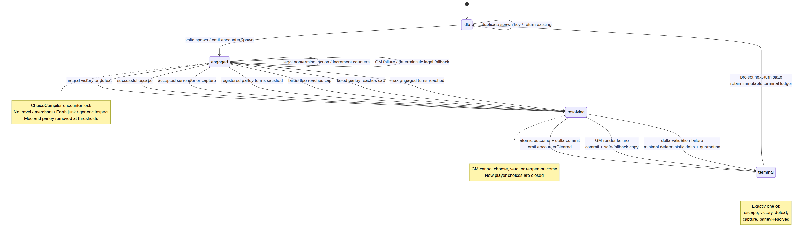

# SynapticGM Post-28c Score Boost Research — Complete 29a Engineering Bundle

**Date:** 2026-08-27  
**Author:** Manus AI  
**Scope:** Live SynapticGM consumer application only; no WOF, licensed series, or second LLM critic path.

## Bundle navigation

| Deliverable | Content |
|---|---|
| T1 | Executive diagnosis and minimum-batch decision |
| T2 | Encounter Terminal FSM, receipts, caps, fallback, and edge cases |
| T3 | Entity allowlist and scrub-scope constitution |
| T4 | Encounter-aware ChoiceCompiler plus CSV edge matrix |
| T5 | STATUS prompt-leak firewall |
| T6 | NPC topic commitment and PYOA branch enforcement |
| T7 | Free T12 hook contract and per-mode pointer cards |
| T8 | Ranked implementation backlog in Markdown and CSV |
| T9 | Honest 29a/29b/three-batch score-ceiling model |
| T10 | Machine-readable evaluation-gate JSON Schema |
| T11 | Unknowns and evidence requests |
| T12 | Explicit rejects and non-goals |

## Companion structured files

| File | Purpose |
|---|---|
| `SynapticGM_score_boost_post_28c_2026-08-27_T04_choice_compiler_edge_matrix.csv` | Mode/phase legality and fallback matrix |
| `SynapticGM_score_boost_post_28c_2026-08-27_T08_ranked_implementation_backlog.csv` | Engineering work queue, dependencies, tests, rollout, and rollback |
| `SynapticGM_score_boost_post_28c_2026-08-27_T10_eval_harness_gates.schema.json` | Validation contract for resolution, branch, hook, replay, and contamination gates |
| `SynapticGM_score_boost_post_28c_2026-08-27_T02_encounter_terminal_fsm.mmd` | Editable Mermaid source |
| `SynapticGM_score_boost_post_28c_2026-08-27_T02_encounter_terminal_fsm.png` | Rendered state-machine diagram |

---


---

<!-- BEGIN SynapticGM_score_boost_post_28c_2026-08-27_T01_executive_summary.md -->

# T1 — Executive Summary: Why 28c Did Not Move Gemini

**Project:** SynapticGM consumer application  
**Batch proposed:** 29a  
**Date:** 2026-08-27  
**Author:** Manus AI

## Decision

Ship **one minimum architectural batch centered on terminal authority**. Batch 29a should add an Encounter Terminal FSM and make the existing ChoiceCompiler, NPC topic FSM, PYOA branch ledger, entity scrubber, STATUS renderer, and evaluation harness obey deterministic terminal and branch receipts. This is not a prose-quality batch. It converts events that currently *begin* into state changes that must *finish*.

> **29a thesis:** the GM may narrate a result, but only code may decide, commit, and prove that an encounter cleared or a branch locked.

The supplied worst-cell summary shows that 28c improved telemetry without improving the reader-visible failure mode. LitRPG s18 gained combat and arc-XP signals but remained in combat from approximately T9 through T300. DnD s69 gained L2 and 235 XP but looped on Wraith flee/parley and emitted repeated STATUS output. RPG s137 reached L3 and produced a crisis receipt but regressed in `them` usage and remained in a leverage dialogue loop. PYOA s188 produced three crises and more XP but never locked a branch.[1] These are not missing-spawn defects. They are missing-terminal, missing-commit, and unsafe-render defects.

| 28c mechanism | What it proved | What it did not prove | 29a authority added |
|---|---|---|---|
| ArcDirector forced spawn | A required threat appeared | The threat ended | `EncounterTerminalFsm` plus `encounterCleared` |
| BeatContract / beat commits | A beat was selected or recorded | The beat changed durable world state | Receipt-coupled state delta and replay hash |
| ChoiceCompiler | Choices could be emitted | Choices were legal for the active state | Encounter lock, exhaustion, terminal synchronization |
| `npcTopicFsm` | A topic could progress | Exhaustion committed a consequential branch | `committedBranch` terminal stage |
| `pyoaBranchLedger` | Crisis activity was visible | Mutually exclusive alternatives were disabled | Atomic `branchLocked` receipt |
| Entity/prose cleanup | Some unwanted wording decreased | Bound nouns and references survived safely | Typed protected-entity spans and no generic substitution |
| Liveness eval gates | A combat receipt existed | Spawned combat cleared | Paired spawn/clear deadline gate |

## Minimum 29a scope

The minimum batch has **seven coupled changes**. The first four are P0 because they establish terminal authority; the remaining three are required to prevent the same worst cells from continuing to score near 1/10 for presentation or early-hook failures.

| Order | Change | Binding outcome |
|---:|---|---|
| 1 | Encounter Terminal FSM | Every spawned combat encounter reaches exactly one of `escape`, `victory`, `defeat`, `capture`, or `parleyResolved`, committed before narration |
| 2 | Encounter-aware ChoiceCompiler | No travel, merchant, Earth-junk, or generic-inspect pads while engaged; flee/parley disappear after thresholds |
| 3 | NPC topic and PYOA branch commitment | Exhausted topics and crises commit a durable branch instead of reopening dialogue |
| 4 | Eval gates | Combat spawn without clear by T50 fails; crisis without branch lock by T30 fails; same-seed replay must reproduce receipts |
| 5 | Entity scrub constitution | Protected mobs, items, props, named NPCs, and location titles are never replaced with generic nouns |
| 6 | STATUS leak firewall | Prompt/control tags remain debug-only; player output is rebuilt from structured state or safe fallback copy |
| 7 | Free T12 hook contract | By T12, at least one durable progress receipt exists; spawn-only purgatory by T15 is an explicit failure |

The components must ship together. An Encounter Terminal FSM without an encounter-aware ChoiceCompiler can still present illegal, repetitive choices. A branch ledger without a crisis gate can silently fail. A scrub or prompt-only patch can make output cleaner while leaving the state machine stuck. Conversely, adding a mid-session writer before terminal authority would improve prose around an unresolved loop rather than eliminate the loop.[1]

## Why this can move the score

The proposed batch targets the **dominant structural reason** each supplied worst cell remains near 1/10: lack of finality or state commitment. If the same seeded reruns produce timely clear/lock receipts, preserve bound nouns, and suppress player-facing control tags, an external evaluator should see completed scenes, consequential choices, and coherent references rather than extended loops. The expected 29a range is therefore **4.5–6.5/10 on the targeted worst cells**, not because the prose model becomes stronger, but because the run stops violating basic playability and coherence invariants.[1]

A **6/10 portfolio average is plausible but not guaranteed in one batch**. It requires all P0 gates to pass across modes and the collateral scrub/leak regressions to reach zero on the supplied worst-cell seeds. An **8/10 average is not a credible 29a promise** because 29a does not address sustained pacing, richer scene composition, long-horizon memory, stylistic variety, or broad portfolio generalization. Those are 29b and later concerns.

## Evidence boundary and cross-run bleed

Only the research brief was attached. The four raw worst-cell transcripts, evaluator judgments, run identifiers, `turns.jsonl`, replay hashes, and the referenced `score-boost-plan-post-28c-2026-08-27.md` were not supplied. This bundle therefore cites the brief as the source of reported counts and loop descriptions and does not invent quotations or unseen turn evidence.

The instruction to flag **Gemini cross-run bleed** is treated as a live confounder, not a settled root cause. A low score can be contaminated if an evaluator context or artifact contains entities, prompts, receipts, or commentary from another seed or mode. Batch 29a should add run-scoped identity fields and a contamination gate, but the architectural defects remain independently demonstrable from the reported absence of `encounterCleared` and `branchLocked` outcomes.[1]

## Engineering handoff status

T2 and T8 in this bundle are designed to be directly handed to engineering. They define state transitions, precedence, receipt payloads, defaults, dependencies, owner surfaces, acceptance tests, rollout controls, and rollback conditions. The existing engineering draft’s sufficiency **cannot be assessed** because that file was not attached. If it already includes the invariants and P0 acceptance criteria in T2 and T8, the only remaining gaps are repository-path assignment, current event-shape mapping, save-version migration, and worst-cell transcript confirmation.

## Release recommendation

Release 29a behind mode-level flags and run the same worst-cell seeds first. Promote only when the paired receipt, branch lock, replay determinism, entity-collateral, STATUS leak, and T12 hook gates all pass. Do not use a score increase alone as the release criterion, because cross-run bleed and evaluator variance can mask deterministic regressions.

## References

[1]: ../sources/pasted_content.txt "SynapticGM — POST-28c SCORE BOOST RESEARCH brief"

<!-- END SynapticGM_score_boost_post_28c_2026-08-27_T01_executive_summary.md -->


---

<!-- BEGIN SynapticGM_score_boost_post_28c_2026-08-27_T02_encounter_terminal_fsm.md -->

# T2 — Encounter Terminal FSM Specification

**Priority:** P0  
**Primary modes:** LitRPG and DnD  
**Applies to:** SynapticGM consumer application only  
**Author:** Manus AI

## Purpose and contract

Path 28c proves that an encounter can spawn but does not guarantee that it will terminate. The Encounter Terminal FSM supplies the missing code authority. Its contract is:

> For every accepted `encounterSpawn`, the runtime must eventually commit exactly one terminal outcome and emit exactly one causally linked `encounterCleared`. The GM narrates the committed result; it does not choose or veto that result.

This FSM is the authoritative owner of encounter lifecycle. `ArcDirector` may request a spawn, the ChoiceCompiler may expose legal actions, the rules engine may compute deltas, and the GM may render prose, but none of those components may directly clear or reopen an encounter.[1]



The editable Mermaid source is included as `SynapticGM_score_boost_post_28c_2026-08-27_T02_encounter_terminal_fsm.mmd`.

## State model

| State | Meaning | Entry invariant | Permitted exit |
|---|---|---|---|
| `idle` | No active encounter exists | `activeEncounterId = null` | Accept a valid spawn and enter `engaged` |
| `engaged` | Player-facing actions can affect an active encounter | One immutable `encounterId`; budgets are initialized; `encounterSpawn` exists | Enter `resolving` on a natural terminal condition, exhausted escape/parley route, max-turn cap, fatal engine condition, or explicit surrender |
| `resolving` | Outcome and world delta are being computed atomically | Choice compilation is closed; no new GM-authored action may mutate encounter state | Commit one terminal outcome and enter `terminal`; on GM/render failure, use deterministic fallback copy without undoing state |
| `terminal` | Outcome and state delta are committed | `terminalOutcome` and `encounterCleared` exist; replay material is sealed | Project post-encounter state, then transition to `idle` without deleting history |

`terminal` is a committed lifecycle state, not a narrative label. The runtime may project `idle` for the next turn, but the terminal record remains immutable in the encounter ledger.

## Canonical state record

The exact repository types must be mapped by engineering, but the runtime record must contain fields equivalent to the following interface.

```ts
type EncounterPhase = 'idle' | 'engaged' | 'resolving' | 'terminal';
type TerminalOutcome =
  | 'escape'
  | 'victory'
  | 'defeat'
  | 'capture'
  | 'parleyResolved';

type EncounterState = {
  encounterId: string;
  runId: string;
  seed: string;
  mode: 'LitRPG' | 'DnD' | 'RPG' | 'PYOA' | string;
  phase: EncounterPhase;
  source: 'arcDirector' | 'player' | 'beatContract' | 'system';
  forcedSpawnKey?: 'Pact-Hunter' | 'Keep Wraith' | string;
  startedTurn: number;
  engagedTurnCount: number;
  failedFleeCount: number;
  failedParleyCount: number;
  maxEngagedTurns: number;
  maxFailedFlee: number;
  maxFailedParley: number;
  participantEntityIds: string[];
  lastAcceptedActionId?: string;
  resolutionReason?: string;
  terminalOutcome?: TerminalOutcome;
  committedDeltaHash?: string;
  replayHash?: string;
  clearedTurn?: number;
  version: 1;
};
```

## Binding decisions versus tunable defaults

| Concern | 29a binding decision | Initial default | Tuning rule |
|---|---|---:|---|
| Failed flee cap | A cap exists; each resolved failure consumes one budget unit; option disappears at cap | LitRPG 2; DnD 2 | Per encounter template, never raised during the encounter |
| Failed parley cap | A cap exists; failed or non-advancing parley consumes one unit; option disappears at cap | LitRPG 1; DnD 2 | Per encounter template, never raised during the encounter |
| Max engaged turns | A cap exists and forces `resolving` | LitRPG 8; DnD 10 | Count accepted player turns after spawn; bosses may use an explicit registry override capped below T50 |
| Resolution render timeout | Rendering cannot block the commit | One render attempt plus sealed fallback | Operational timeout value is environment-specific |
| Active encounters | Only one foreground encounter may be `engaged` or `resolving` | 1 | Additional spawn requests are queued or merged deterministically |
| Clear deadline | Spawn without clear by T50 fails the combat-mode eval gate | T50 | Binding evaluation maximum, not a desired pacing target |

The defaults are deliberately shorter than T50. T50 is a safety/evaluation deadline; it must not become the normal encounter duration.

## Transition table

| From | Event or guard | To | Atomic effects | Narration responsibility |
|---|---|---|---|---|
| `idle` | Valid spawn request and no active encounter | `engaged` | Allocate `encounterId`; freeze participants and caps; emit `encounterSpawn`; set active encounter | Narrate arrival from committed spawn data |
| `idle` | Duplicate spawn idempotency key | `idle` or existing phase | Return existing encounter; emit no duplicate receipt | None |
| `engaged` | Natural victory, defeat, successful escape, accepted surrender, or accepted parley agreement | `resolving` | Freeze choices; set candidate outcome and resolution reason | May render transition, but cannot alter outcome |
| `engaged` | Failed flee reaches cap | `resolving` | Remove flee; select deterministic forced outcome using precedence table | Narrate forced confrontation/capture/escape as committed |
| `engaged` | Failed parley reaches cap | `resolving` | Remove parley; apply hostility/escalation; select outcome or legal combat continuation | Narrate refusal; no renewed parley choice |
| `engaged` | Max engaged turns reached | `resolving` | Invoke deterministic terminal resolver | Narrate resolver output |
| `engaged` | GM output missing, malformed, or non-advancing | `engaged` or `resolving` | Apply legal fallback action; increment non-advancing/turn counters; resolve if cap reached | Use safe fallback copy |
| `resolving` | Rules delta validates | `terminal` | Commit outcome and state delta in one transaction; emit `encounterCleared`; seal replay hash | Render committed delta |
| `resolving` | Narrative render fails | `terminal` | Commit anyway; set `renderFallbackUsed = true`; emit clear once | Use sealed, player-safe terminal template |
| `resolving` | Delta validation fails | `terminal` | Apply deterministic minimal delta for selected outcome; quarantine diagnostic; emit clear once | Use fallback copy |
| `terminal` | Projection completed | `idle` | Clear active pointer; retain immutable terminal ledger; unlock normal choices next turn | Present post-encounter options |

## Terminal outcome resolver

Natural rule results always outrank caps. When a cap or system failure requires forced resolution, the runtime selects an outcome by the following deterministic precedence. The resolver must use only committed state, registry configuration, the seed, and stable tie-breaking—not fresh GM prose.

| Precedence | Guard | Outcome | Minimum committed delta |
|---:|---|---|---|
| 1 | Player and opponent victory/defeat rules already identify a result | `victory` or `defeat` | HP/status, rewards or loss, opponent disposition, quest/beat advancement if configured |
| 2 | A previously accepted escape check succeeded | `escape` | Player location/position changes; pursuer disposition persists if applicable |
| 3 | A previously accepted parley offer satisfies registered terms | `parleyResolved` | Disposition and obligation/concession commit; combat closes |
| 4 | Player explicitly surrendered or a nonlethal captor rule applies | `capture` | Captivity/location/quest consequence commits |
| 5 | Max-turn/system fallback and player has a registered viable retreat edge | `escape` | Retreat cost and location delta commit |
| 6 | Max-turn/system fallback and opponent has decisive advantage | `defeat` or `capture` | Deterministic loss/capture delta commits |
| 7 | Max-turn/system fallback otherwise | `victory` | Minimal victory delta; reward only if registry defines it |

A configured encounter may prohibit an outcome, but it must still register at least one reachable terminal fallback. Misconfigured encounters fail validation before spawn; they must not enter `engaged`.

## Hard-cap semantics

A flee or parley attempt consumes budget only after the rules layer classifies the action. A malformed duplicate request with the same action id is idempotent and consumes nothing. A failed action consumes one unit even if the GM describes it ambiguously. A successful action moves immediately to `resolving`.

When a threshold is reached, the related action family is unavailable on the next compilation. If reaching the threshold also satisfies a forced-resolution rule, the FSM moves to `resolving` in the same transaction, so no additional loop turn is emitted. The max-turn cap is evaluated after applying the current accepted action and before requesting another GM response.

## ArcDirector forced-spawn interaction

`ArcDirector` retains its 28c responsibility for scheduling Pact-Hunter and Keep Wraith spawns.[1] It must call one FSM entry point with an idempotency key derived from run, beat, and forced-spawn identity. It must not write `activeEncounter` directly.

| Condition | Required behavior |
|---|---|
| FSM is `idle` | Accept spawn, emit `encounterSpawn`, enter `engaged` |
| Same forced spawn is already active | Return the existing encounter and emit no second spawn |
| Another foreground encounter is active | Queue the forced spawn by stable priority, or merge only if the BeatContract explicitly defines a composite encounter |
| Previous instance is terminal | A recurrence requires a new registry recurrence key; the old encounter cannot reopen |
| Forced spawn template lacks a fallback outcome | Reject before activation, log configuration fault, and apply a safe non-combat beat rather than create purgatory |

The Pact-Hunter and Keep Wraith tests must prove that ArcDirector cannot repeatedly reassert the spawn after terminal clear.

## Receipt contracts

The receipt pair is the durable proof of lifecycle entry and terminal completion. Both event shapes are versioned, run-scoped, replayable, and causally linked.

### `encounterSpawn`

```json
{
  "receiptType": "encounterSpawn",
  "schemaVersion": 1,
  "receiptId": "rcpt_run-42_enc-7_spawn",
  "idempotencyKey": "run-42:keep-wraith:beat-3",
  "runId": "run-42",
  "seed": "s69",
  "turn": 6,
  "mode": "DnD",
  "encounterId": "enc-7",
  "source": "arcDirector",
  "forcedSpawnKey": "Keep Wraith",
  "participantEntityIds": ["pc", "keep-wraith"],
  "limits": {
    "maxEngagedTurns": 10,
    "maxFailedFlee": 2,
    "maxFailedParley": 2
  },
  "previousReceiptHash": "sha256:...",
  "replayHash": "sha256:..."
}
```

### `encounterCleared`

```json
{
  "receiptType": "encounterCleared",
  "schemaVersion": 1,
  "receiptId": "rcpt_run-42_enc-7_clear",
  "idempotencyKey": "run-42:enc-7:terminal",
  "runId": "run-42",
  "seed": "s69",
  "turn": 13,
  "mode": "DnD",
  "encounterId": "enc-7",
  "spawnReceiptId": "rcpt_run-42_enc-7_spawn",
  "outcome": "parleyResolved",
  "resolutionReason": "registered_terms_satisfied",
  "engagedTurnCount": 7,
  "failedFleeCount": 1,
  "failedParleyCount": 1,
  "committedDelta": {
    "disposition": [{"entityId": "keep-wraith", "state": "stoodDown"}],
    "questStage": [{"questId": "keep", "from": 1, "to": 2}]
  },
  "committedDeltaHash": "sha256:...",
  "renderFallbackUsed": false,
  "previousReceiptHash": "sha256:...",
  "replayHash": "sha256:..."
}
```

Both receipts are append-only. One spawn maps to zero clears only while nonterminal and to exactly one clear after terminal. Duplicate terminal calls return the first clear receipt byte-for-byte.

## Transaction and precedence boundaries

The `resolving → terminal` transition must atomically write the terminal outcome, state delta, `encounterCleared`, active-pointer release intent, and replay material. If the storage layer cannot provide one transaction, use an outbox keyed by `encounterId` and make every consumer idempotent.

Precedence is: **safety/fatal rule → existing natural terminal rule → accepted player action → hard-cap resolver → GM suggestion**. GM text cannot revive a defeated mob, reopen a cleared encounter, change a committed outcome, or present an exhausted flee/parley edge.

## Deterministic fallback copy

If the GM fails before a legal action is classified, the ChoiceCompiler supplies a registry-defined `defend/advance` fallback and the FSM increments the turn. If the GM fails during resolution, state still commits and the renderer uses a player-safe template populated only from the terminal receipt:

> “The encounter ends in **{outcomeLabel}**. {oneSentenceDeltaSummary} Your next options are ready.”

No internal tag, prompt text, stack trace, raw enum, or `[RenderFallbackUsed]` marker may appear. The marker is written only to `turns.jsonl` and receipt diagnostics.

## Lifecycle invariants

| ID | Invariant |
|---|---|
| E-I01 | At most one foreground encounter is `engaged` or `resolving` per run |
| E-I02 | Every `encounterCleared.spawnReceiptId` references one spawn in the same `runId`, `seed`, `mode`, and `encounterId` |
| E-I03 | Exactly one terminal outcome is committed per encounter |
| E-I04 | Terminal state is monotonic; it cannot return to `engaged` |
| E-I05 | Choice compilation is closed during `resolving` |
| E-I06 | The GM may render but may not mutate outcome or committed delta |
| E-I07 | Duplicate action, spawn, and clear idempotency keys do not change counters or emit receipts |
| E-I08 | Same seed, initial state, action stream, and registry version reproduce terminal outcome and receipt hashes |
| E-I09 | A protected participant entity remains addressable by its bound entity id through clear |
| E-I10 | Spawn at or before T50 with no clear by T50 fails the combat-mode resolution gate |

## Edge cases

| Edge case | Required decision |
|---|---|
| Spawn and natural terminal occur in one turn | Emit spawn, then clear in ledger order; both may share a turn but not a receipt id |
| Player disconnects while engaged | Resume from persisted counters; a product-level inactivity policy may resolve later, but replay does not synthesize unrecorded actions |
| Encounter starts after T50 | The `spawnByT50` coverage rule and paired-clear deadline are evaluated separately; late-spawn policy must be explicit in the harness |
| Clear occurs exactly at T50 | Pass the stated “by T50” gate |
| Multiple mobs | One encounter terminal covers the registered group; individual participant states live in the committed delta |
| Parley resolves with continuing pursuit | Current encounter clears as `parleyResolved`; any future encounter requires a new id and beat trigger |
| GM narrates victory while rules select capture | Capture remains authoritative; post-render validator rejects or replaces contradictory prose |
| Save from 28c contains active combat with no FSM record | Migration creates one v1 encounter from the active receipt and initializes conservative remaining budgets; migration is logged and replay-versioned |

## Evaluation and acceptance tests

| Test name | Setup | Assertion |
|---|---|---|
| `encounter_fsm_spawn_is_idempotent` | Reissue same ArcDirector idempotency key | One active encounter and one spawn receipt |
| `encounter_fsm_failed_flee_cap_resolves` | Fail flee to configured cap | Flee removed; same transaction enters `resolving` or commits forced outcome |
| `encounter_fsm_failed_parley_cap_resolves` | Fail parley to cap | Parley removed; no later parley choice; encounter progresses |
| `encounter_fsm_max_turn_cap_clears` | Supply nonterminal legal actions through cap | Exactly one terminal outcome and clear receipt |
| `encounter_fsm_gm_failure_before_action_advances` | Return malformed/empty GM output | Registry fallback applied; no stuck turn |
| `encounter_fsm_gm_failure_during_resolution_commits` | Fail render after delta calculation | State and clear persist; safe fallback shown |
| `encounter_fsm_terminal_is_monotonic` | Attempt to reopen terminal encounter | Mutation rejected; no new spawn/clear |
| `encounter_fsm_pact_hunter_no_respawn_loop` | Clear forced Pact-Hunter, rerun director same beat | Old encounter remains terminal; no duplicate spawn |
| `encounter_fsm_keep_wraith_no_dialogue_revert` | Clear Wraith through parley or combat | NPC/encounter state cannot return to active loop |
| `eval_combat_spawn_without_clear_by_t50_fails` | Spawn and suppress clear through T50 | Hard evaluation failure and quarantine evidence |
| `replay_encounter_receipts_are_stable` | Replay identical seed/actions/registry | Byte-stable normalized receipts and matching replay hash |
| `cross_run_encounter_reference_fails` | Inject receipt from another run | Contamination gate fails before score aggregation |

## Rollout and rollback

Use mode flags for LitRPG and DnD, with deterministic shadow logging before enforcing terminal deltas. Promotion requires the same-seed worst-cell reruns to produce valid paired receipts and no terminal reversion. Rollback may disable new encounter creation under the FSM, but must **not** reinterpret or delete terminal receipts already committed. A rollback that restores spawn-only behavior is acceptable only as an emergency feature rollback, never as a successful 29a outcome.

## References

[1]: ../sources/pasted_content.txt "SynapticGM — POST-28c SCORE BOOST RESEARCH brief"

<!-- END SynapticGM_score_boost_post_28c_2026-08-27_T02_encounter_terminal_fsm.md -->


---

<!-- BEGIN SynapticGM_score_boost_post_28c_2026-08-27_T03_entity_scrub_constitution.md -->

# T3 — Entity Allowlist and Scrub-Scope Constitution

**Priority:** P0 for collateral safety  
**Scope:** Narrative and STATUS rendering in the live SynapticGM consumer application  
**Author:** Manus AI

## Constitutional rule

> A scrubber may suppress an untrusted disclosure, but it may not rename, generalize, delete, or substitute a game entity that is bound to authoritative state.

The 28c worst-cell summary reports `the mark` at roughly 173 hits in LitRPG s18, `nearby building` in DnD s69, `the panel` as another collateral form, and an RPG `them` regression from 26 to 52.[1] The common architectural risk is a cleanup rule operating on surface strings without a semantic boundary between prohibited material and valid world nouns. The exact rule that caused each hit cannot be proven without the scrub logs and transcripts, so the diagnosis below is a constrained root-cause model rather than a claim about unseen implementation.

## Constrained root-cause analysis

| Observed symptom | Most plausible failure class | Why the symptom fits | Evidence needed to confirm |
|---|---|---|---|
| Named or quest-relevant text becomes `the mark` | Replacement template applied to an entity-like span after identity was lost | The generic noun is grammatical but semantically unbound | Pre/post scrub text, matched rule id, entity annotations |
| Location becomes `nearby building` | Location title was treated as sensitive or unknown rather than protected world state | A specific title appears generalized to a location category | Location registry snapshot and scrub match trace |
| Object/interface term becomes `the panel` | Broad noun fallback reused across unrelated spans | Generic replacement survives prose validation while losing referent | Rule/template map and source spans |
| `them` count rises 26→52 | Whole-mention replacement or pronoun repair runs without number/gender/discourse tracking | A generic plural pronoun can replace distinct entities and degrade reference clarity | Per-turn replacements and coreference context |

The principal architectural correction is **not** to add more replacement words. It is to make scrub decisions on typed spans and, where a span must be removed, regenerate the containing sentence from safe structured facts rather than insert a generic noun.

## Protected entity constitution

An entity is protected when its identity originates in authoritative state, a current BeatContract, a receipt, or an accepted player action. Protection follows the entity id across aliases and inflections; it is not limited to one exact display string.

| Protected role | Minimum registration source | Examples in scope | Allowed scrub action |
|---|---|---|---|
| Active mob or encounter participant | Active Encounter Terminal FSM record | Pact-Hunter, Keep Wraith, current target | None on the entity mention; validate casing/alias only |
| Inventory item | Inventory ledger or accepted item-use action | Millstone Charter | None; item identity must survive item-use narration |
| Quest prop | Current quest-stage registry or BeatContract | Evidence, token, device, charter, keyed objective object | None while active or referenced by committed delta |
| Named NPC | NPC registry, topic FSM, branch record, or BeatContract | Aldous, Oskar | None; unregistered aliases may be normalized to canonical display name |
| Location title | Location registry, current/adjacent location ids, or quest/encounter target | Cape District, Thornferry, Keep title | None; preserve canonical title |
| Player-selected proper noun | Accepted character/campaign state | Character, party, custom place names | None unless a separate safety rule requires sentence regeneration |
| Bound system noun intended for players | Player-visible schema | Level, XP, quest stage, branch label | Format normalization only |

Protection is denied only when the text span is not bound to a known id or when a higher-priority safety policy requires suppression. Even then, the fallback is a safe sentence rebuilt from permitted fields, not `stranger`, `building`, `mark`, `panel`, `them`, or another generic substitute.

## Explicitly forbidden replacements

The following tokens are **never valid automatic replacements** for a protected or unresolved entity span: `stranger`, `building`, `nearby building`, `mark`, `the mark`, `panel`, `the panel`, `someone`, `something`, or a forced `they/them` substitution. These words may still appear when authored naturally and bound to a legitimate referent; the ban applies to scrub replacement output.

A replacement event must record `ruleId`, source span, output action, protected status, and decision reason in debug telemetry. The player-facing surface never receives rule identifiers or scrub markers.

## Pipeline order

The brief requires integration with `typedEntityValidator` and `proseWarden` before and after GM generation.[1] The binding pipeline is:

| Order | Component | Input | Responsibility | Failure behavior |
|---:|---|---|---|---|
| 1 | State projection | Ledgers, FSMs, BeatContract, inventory, location | Build the protected entity registry and safe player-visible fact set | Fail closed to a minimal safe fact set; do not call scrubber without protection metadata |
| 2 | `typedEntityValidator.preGM` | Prompt context and projected registry | Mark canonical entity ids, aliases, semantic roles, and non-exportable control spans | Quarantine diagnostic if a required active entity has no id |
| 3 | GM generation | Structured state and annotated context | Draft narration; it does not grant or revoke protection | Missing/invalid output routes to sealed fallback |
| 4 | `typedEntityValidator.postGM` | Draft narration plus registry | Resolve mentions back to entity ids; detect invented, ambiguous, or contradictory spans | Ambiguous bound span triggers sentence regeneration, not generic substitution |
| 5 | `proseWarden` | Typed draft | Remove prohibited disclosures and enforce player-safe prose while skipping protected spans | Rewrite the minimum sentence from safe facts |
| 6 | Entity integrity check | Wardended text plus required entity ids | Assert required bound nouns remain and no forbidden replacement event occurred | Reject render and use structured safe fallback |
| 7 | STATUS leak firewall | Structured STATUS render | Strip control metadata and validate player surface separately | Use STATUS safe fallback; retain debug-only record |
| 8 | Player renderer | Validated narrative and STATUS | Display output | Never consume raw prompt or debug log |

The validator must run on both sides of generation. Pre-GM typing constrains context construction; post-GM typing validates what the model actually wrote. `proseWarden` operates only after post-GM typing so it can distinguish a protected world entity from an unbound or prohibited phrase.

## Protected registry shape

```json
{
  "runId": "run-42",
  "turn": 9,
  "registryVersion": 1,
  "entities": [
    {
      "entityId": "keep-wraith",
      "role": "activeMob",
      "canonicalDisplay": "Keep Wraith",
      "aliases": ["the wraith"],
      "source": "encounter:enc-7",
      "protection": "mustPreserveIdentity"
    },
    {
      "entityId": "millstone-charter",
      "role": "inventoryItem",
      "canonicalDisplay": "Millstone Charter",
      "aliases": ["the Charter"],
      "source": "inventory",
      "protection": "mustPreserveIdentity"
    }
  ]
}
```

The runtime should pass ids or opaque span markers internally and render canonical display names only at the player boundary. If prompt format requires readable names, the annotation must remain out-of-band or use a channel guaranteed not to leak into prose.

## Scrub decision algorithm

For each candidate span, the scrubber follows this decision order:

1. If the span resolves to a protected entity id, preserve the identity and allow only canonical formatting.
2. If it matches a non-exportable control tag, remove it and record the removal in debug telemetry.
3. If it expresses a prohibited disclosure but the sentence also contains protected facts, regenerate that sentence from the safe fact set.
4. If it is an unbound invented entity that conflicts with state, reject or regenerate the sentence.
5. If it is ordinary prose, leave it unchanged.
6. After all actions, verify that required entity ids still have a readable mention where the terminal receipt or beat requires one.

Regex-only matching is insufficient for decisions 1, 3, and 4. Regex may detect candidate control tags, but semantic authority comes from registry ids and typed spans.

## Pronoun and coreference policy

The `them` regression is handled as a reference-integrity problem, not as a banned-word count. Pronouns may remain only when the antecedent is unambiguous within the configured discourse window and number is consistent. When ambiguous, rerender the smallest phrase with the canonical name; do not replace every entity with `them`.

| Condition | Player-facing action |
|---|---|
| Single unambiguous antecedent | Preserve natural pronoun |
| Multiple candidate antecedents | Use canonical short name |
| Group entity registered | Use registered group display or valid plural pronoun |
| Antecedent removed by safety rewrite | Rebuild sentence and restore safe canonical referent |
| Resolver confidence below threshold | Prefer canonical name; emit debug diagnostic |

## Acceptance metrics by worst cell

All targets apply to reruns using the same seeds and equivalent run configuration referenced in the brief. Because raw transcripts were not attached, baseline counts other than those explicitly reported must be recomputed from the artifacts.[1]

| Worst cell | Reported collateral symptom | 29a target | Additional integrity assertion |
|---|---|---:|---|
| LitRPG s18 | `the mark` approximately 173 hits | **0 scrub-generated hits** | Every active mob, item, quest prop, named NPC, and location required by receipts remains addressable by canonical id/name |
| DnD s69 | `nearby building` scrub | **0 scrub-generated hits** | Keep Wraith and registered location titles survive from spawn through clear |
| RPG s137 | `them` 26→52 regression | **0 scrub-generated pronoun substitutions** and no increase over validated 28c source baseline | Cape District and leverage/feed referents remain unambiguous across topic commit |
| PYOA s188 | Branch/item nouns at risk, exact count not supplied | **0 scrub-generated `mark/panel/building/stranger` hits** | Millstone Charter and locked branch label survive item-use and branch receipt rendering |
| All cells | `the panel` named as collateral token | **0 scrub-generated hits** | Any natural occurrence must have a valid bound referent and `replacement=false` telemetry |

The acceptance metric is tied to **scrub-generated events**, avoiding false failures when a word is legitimately present in source content. A secondary raw-string scan remains useful as a triage signal, but it is not the authority.

## Tests

| Test name | Assertion |
|---|---|
| `entity_scrub_preserves_active_mob_identity` | Active encounter participant mention cannot be generalized or removed |
| `entity_scrub_preserves_inventory_item_identity` | Millstone Charter remains canonical through item-use narration |
| `entity_scrub_preserves_quest_prop_identity` | Active quest prop remains bound after wardening |
| `entity_scrub_preserves_named_npc_identity` | Aldous/Oskar aliases resolve to canonical ids and are not replaced |
| `entity_scrub_preserves_location_title` | Cape District/Thornferry titles survive safety cleanup |
| `entity_scrub_never_uses_generic_substitute` | A scrub action cannot output forbidden generic replacements |
| `entity_scrub_ambiguous_sentence_regenerates` | Ambiguous or prohibited mixed sentence is rebuilt from safe facts |
| `entity_scrub_pronoun_requires_antecedent` | Ambiguous `them` becomes a canonical short name, not another generic pronoun |
| `entity_integrity_required_mentions_survive` | Receipt-required entities are present in final player prose |
| `entity_scrub_debug_trace_is_run_scoped` | Every scrub event carries run, seed, turn, rule, and source-span hashes |
| `entity_scrub_cross_run_registry_rejected` | Registry from a different run cannot authorize a span |

## Rollout rule

Deploy in report-only mode first, comparing current output with typed-policy output on the same seed and action stream. Enforcement may begin only when all current protected roles are populated from real state. If registry coverage is incomplete, prefer sealed fallback prose over returning to broad generic substitution.

## References

[1]: ../sources/pasted_content.txt "SynapticGM — POST-28c SCORE BOOST RESEARCH brief"

<!-- END SynapticGM_score_boost_post_28c_2026-08-27_T03_entity_scrub_constitution.md -->


---

<!-- BEGIN SynapticGM_score_boost_post_28c_2026-08-27_T04_choice_compiler_encounter_lock.md -->

# T4 — Encounter-Aware ChoiceCompiler Rules

**Priority:** P0  
**Dependency:** Encounter Terminal FSM state contract  
**Author:** Manus AI

## Compiler contract

The ChoiceCompiler is a projection of legal state transitions, not a prose suggestion generator. During an active encounter it must compile only actions that are legal for the current Encounter Terminal FSM phase, registered for the mode/beat, and capable of changing encounter state or resources. It may not create an escape hatch from the FSM by emitting ordinary exploration pads.[1]

> If `activeEncounter.phase ∈ {engaged, resolving}`, the encounter rules outrank general padding, model-proposed choices, and mode-default exploration choices.

## Rule precedence

| Rank | Rule source | Behavior |
|---:|---|---|
| 1 | Encounter FSM phase and terminal guard | Close choices in `resolving`; unlock ordinary choices only after committed `encounterCleared` |
| 2 | Safety and fatal-state rules | Suppress actions impossible under incapacitation, capture, or other authoritative status |
| 3 | Exhaustion counters | Remove flee/parley once their attempt cap is reached |
| 4 | BeatContract legal-edge registry | Admit only mode- and beat-valid encounter edges |
| 5 | Resource and target validation | Remove choices lacking a legal target, item, spell, resource, or prerequisite |
| 6 | Diversity/minimum-choice policy | Fill from registered consequential fallbacks; never from forbidden pad families |
| 7 | GM/model suggestions | May label or rank already legal actions; cannot legalize an edge |

A choice that fails any higher-ranked guard is excluded even when a model generated persuasive prose for it.

## Action-family rules by phase

| Encounter phase | Allowed families | Conditionally allowed | Forbidden families | Output behavior |
|---|---|---|---|---|
| `idle` | Mode-standard exploration, travel, merchant, inspect, social, quest, item use | BeatContract-dependent actions | None solely due to encounter state | Compile ordinary mode choices |
| `engaged` | `attack`, `defend`, `tactical`, `useEncounterItem`, `assist`, mode-legal `cast/skill`, registered objective interaction | `flee` below cap; `parley` below cap and only when opponent/beat permits; `surrender` when permitted | `travel`, `merchant`, Earth junk, `genericInspect`, unrelated crafting/rest, unrelated NPC topic, filler wait | Compile consequential encounter edges only |
| `resolving` | None as a new player action | A registered post-outcome decision may be rendered only after terminal commit | All ordinary, encounter, flee, and parley families | Return a resolving projection, not selectable choices |
| `terminal` | None from the old encounter | Post-encounter choices are compiled from the next `idle` projection | Every edge carrying the old `encounterId` | Wait for committed clear, then compile new-state choices |

“Earth junk” is the brief’s category for out-of-mode or irrelevant contemporary-object padding. Engineering should map the existing family identifiers to this policy rather than introducing a user-visible label.

## Meaningful-choice invariant

While `engaged`, the compiler should target **three** choices when the registry and state permit, with at least **two distinct consequence families**. This is a tunable presentation default, not permission to invent illegal actions. One legal choice is acceptable when state truly constrains the player; the compiler must report `choiceSetConstrained=true` rather than pad with travel, merchant, generic inspect, or inert dialogue.

Each emitted choice must include:

```ts
type CompiledEncounterChoice = {
  choiceId: string;
  encounterId: string;
  family: string;
  beatEdgeId: string;
  targetEntityIds: string[];
  consumesAttempt?: 'flee' | 'parley';
  expectedTransition:
    | 'remainEngaged'
    | 'mayResolve'
    | 'mustResolve';
  consequenceClass: string;
  idempotencyKey: string;
  displayLabel: string;
};
```

The player-facing `displayLabel` may be GM-polished only after the structural fields are fixed. If the label contradicts the registered edge, use the registry fallback label.

## Flee and parley exhaustion

| Counter condition | Flee behavior | Parley behavior |
|---|---|---|
| Below threshold | Compile only if current encounter registers the edge | Compile only if target disposition and beat register the edge |
| Action selected and succeeds | Stop compilation and enter `resolving` | Stop compilation and enter `resolving` with `parleyResolved` candidate |
| Action selected and fails below threshold | Increment corresponding counter; may compile again next turn | Increment corresponding counter; may compile again only if registry says terms can change |
| Action fails and reaches threshold | Remove immediately; if threshold rule requires escalation, enter `resolving` in same transaction | Remove immediately; apply hostility/escalation; either continue with combat edges or resolve deterministically |
| At or above threshold | Never emit, regardless of GM suggestion | Never emit, regardless of GM suggestion |

A non-advancing parley repeat counts as a failed attempt when it produces no new registered term, disposition delta, topic-stage change, or terminal candidate. Rewording the same request does not reset the budget.

## Mode-specific legal edges

The attached CSV is the initial 29a policy matrix. It identifies required edge families and defaults without pretending to know the repository’s exact edge ids. Engineering must bind each `registry_edge_requirement` to existing or newly registered BeatContract entries.

| Mode | Encounter emphasis | Required legal edges | Terminal pressure |
|---|---|---|---|
| LitRPG | Tactical combat with visible state/progression | Attack/skill, defend, item/tactic, conditional flee/parley | Shorter max engaged default; terminal may emit XP/quest delta only when registry authorizes it |
| DnD | Rules-facing combat plus negotiation | Attack/action, defend/help, spell/feature/item, conditional flee/parley/surrender | Wraith and similar threats cannot reoffer exhausted flee/parley |
| RPG | Consequence and social leverage | Confront, protect/assist, use leverage/quest prop, conditional disengage/commit terms | Encounter clear must hand off to committed NPC topic/quest branch |
| PYOA | Crisis fork rather than freeform combat padding | Commit branch, use key item, accept cost, overseer escalation | Crisis edges must culminate in `branchLocked`, not indefinite “buy time” |

## Deterministic fallback

If the model returns no valid choices or all suggestions are filtered, fallback selection uses this order:

1. Registered `mustResolve` edge whose guards are satisfied.
2. Registered defensive/tactical edge that advances an encounter clock or resource.
3. Registered basic mode action against a valid target.
4. FSM deterministic resolution when max-turn or exhaustion guard is reached.

The fallback must come from the current BeatContract registry. A global “inspect surroundings,” merchant visit, travel, random ambush, or unregistered generic attack is not an acceptable fallback.

## Terminal synchronization

`activeEncounter` remains true until the FSM’s atomic terminal commit emits `encounterCleared`. GM prose such as “the fight is over” is not sufficient. Conversely, once a valid clear is committed, the compiler may not emit any choice bound to the old encounter id. The next turn projects post-encounter state and compiles from `idle`.

The receipt consumer must be idempotent. Duplicate delivery of the same `encounterCleared.receiptId` produces no extra unlock, reward, or choice-set regeneration side effect.

## Choice telemetry

Each compilation records a run-scoped debug event with the FSM phase, considered edge ids, rejection reasons, exhaustion counters, selected fallbacks, and final choice ids. Player output contains only labels. Recommended rejection enums include `forbiddenDuringEncounter`, `attemptExhausted`, `missingRegistryEdge`, `guardFailed`, `invalidTarget`, `resourceUnavailable`, `staleEncounterId`, and `resolvingClosed`.

## Acceptance tests

| Test name | Assertion |
|---|---|
| `choice_encounter_forbids_travel` | No travel edge appears while engaged |
| `choice_encounter_forbids_merchant` | No merchant edge appears while engaged |
| `choice_encounter_forbids_earth_junk` | No out-of-mode Earth-junk edge appears while engaged |
| `choice_encounter_forbids_generic_inspect` | Generic inspect is suppressed; registered objective interaction remains possible |
| `choice_flee_removed_at_threshold` | Flee is absent at cap and cannot be restored by GM text |
| `choice_parley_removed_at_threshold` | Parley is absent at cap; repeated rephrasing does not reset counter |
| `choice_edges_are_registered_for_mode_and_beat` | Every output edge resolves to a current BeatContract entry |
| `choice_resolving_has_no_selectable_action` | No new action is accepted while terminal commit is pending |
| `choice_clear_unlocks_next_turn_only` | Old encounter edges vanish and ordinary choices return after committed clear |
| `choice_invalid_model_output_uses_registered_fallback` | Fallback advances state without forbidden padding |
| `choice_constrained_set_does_not_pad` | A true one-choice state reports constrained rather than inventing filler |
| `choice_replay_is_stable` | Same state, registry version, seed, and counters produce the same structural choices |

## References

[1]: ../sources/pasted_content.txt "SynapticGM — POST-28c SCORE BOOST RESEARCH brief"

<!-- END SynapticGM_score_boost_post_28c_2026-08-27_T04_choice_compiler_encounter_lock.md -->


---

<!-- BEGIN SynapticGM_score_boost_post_28c_2026-08-27_T05_status_leak_firewall.md -->

# T5 — STATUS Prompt-Leak Firewall

**Priority:** P0 for player-surface integrity  
**Scope:** Player-facing STATUS only; debug data remains in `turns.jsonl`  
**Author:** Manus AI

## Security boundary

STATUS must be rendered from a player-visible structured projection. It must never be a trimmed slice of the GM prompt, raw response, fallback diagnostic, campaign contract, or internal control stream. The reported `STATUS×110` behavior in DnD s69 and prompt leaks in RPG s137 show that player rendering requires an explicit output firewall rather than more prompt instructions.[1]

> Detection is a backstop. The primary control is architectural separation: debug/control fields do not enter the player-visible STATUS object.

## Render pipeline

| Order | Stage | Responsibility | Failure response |
|---:|---|---|---|
| 1 | `StatusProjector` | Select only allowlisted player fields from committed game state | Produce minimal safe projection |
| 2 | Normalizer | Apply Unicode NFKC, normalize line endings and spacing, preserve ordinary display casing | Continue with normalized structured fields |
| 3 | Tag detector | Detect exact and obfuscated control-tag forms in every string field | Remove field fragment or rebuild field from typed value; record debug event |
| 4 | Content validator | Reject prompt instructions, raw metadata keys, internal fallback notes, or repeated STATUS headers | Replace affected field with safe copy |
| 5 | Formatter | Render stable player labels from typed fields | No model-authored labels for internal keys |
| 6 | Final scanner | Assert no denied pattern and no raw debug field remains | Replace the entire STATUS block with safe fallback |
| 7 | Debug sink | Write original diagnostic, matched pattern id, normalized hash, and action to `turns.jsonl` | Never expose to renderer |

The firewall runs independently from narrative prose cleanup. A safe narrative does not prove a safe STATUS block.

## Denied tag families

The following list includes the exact examples required by the brief and bounded variants needed to resist case, whitespace, underscore, and punctuation drift.[1]

| Pattern ID | Canonical examples | Detection policy | Player action |
|---|---|---|---|
| `ST-001` | `[GM_VOICE]` | Bracketed token after NFKC; case-insensitive; allow spaces, hyphens, or underscores between words | Strip token; rebuild affected field if token separates clauses |
| `ST-002` | `[PYOA]` | Bracketed exact control token; case-insensitive | Strip token |
| `ST-003` | `[RenderFallbackUsed]` | Bracketed camel/space/underscore/hyphen variants | Strip token; retain boolean debug field only |
| `ST-004` | `[Campaign Contract]` | Bracketed phrase with normalized spacing/hyphens/underscores | Remove containing control line; never preserve contract text |
| `ST-005` | `[SYSTEM]`, `[DEVELOPER]`, `[ASSISTANT]`, `[TOOL]` | Bracketed role labels; case-insensitive | Remove containing control line and flag high severity |
| `ST-006` | `<system>`, `</system>`, `<developer>`, `<tool_call>` | Angle-bracket control/role tags after normalization | Remove containing control block; flag high severity |
| `ST-007` | `BEGIN/END ... PROMPT`, `INTERNAL ONLY`, `DO NOT SHOW PLAYER` | Anchored control phrases with bounded whitespace/punctuation variants | Remove containing line/block; flag high severity |
| `ST-008` | `prompt=`, `system_prompt`, `campaign_contract`, `renderFallbackUsed` | Raw internal keys at line start or structured-data boundary | Drop field or block and rebuild from player projection |
| `ST-009` | Repeated `STATUS:` headers or nested STATUS block | More than one formatter-owned header or model-authored header in field text | Deduplicate only formatter header; reject embedded block |
| `ST-010` | Code fence containing prompt/control metadata | Fenced block with denied role/tag/key | Remove entire fenced block; flag high severity |

Patterns detect control material; they do not delete arbitrary bracketed game text. A bracketed quest title or player-facing status effect is allowed only when it comes from the typed player-visible schema or an allowlisted display enum.

## Reference detection expressions

The production language may differ, but tests should cover semantics equivalent to the following normalized expressions. Detection runs after Unicode NFKC and removal of zero-width control characters.

```regex
(?i)\[\s*gm[\s_-]*voice\s*\]
(?i)\[\s*pyoa\s*\]
(?i)\[\s*render[\s_-]*fallback[\s_-]*used\s*\]
(?i)\[\s*campaign[\s_-]*contract\s*\]
(?i)\[\s*(system|developer|assistant|tool)\s*\]
(?i)<\s*/?\s*(system|developer|assistant|tool(?:_call)?)\b[^>]*>
(?i)^\s*(begin|end)?\s*(system|developer|internal)?\s*prompt\s*[:\-]?\s*$
(?i)^\s*(system_prompt|campaign_contract|render_fallback_used|renderFallbackUsed)\s*[:=]
```

These expressions are candidate detectors only. A structural parser should remove complete fields or blocks when available; blindly deleting a substring can join unsafe text into a misleading sentence.

## Normalization policy

| Input risk | Required normalization |
|---|---|
| Full-width brackets/letters | Unicode NFKC before detection |
| Zero-width characters splitting a tag | Remove characters in the approved zero-width/control denylist before detection; retain original hash in debug |
| Case variation | Detect case-insensitively, preserve legitimate player-value casing |
| Multiple spaces/tabs/newlines | Collapse for pattern comparison; format output from structured fields |
| `_`, `-`, or spaces inside canonical tags | Treat as equivalent separators for denied control terms |
| Markdown code fences | Parse block boundaries before line scanning |
| JSON-like raw fragments | Reject internal keys structurally; do not expose raw serialization |

Normalization must not mutate proper nouns or identifiers in the final display. It creates a comparison form; the formatter still renders from typed canonical values.

## Player-visible STATUS allowlist

The actual product schema may use different fields, but only classes equivalent to the following may be rendered: player name, level/XP, player-visible health/resources, current location title, active quest stage label, visible encounter summary, visible conditions, inventory summary, and branch/decision summary after commitment. Run ids, seed, replay hash, prompt tags, evaluator notes, rule ids, stack traces, internal confidence, quarantine state, and fallback markers are debug-only.

```json
{
  "title": "STATUS",
  "player": {"name": "Mara", "level": 2, "xp": 235},
  "location": "The Keep",
  "encounter": {"state": "cleared", "outcome": "parley resolved"},
  "quest": {"name": "Keep Vigil", "stage": 2}
}
```

## Debug-only retention

Every detected leak produces one `turns.jsonl` diagnostic object, separate from player messages:

```json
{
  "eventType": "statusFirewall",
  "schemaVersion": 1,
  "runId": "run-42",
  "seed": "s69",
  "turn": 13,
  "patternIds": ["ST-003"],
  "severity": "high",
  "action": "safeFallback",
  "originalTextHash": "sha256:...",
  "normalizedTextHash": "sha256:...",
  "playerSurfaceHash": "sha256:...",
  "retention": "debugOnly"
}
```

Raw leaked content should be retained only if current privacy/security logging policy allows it. Hashes plus rule ids are sufficient for routine telemetry; secured quarantine artifacts can preserve raw text when necessary for diagnosis.

## Player-safe fallback copy

If final validation fails, render from committed state with no model text:

```text
STATUS
Progress: {levelOrQuestSummary}
Location: {canonicalLocationOrUnknown}
Current situation: {safeEncounterOrBranchSummary}
Your next valid choices are ready.
```

If a field is unavailable, omit the line. Do not print `unknown`, nulls, internal enums, or diagnostics. A fallback may say “The situation is still being resolved” only when the FSM is truly `resolving`; it may not mask a missing terminal commit.

## Acceptance tests

| Test name | Assertion |
|---|---|
| `status_strips_required_canonical_tags` | All four brief-named patterns are absent from player output |
| `status_strips_case_spacing_separator_variants` | Mixed case, whitespace, `_`, and `-` variants are detected |
| `status_strips_zero_width_obfuscation` | Split tags are detected after comparison normalization |
| `status_rejects_internal_role_blocks` | Role-tagged blocks never reach player output |
| `status_keeps_debug_event_in_turns_jsonl` | Match metadata is retained with run/seed/turn and player-surface hash |
| `status_does_not_log_debug_to_player_channel` | Debug object cannot be serialized by player renderer |
| `status_rebuilds_from_typed_projection` | Unsafe source block yields valid safe fallback fields |
| `status_allows_registered_player_status_effects` | Legitimate bracketed effects from the allowlist remain readable |
| `status_has_single_formatter_owned_header` | Repeated or model-authored STATUS headers are removed |
| `status_cross_run_metadata_is_rejected` | Foreign run id/seed content causes contamination failure |
| `status_worst_cell_scan_zero_leaks` | LitRPG s18, DnD s69, RPG s137, and PYOA s188 reruns show zero denied patterns on player surface |

## Acceptance threshold

The release threshold is **zero player-facing matches** for all denied canonical patterns and normalized variants across the targeted worst-cell reruns. Debug detection events may be nonzero during shadow mode; after enforcement, any final-surface match is a hard gate failure and quarantine trigger.

## References

[1]: ../sources/pasted_content.txt "SynapticGM — POST-28c SCORE BOOST RESEARCH brief"

<!-- END SynapticGM_score_boost_post_28c_2026-08-27_T05_status_leak_firewall.md -->


---

<!-- BEGIN SynapticGM_score_boost_post_28c_2026-08-27_T06_topic_and_pyoa_branch_enforcement.md -->

# T6 — NPC Topic Exhaustion and PYOA Branch Enforcement

**Priority:** P0  
**Modes:** RPG, DnD, and PYOA  
**Author:** Manus AI

## Shared principle

Dialogue progress and crisis activity are not durable unless they change authoritative state. Both systems therefore use monotonic commitment: an exhausted topic must produce a branch consequence, and a PYOA crisis must lock one mutually exclusive branch. The GM narrates these commits but cannot keep an exhausted topic open or present alternatives disabled by a branch lock.[1]

## Part I — NPC topic FSM

This part defines a monotonic topic lifecycle for RPG and DnD, including concrete Cape District commits and a terminal encounter handoff that cannot reopen Aldous/Oskar dialogue.

### State contract

| State | Meaning | Legal next state | Re-entry rule |
|---|---|---|---|
| `fresh` | Topic is available and has not yielded a substantive exchange | `engaged` | May be entered once per topic version |
| `engaged` | Player can traverse registered information, demand, leverage, or concession edges | `exhausted` or directly `committedBranch` | Repeated wording does not create a fresh edge |
| `exhausted` | No unvisited substantive edge remains, or topic turn/attempt budget is consumed | `committedBranch` | Transitional only; no player-facing loop turn |
| `committedBranch` | A durable consequence, refusal, quest stage, disposition, or encounter handoff is committed | None for the same topic version | Terminal and monotonic; a new topic requires a new topic id/version |

`exhausted` must not persist as a conversational holding state. The same transaction that marks exhaustion selects and commits the registered terminal branch, or uses a deterministic refusal/escalation fallback.

### Topic record

```ts
type TopicState = {
  topicId: string;
  topicVersion: number;
  runId: string;
  npcEntityIds: string[];
  stage: 'fresh' | 'engaged' | 'exhausted' | 'committedBranch';
  visitedEdgeIds: string[];
  substantiveTurnCount: number;
  maxSubstantiveTurns: number;
  relatedEncounterId?: string;
  candidateBranchIds: string[];
  committedBranchId?: string;
  commitmentReceiptId?: string;
};
```

### Transition rules

| From | Trigger | To | Required commit |
|---|---|---|---|
| `fresh` | Player or beat selects a registered topic edge | `engaged` | Record first visited edge and any fact/disposition delta |
| `engaged` | New substantive registered edge | `engaged` | Record visited edge and concrete delta |
| `engaged` | A decisive edge is accepted | `committedBranch` | Commit branch, quest stage, disposition, encounter spawn, or refusal consequence |
| `engaged` | All substantive edges visited or budget reached | `exhausted` then `committedBranch` atomically | Deterministic branch selection; no repeated dialogue turn |
| Any nonterminal topic | Related encounter becomes terminal | `committedBranch` when registry defines a handoff | Commit branch derived from encounter outcome; prohibit dialogue reversion |

A “substantive edge” must change a registered fact, disposition, quest/branch candidate, resource, or encounter state. A paraphrase with no delta is not a new edge and may consume the repetition budget.

### Cape District leverage/feeds commits

The exact product data is not attached, so 29a should implement the following **concrete stage categories** and bind them to the existing Cape District quest/beat ids rather than invent new story prose.

| Registered condition | Required topic/branch commit | Choice effect |
|---|---|---|
| Player presents valid leverage | Commit `leverageAccepted` or registry-defined refusal-with-cost; record leverage consumed/persisted | Remove “present the same leverage” loop; expose consequence edge |
| Player secures a feed/source | Commit `feedSecured`; advance associated quest/relationship stage | Remove repeated “ask for feeds” edge |
| NPC refuses after allowed attempts | Commit `refusalFinal`; apply disposition or escalation delta | Offer leave, confront, alternate source, or registered encounter—not the same question |
| Related threat interrupts | Preserve topic record; run encounter FSM | On clear, commit topic branch from encounter outcome or resume only unvisited substantive edge |

The binding requirement is a real state/receipt delta. Labels such as `leverageAccepted` are specification names and must be mapped to current registry terms.

### Aldous/Oskar non-reversion rule

When an Aldous- or Oskar-related encounter reaches `terminal`, a handoff reducer consumes `encounterCleared` once. It selects a topic branch from the terminal outcome and current BeatContract mapping, writes a topic commit, and disables every topic edge invalidated by that result. The old topic cannot return to `fresh` or `engaged` because the GM mentions the NPC again.

| Encounter outcome | Required handoff class |
|---|---|
| `victory` / `defeat` | Commit the registered consequence and NPC availability/disposition |
| `escape` | Commit separation/pursuit state; a future meeting uses a new encounter/topic version |
| `capture` | Commit captivity/authority branch and disable ordinary dialogue pads |
| `parleyResolved` | Commit agreed terms/obligation and disable renegotiating the identical terms |

If no mapping exists, commit `unmappedTerminalFallback` with a safe refusal/separation consequence and quarantine the registry defect. Never reopen dialogue purgatory.

### Topic receipt

```json
{
  "receiptType": "topicBranchCommitted",
  "schemaVersion": 1,
  "receiptId": "rcpt_run-9_topic-cape-feeds_v1_commit",
  "idempotencyKey": "run-9:topic-cape-feeds:v1:terminal",
  "runId": "run-9",
  "seed": "s137",
  "turn": 11,
  "mode": "RPG",
  "topicId": "cape-feeds",
  "topicVersion": 1,
  "npcEntityIds": ["npc-cape-contact"],
  "branchId": "feedSecured",
  "reason": "registered_decisive_edge",
  "committedDeltaHash": "sha256:...",
  "replayHash": "sha256:..."
}
```

## Part II — PYOA Thornferry branch ledger

This part turns Thornferry crisis activity, key-item use, and exhausted delay/help choices into one durable mutually exclusive branch lock.

### Crisis-to-lock contract

A `crisis` receipt identifies the branch group and starts a bounded decision window. It does not itself prove success. By T30 at the latest, and normally within the registered crisis budget, the ledger must atomically commit exactly one branch and emit `branchLocked`. All mutually exclusive sibling branches become disabled in the same transaction.[1]

```ts
type BranchLock = {
  branchGroupId: string;
  lockedBranchId: string;
  disabledBranchIds: string[];
  triggerReceiptIds: string[];
  committedTurn: number;
  committedDeltaHash: string;
  lockVersion: 1;
};
```

### Branch invariants

| ID | Invariant |
|---|---|
| B-I01 | One branch group has at most one active lock version |
| B-I02 | `lockedBranchId` is a member of the crisis branch group |
| B-I03 | Every sibling in the group is listed as disabled unless explicitly nonexclusive in the registry |
| B-I04 | A locked branch is monotonic; later prose or choices cannot switch it |
| B-I05 | Duplicate item use or crisis events return the existing lock and do not duplicate deltas |
| B-I06 | Every crisis receipt at or before T30 has a valid linked `branchLocked` by T30 or the gate fails |
| B-I07 | Same seed, action stream, registry version, and item state reproduce the lock and hashes |
| B-I08 | A receipt from another run/seed cannot satisfy the current run’s gate |

### Millstone Charter item-use transition

Using the Millstone Charter is an accepted action with ledger authority, not a prose hint. The item-use handler validates possession, eligibility, branch group, and current lock before the GM render call.

| Condition | Atomic behavior |
|---|---|
| Valid item, no branch locked | Consume or mark use according to item rules; lock the Charter branch; disable siblings; emit `itemUsed` and `branchLocked`; then narrate |
| Valid item, same branch already locked | Return existing lock idempotently; do not consume again |
| Valid item, conflicting branch locked | Reject structurally and compile consequences of the existing branch; do not let GM imply success |
| Item absent/ineligible | Reject action and compile a legal crisis edge |
| GM render fails after valid use | Preserve lock and show sealed player-safe branch copy |

### Buy time / Call for help exhaustion

The initial default is **two accepted attempts per family**, configurable by crisis template. An attempt changes a clock, resource, helper state, or risk. Rewording the same action does not create a new family or reset the budget.

| State | Available edges | Result |
|---|---|---|
| Below both thresholds | `buyTime`, `callForHelp`, decisive forks, eligible item use | Accepted delay/help action updates crisis state |
| One family exhausted | Remove that family; retain unexhausted and decisive edges | No generic filler replacement |
| Both families exhausted | Remove both and compile at least two decisive registered forks if available | Next accepted decisive action locks branch |
| No decisive player edge available at exhaustion | Invoke registered overseer escalation | Escalation deterministically locks its branch and applies cost |
| Max crisis decision turns reached | Force registered fork by stable precedence | Emit branch lock; no further delay turn |

The overseer escalation is deterministic and BeatContract-backed; it is not a random ambush.[1]

### `branchLocked` receipt

```json
{
  "receiptType": "branchLocked",
  "schemaVersion": 1,
  "receiptId": "rcpt_run-11_thornferry-crisis_lock",
  "idempotencyKey": "run-11:thornferry-crisis:v1:lock",
  "runId": "run-11",
  "seed": "s188",
  "turn": 10,
  "mode": "PYOA",
  "branchGroupId": "thornferry-crisis",
  "lockedBranchId": "millstone-charter",
  "disabledBranchIds": ["buy-time-exit", "call-for-help-exit", "overseer-takes-control"],
  "triggerReceiptIds": ["rcpt_run-11_item-millstone-charter_used"],
  "reason": "key_item_committed",
  "committedDeltaHash": "sha256:...",
  "previousReceiptHash": "sha256:...",
  "replayHash": "sha256:..."
}
```

### Crisis receipts before and after lock

Multiple crisis events may be recorded, but they do not create multiple branch groups unless the registry explicitly versions the crisis. After lock, additional crisis narration may update consequences inside the locked branch; it cannot present or reactivate disabled siblings. The three crisis receipts reported for PYOA s188 would therefore either link to one branch group and one lock or expose a configuration error, rather than remain three uncommitted narrative events.[1]

## Cross-system ordering

| Sequence | Event |
|---:|---|
| 1 | Accept player action and validate against current topic/branch/encounter state |
| 2 | Apply NPC topic or PYOA transition structurally |
| 3 | If an encounter is triggered, allocate it through Encounter Terminal FSM |
| 4 | Atomically commit topic/branch delta and receipt when terminal condition is met |
| 5 | Update ChoiceCompiler from committed state |
| 6 | Ask GM to narrate only the committed result |
| 7 | Apply entity and STATUS firewalls to player surfaces |

## Acceptance tests

| Test name | Assertion |
|---|---|
| `topic_fresh_to_engaged_records_edge` | First substantive topic edge changes stage and ledger |
| `topic_exhausted_commits_same_transaction` | No player turn observes a loopable exhausted state |
| `topic_rephrased_question_does_not_reset` | Reworded leverage/feed question does not create a fresh edge |
| `cape_leverage_commits_consequence` | Valid leverage results in durable branch/quest/disposition delta |
| `cape_feed_commits_stage` | Feed acquisition advances the registered stage and removes repeat edge |
| `dnd_terminal_handoff_never_reopens_topic` | Aldous/Oskar-related clear cannot return topic to fresh/engaged |
| `pyoa_crisis_locks_exactly_one_branch` | One lock and disabled siblings commit atomically |
| `pyoa_millstone_charter_use_commits_branch` | Item use changes ledger before narration and is idempotent |
| `pyoa_buy_time_removed_at_threshold` | Exhausted delay family cannot reappear |
| `pyoa_call_help_removed_at_threshold` | Exhausted help family cannot reappear |
| `pyoa_overseer_escalation_is_deterministic` | No decisive edge triggers registered, reproducible escalation |
| `eval_crisis_without_branch_lock_by_t30_fails` | Missing lock produces hard gate failure and quarantine |
| `branch_lock_rejects_cross_run_receipt` | Foreign run/seed receipt cannot satisfy branch gate |

## References

[1]: ../sources/pasted_content.txt "SynapticGM — POST-28c SCORE BOOST RESEARCH brief"

<!-- END SynapticGM_score_boost_post_28c_2026-08-27_T06_topic_and_pyoa_branch_enforcement.md -->


---

<!-- BEGIN SynapticGM_score_boost_post_28c_2026-08-27_T07_free_t12_hook_contract.md -->

# T7 — Free 12-Turn Hook Contract

**Priority:** P0 evaluation and retention contract  
**Window:** T1–T12 success; T15 explicit purgatory failure  
**Author:** Manus AI

## Contract

By the end of turn 12, a Free run must contain at least one valid, run-scoped, replayable receipt proving a durable state delta:

1. `levelTick`;
2. `questStageChanged` with `toStage >= 2`;
3. `encounterCleared` with one terminal outcome; or
4. `branchLocked` for a mutually exclusive branch group.[1]

The condition is a logical **OR**, but each qualifying receipt must pass causal and integrity validation. A log string, STATUS claim, GM sentence, encounter spawn, crisis event, XP increase without a level tick, or topic marked merely “exhausted” does not satisfy the contract.

> **Explicit hook NO:** an `encounterSpawn` that remains active and nonterminal at T15 is a failure even if another cosmetic or unrelated telemetry event appears successful.[1]

## Receipt validity

| Requirement | Rule |
|---|---|
| Timing | Receipt turn is `<= 12` for success |
| Scope | `runId`, `seed`, and mode match the evaluated run |
| Causality | Receipt links to the triggering encounter, quest, branch, or prior state version |
| Durability | A committed delta hash exists and the next state reflects the delta |
| Replay | Same seed, action stream, initial state, and registry version reproduce the normalized receipt |
| Non-duplication | Retries do not create additional qualifying progress |
| Presentation | Player-facing narration/STATUS does not contradict the receipt or leak control tags |

## Failure precedence

| Condition | Hook result |
|---|---|
| No qualifying receipt by T12 | `NO` at T12 |
| Spawn at/before T12 remains nonterminal at T15 | `NO_PURGATORY` at T15, even if spawn telemetry passed |
| Qualifying receipt exists but belongs to another run/seed | `INVALID_CONTAMINATED` and quarantine |
| Receipt exists but committed delta is absent or state contradicts it | `INVALID_RECEIPT` and quarantine |
| Valid qualifying receipt by T12 and no active spawned encounter at T15 | `YES` |
| Valid qualifying receipt by T12 but another active spawn is unresolved at T15 | `NO_PURGATORY`; finality outranks an earlier unrelated tick |

This precedence prevents the test from passing merely because arc XP or another early event occurred while the player is trapped in a later encounter.

## Pointer-card design

Pointer cards are state goals, not prose scripts. Each card names a turn window, required authority, legal transition class, and fallback. The GM remains free to phrase the scene, but code owns the timing and receipt.

### LitRPG T1–12

| Window | Pointer | Required state effect | Fallback if GM does not advance |
|---|---|---|---|
| T1–T2 | Establish immediate goal and visible progression vector | Register quest/beat target and player-visible state | Sealed goal card from BeatContract |
| T3–T4 | Present consequential approach | Record item/skill/route edge; no merchant/travel filler unrelated to hook | Compile two registered setup edges |
| T5–T6 | Trigger progression event or bounded combat | Emit `encounterSpawn` if combat path; initialize caps | ArcDirector forced spawn remains available |
| T7–T9 | Advance encounter every accepted turn | Reduce resource, change position, satisfy objective, or consume escape/parley budget | Registry legal fallback action |
| T10–T11 | Enter and commit resolution | Emit `encounterCleared`, or apply enough XP to emit actual `levelTick` | FSM forced terminal resolver |
| T12 | Confirm durable delta and offer post-commit choices | Hook receipt validates; old encounter edges absent | Safe STATUS and next-turn choices from committed state |

**Preferred qualifying evidence:** `encounterCleared` or `levelTick`. A combat receipt alone is not qualifying.

### DnD T1–12

| Window | Pointer | Required state effect | Fallback if GM does not advance |
|---|---|---|---|
| T1–T2 | Establish objective, threat, and relevant NPC/location | Bind named entities and quest/beat ids | Sealed objective card |
| T3–T4 | Permit one substantive social/investigation exchange | Advance topic edge or disposition | Remove repeated generic inquiry |
| T5–T6 | Spawn Keep Wraith or registered threat when due | Emit one idempotent `encounterSpawn`; lock choices to encounter | ArcDirector calls FSM entry point |
| T7–T9 | Resolve tactics, flee, or parley against budgets | Each turn changes rule state or consumes attempt budget | Registered defend/action fallback |
| T10–T11 | Commit victory/defeat/escape/capture/parley | Emit `encounterCleared`; hand off Aldous/Oskar topic consequence | Deterministic terminal outcome |
| T12 | Render consequence and legal next choices | No flee/parley reversion; hook receipt validates | Safe terminal/status copy |

**Preferred qualifying evidence:** `encounterCleared`; `questStageChanged(toStage >= 2)` is acceptable if causally committed.

### RPG T1–12

| Window | Pointer | Required state effect | Fallback if GM does not advance |
|---|---|---|---|
| T1–T2 | Bind Cape District objective, NPC, and leverage/feed topic | Create topic v1 with registered candidate branches | Sealed objective card |
| T3–T5 | Traverse substantive topic edges | Record facts, disposition, leverage, or feed delta | Reject paraphrase-only repetition |
| T6–T8 | Present or acquire leverage/feed | Move topic toward decisive edge | Compile registered alternative consequence |
| T9–T10 | Exhaust remaining substantive edges | Atomically enter `committedBranch` rather than loop | Deterministic refusal/escalation branch |
| T11 | Commit quest/topic consequence | Emit `topicBranchCommitted` and, when mutually exclusive, `branchLocked` or `questStageChanged` | Registry fallback branch |
| T12 | Present next consequence-bearing choices | Old leverage/feed loop absent; hook receipt validates | Safe post-commit choices |

**Preferred qualifying evidence:** `questStageChanged(toStage >= 2)` or `branchLocked`. `topicBranchCommitted` qualifies only when it also produces one of the four contract receipts.

### PYOA T1–12

| Window | Pointer | Required state effect | Fallback if GM does not advance |
|---|---|---|---|
| T1–T2 | Establish Thornferry crisis and mutually exclusive branch group | Emit crisis receipt linked to branch group | Sealed crisis card |
| T3–T5 | Present decisive forks, Millstone Charter use, and bounded delay/help | Track branch and attempt budgets | Compiler removes unrelated pads |
| T6–T8 | Consume Buy time / Call for help attempts if selected | Update crisis clock/resource/helper state | Remove family at threshold |
| T9–T10 | Force decisive fork if delay/help exhausted | Commit chosen fork or registered overseer escalation | Deterministic branch resolver |
| T11 | Atomically lock branch and disable siblings | Emit `branchLocked` with delta and replay hashes | Sealed branch fallback copy |
| T12 | Render locked consequence and next in-branch choices | Disabled siblings absent; hook receipt validates | Compiler reads only locked branch |

**Preferred qualifying evidence:** `branchLocked`. Repeated crisis receipts and XP movement without a lock do not qualify.

## Success and failure examples

| Mode | Outcome | Example |
|---|---|---|
| LitRPG | Success | Encounter spawns T5, advances on T6–T8, commits `victory` and `encounterCleared` at T9; post-clear choices appear T10 |
| LitRPG | Failure | Arc XP appears T5 but combat remains `engaged` at T15; result is `NO_PURGATORY` despite early telemetry |
| DnD | Success | Wraith spawns T6; one failed flee and one accepted parley term lead to `parleyResolved` clear at T10 |
| DnD | Failure | Flee/parley continue reappearing through T15 with no clear, reproducing the reported loop class |
| RPG | Success | Cape leverage is accepted T8; quest advances to stage 2 at T10 and the topic commits; repeat edge is absent |
| RPG | Failure | L3 is reached but the leverage/feed topic remains open and no qualifying T1–12 receipt exists; hook result depends on whether `levelTick` itself occurred by T12, not on level observed later |
| PYOA | Success | Millstone Charter use at T7 atomically locks its branch and disables siblings; `branchLocked` validates |
| PYOA | Failure | Crisis receipts occur at T3, T8, and T11, but Buy time / Call for help remain available and no branch is locked by T12 |

## Harness computation

```text
qualifying = first valid receipt where
  turn <= 12 and receiptType in {
    levelTick,
    questStageChanged(toStage >= 2),
    encounterCleared,
    branchLocked
  }

if no qualifying:
  hook = NO
else:
  hook = YES

if any encounterSpawn.turn <= 12 and encounter remains nonterminal at turn 15:
  hook = NO_PURGATORY

if run identity, causal link, delta, or replay validation fails:
  hook = INVALID_* and quarantine
```

A run that ends before T12 must be classified separately as `INCOMPLETE_RUN`; it must not be counted as a pass. Product analytics may report abandonment separately, but the architecture evaluation needs a complete replay to determine contract compliance.

## Acceptance tests

| Test name | Assertion |
|---|---|
| `hook_t12_accepts_level_tick` | Valid `levelTick` by T12 passes absent purgatory |
| `hook_t12_accepts_quest_stage_2` | Valid stage transition to 2+ passes |
| `hook_t12_accepts_encounter_clear` | Valid terminal clear passes |
| `hook_t12_accepts_branch_lock` | Valid mutually exclusive lock passes |
| `hook_t12_rejects_spawn_only` | Spawn receipt alone does not pass |
| `hook_t12_rejects_crisis_only` | Crisis receipt alone does not pass |
| `hook_t15_purgatory_overrides_earlier_cosmetic_progress` | Active spawn at T15 produces failure |
| `hook_rejects_cross_run_receipt` | Foreign receipt causes contamination quarantine |
| `hook_rejects_uncommitted_delta` | Narrative-only or missing state delta fails |
| `hook_same_seed_replay_matches` | Result and qualifying receipt are deterministic |
| `hook_pointer_cards_are_not_player_prose` | Internal card/control text never reaches narrative or STATUS |

## References

[1]: ../sources/pasted_content.txt "SynapticGM — POST-28c SCORE BOOST RESEARCH brief"

<!-- END SynapticGM_score_boost_post_28c_2026-08-27_T07_free_t12_hook_contract.md -->


---

<!-- BEGIN SynapticGM_score_boost_post_28c_2026-08-27_T08_ranked_implementation_backlog.md -->

# T8 — Ranked Implementation Backlog and Shipping Plan

**Batch:** 29a  
**Author:** Manus AI  
**Companion file:** `SynapticGM_score_boost_post_28c_2026-08-27_T08_ranked_implementation_backlog.csv`

## Shipping decision

The critical path begins with encounter state and receipt authority, then constrains choice generation, commits NPC/PYOA branches, secures entity and STATUS surfaces, and finally promotes the new evaluation gates. This order avoids building tests around narrative signals that the runtime cannot yet guarantee.[1]

The CSV is the authoritative row-level backlog. Its `logical_owner_surface` values name responsibilities, not assumed repository paths. The SynapticGM repository was not attached, so engineering must complete the owner-file mapping before sprint assignment rather than infer filenames from this research.

## Critical path

| Sequence | Backlog IDs | Deliverable | Exit condition |
|---:|---|---|---|
| 1 | SGM29A-001–003 | Encounter lifecycle, paired clear receipt, deterministic terminal resolver | Unit fixtures prove monotonic terminal state, idempotency, one clear per spawn, and forced resolution |
| 2 | SGM29A-004–006 | ArcDirector and ChoiceCompiler integration | Pact-Hunter/Keep Wraith do not duplicate; forbidden pads are absent; flee/parley exhaust |
| 3 | SGM29A-007–009 | NPC topic and PYOA branch commitment | Cape topic commits; Aldous/Oskar do not revert; Thornferry locks one branch; Millstone Charter is stateful |
| 4 | SGM29A-010–012 | Entity and STATUS output integrity | Protected entity coverage is complete; generic replacements and denied tags are zero on player surfaces |
| 5 | SGM29A-013–015 | Resolution, branch, contamination, replay, and T12 hook gates | Negative fixtures fail for the correct reason; positive same-seed reruns pass deterministically |
| 6 | SGM29A-016–017 | Migration and staged rollout | Golden 28c saves migrate; shadow metrics are stable; mode canary meets all gates |

The work may proceed concurrently inside a sequence where dependencies allow. For example, the STATUS projector and branch-ledger core can be implemented while the terminal resolver is underway. Promotion remains ordered: do not enforce a gate until the receipt it validates is authoritative.

## P0 scope

| Area | P0 outcome | Why P0 |
|---|---|---|
| Encounter terminal authority | Spawned combat reaches and proves one terminal result | Directly fixes LitRPG/DnD purgatory |
| Choice lock and exhaustion | Active encounters cannot emit irrelevant or exhausted loops | Prevents the UI from reopening invalid paths |
| NPC topic commitment | Exhaustion commits consequence and terminal handoff | Fixes RPG/DnD dialogue purgatory |
| PYOA ledger enforcement | Crisis/item/action flow locks one branch | Fixes PYOA non-commit |
| Entity protection | Bound nouns survive all cleanup passes | Fixes severe collateral coherence loss |
| STATUS firewall | Debug/control material is absent from player output | Fixes visible prompt leaks and repeated internal status artifacts |
| Core eval gates | Spawn/clear, crisis/lock, replay, and contamination become release blockers | Prevents telemetry-only “wins” from passing |

P1 in this backlog does not mean optional to the release decision. It marks work that can follow the P0 runtime core within the same batch: T12 product/eval integration, migration hardening, and staged rollout instrumentation.

## Owner-file assignment worksheet

Engineering should map each logical owner surface to the current repository using symbol search and runtime call graphs. Do not create duplicate subsystems merely to match specification names.

| Logical owner surface | Required repository mapping evidence |
|---|---|
| `EncounterTerminalFsm` | Existing active encounter state type, transition reducer/service, persistence boundary |
| Encounter receipt writer/outbox | Existing receipt schema, append path, transaction/outbox implementation |
| Rules/terminal outcome reducer | Combat resolution and state-delta application boundary |
| `ArcDirector` | Forced spawn call site and idempotency behavior |
| `ChoiceCompiler` | Choice family registry, pad source, filter/ranking pipeline |
| `npcTopicFsm` | Topic states, visited edges, persistence, encounter handoff |
| `pyoaBranchLedger` | Crisis receipt consumer, branch group/lock persistence, save serialization |
| `typedEntityValidator` / `proseWarden` | Prompt context builder, post-GM transform order, render rejection/fallback path |
| STATUS projector/firewall | Player STATUS schema, formatter, debug channel separation |
| Eval harness | Turn/receipt parser, gates, quarantine, replay comparison, score aggregation |

## Integration definitions

The following definitions of done are cross-component release contracts. A work item is not complete when its local code passes while the linked receipt, choice, output, or harness invariant remains unproven.

### Encounter authority definition of done

A valid run demonstrates one `encounterSpawn`, bounded `engaged` progress, one atomic terminal outcome/delta, one linked `encounterCleared`, and ordinary choices only after the clear. Duplicate delivery and same-seed replay produce no divergent state.

### Branch authority definition of done

A crisis or exhausted topic produces a durable branch/consequence receipt. PYOA sibling branches are disabled atomically. GM prose, reload, duplicate item use, and later encounter narration cannot unlock or switch the branch.

### Output integrity definition of done

Every required world entity in the targeted run is registered and preserved. No scrub action emits the forbidden generic replacements. No denied STATUS tag or internal key reaches the player surface, including Unicode/case/spacing variants. Debug telemetry remains available and run-scoped.

### Evaluation definition of done

The harness proves causality, deadlines, run identity, delta existence, and replay stability. It does not pass based on a raw token match such as “combat,” “crisis,” or “victory.” A seeded negative fixture for each gate must fail, ensuring that the gate itself is live.

## Merge and flag strategy

| Flag | Initial state | Promotion condition | Emergency rollback |
|---|---|---|---|
| `encounterTerminalFsmV1` | Shadow in LitRPG/DnD | Receipt pairing and replay tests pass; no stuck state in target seeds | Stop new v1 encounters; finish/preserve active v1 ledger |
| `encounterChoiceLockV1` | Shadow comparison | Zero forbidden pads; no valid edge loss in fixtures | Roll back together with encounter FSM mode canary |
| `topicCommitV1` | RPG/DnD canary | Cape and Aldous/Oskar terminal tests pass | Use prior topic versions for new topics only |
| `pyoaBranchLockV1` | PYOA canary | s188 and negative fixtures prove one atomic lock | Stop new crisis starts; never unlock committed branch |
| `typedScrubPolicyV1` | Report-only | Protected registry coverage complete and collateral target zero | Disable faulty rules; use sealed structured fallback |
| `statusFirewallV1` | Enforce after unit tests | Zero denied final-surface patterns | Always fall back to safe structured STATUS |
| `evalTerminalGatesV1` | Report-only | Expected positive/negative fixtures classify correctly | Keep report output; pause release blocking until parser defect fixed |

No rollback may delete receipts, reverse branch locks, or reinterpret a terminal outcome already exposed to a player. State is versioned; flags choose behavior for new transitions.

## Observability dashboard

| Signal | Target for 29a worst-cell reruns |
|---|---:|
| Spawn-to-clear pairing | 100% for completed combat-mode runs |
| Clear by T50 | 100% when spawn occurs within evaluable window |
| Active encounter at T15 after early spawn | 0 |
| Crisis-to-lock by T30 | 100% |
| Forbidden encounter pad emissions | 0 |
| Flee/parley emission after threshold | 0 |
| Scrub-generated forbidden replacements | 0 |
| Player-facing denied STATUS patterns | 0 |
| Same-seed normalized receipt divergence | 0 |
| Cross-run evidence accepted into scoring | 0 |

These are engineering acceptance targets for the defined seeded suite, not predictions of all live traffic.

## 29a release checklist

| Gate | Required status |
|---|---|
| LitRPG s18 | Encounter clears; no combat purgatory; `the mark` scrub-generated hits = 0 |
| DnD s69 | Wraith clears; flee/parley exhaustion holds; STATUS denied patterns = 0; `nearby building` scrub-generated hits = 0 |
| RPG s137 | Cape topic commits; no leverage loop; no prompt leak; no scrub-generated pronoun regression |
| PYOA s188 | One mutually exclusive branch locks; Millstone Charter is stateful; Buy time/Call for help exhaust |
| Replay | Same inputs reproduce normalized receipts and deltas |
| Contamination | Injected cross-run artifact is detected and excluded/quarantined |
| Negative gate fixtures | Spawn-only T50 and crisis-without-lock T30 both fail |
| Migration | Representative 28c saves load without duplicate receipts or unlocked terminals |

## Engineering questions that do not block architecture

Repository paths, exact existing event field names, configured encounter caps, current save-schema version, and current BeatContract edge ids require mapping. They do not reopen the core decisions that terminal outcomes and branch locks are code commits, choices are state-filtered, and gates validate causal receipts.

## References

[1]: ../sources/pasted_content.txt "SynapticGM — POST-28c SCORE BOOST RESEARCH brief"

<!-- END SynapticGM_score_boost_post_28c_2026-08-27_T08_ranked_implementation_backlog.md -->


---

<!-- BEGIN SynapticGM_score_boost_post_28c_2026-08-27_T09_score_ceiling_model.md -->

# T9 — Honest Score-Ceiling Model

**Baseline:** External Gemini-style scores reported at approximately 1/10 on the four worst cells  
**Author:** Manus AI

## Conclusion

A **4.5–6.5/10 outcome on the targeted worst cells is a defensible 29a ambition**, because the batch directly removes the reported structural floor: encounters that never end, branches that never lock, bound nouns destroyed by cleanup, and internal tags shown to players.[1] A **6/10 portfolio average may be achievable in one batch**, but it should be treated as an upside case rather than the ship promise. An **8/10 portfolio average is not a credible one-batch commitment**.

The ranges below are architecture forecasts, not measured results. No raw evaluator outputs, variance estimates, or complete portfolio distribution were supplied, and Gemini cross-run bleed may distort the apparent baseline or uplift.

## Ceiling table

| Horizon | Required scope | Targeted worst-cell range | Plausible portfolio-average range | Confidence | What still limits the score |
|---|---|---:|---:|---|---|
| **29a** | Terminal FSM, paired clear receipt, encounter choice lock, topic/branch commit, PYOA enforcement, entity protection, STATUS firewall, resolution/branch/T12/replay gates | **4.5–6.5** | **3.5–6.0** | Medium-low until same-seed reruns | Prose quality, pacing variety, long-horizon continuity, evaluator variance, untested cells |
| **29b** | Tune terminal pacing; broaden registry coverage; improve post-terminal consequence rendering; repair medium-horizon NPC/world memory; calibrate choice diversity without weakening legality | **5.8–7.3** | **5.5–7.0** | Low-medium | Long sessions, multi-actor coherence, style repetition, sparse or misconfigured BeatContracts |
| **Three-batch** | Generalize across portfolio; long-term consequence and memory coherence; richer scene composition; adversarial leak/scrub coverage; evaluator calibration | **6.8–8.3** | **6.5–8.0** | Low | Model creativity ceiling, edge-case combinatorics, subjective evaluator preferences |

The upper ends assume the new gates pass without merely forcing abrupt or repetitive outcomes. A deterministic clear that feels arbitrary may remove a 1/10 failure but still cap the experience below the top of the range.

## Scenario model for 29a

| Scenario | Preconditions | Targeted worst-cell expectation | Portfolio implication |
|---|---|---:|---|
| **Downside** | Terminal receipts exist but pacing is abrupt; registry gaps cause frequent fallbacks; scrub/leak defects remain | 2.5–4.5 | Structural improvement is visible but presentation failures remain; no 6 average |
| **Base** | All P0 invariants pass on four worst seeds; most terminal outcomes are natural; protected nouns and STATUS are clean | 4.5–5.8 | Broad average improves, but untested cells and prose ceilings keep portfolio below 6 |
| **Upside** | Base conditions plus good registry coverage, low fallback rate, clean post-terminal choices, and no evaluator contamination | 5.8–6.5 | A portfolio average near 6 becomes plausible if failures are concentrated in the same repaired classes |

## Why 28c telemetry did not translate into score

The reported evidence shows event presence without reader-visible completion. LitRPG s18 had a combat receipt and early arc XP but remained in combat for hundreds of turns. DnD s69 reached L2 and 235 XP but repeated Wraith flee/parley and STATUS. RPG s137 reached L3 and recorded a crisis while dialogue, pronoun, and prompt-leak defects remained. PYOA s188 had three crises and XP growth but no branch lock.[1]

An external evaluator judging playability, agency, and coherence is likely to penalize the unresolved loop more heavily than it rewards telemetry that is invisible or contradicted by the next turns. Batch 29a raises the floor by aligning receipts with terminal state, legal choices, and player-facing output.

## Conditions required for the 29a upper bound

| Condition | Required evidence |
|---|---|
| Encounters truly terminate | Every evaluable combat spawn has one linked `encounterCleared` by T50, with no active encounter at T15 for early-hook fixtures |
| Choices reinforce terminality | Zero forbidden encounter pads and zero flee/parley emissions after threshold |
| Consequences persist | Topic commits and PYOA branch locks survive the next turn, reload, and same-seed replay |
| Text remains coherent | Zero scrub-generated collateral tokens and no required bound entity loss |
| Player surface is clean | Zero denied STATUS/prompt patterns after normalization |
| Evaluation is trustworthy | Run/seed/mode identity is consistent; foreign artifacts are quarantined; same-seed normalized receipts match |
| Fallbacks do not dominate | Fallback usage is measured and low enough that most outcomes are contextually grounded; threshold requires calibration from reruns |

## Why 8/10 is not a 29a promise

Batch 29a intentionally does not add a second LLM critic, default to a stronger Free model, or prioritize a stagnation Mid writer.[1] It also does not solve all dimensions associated with high evaluator scores. Even after terminal authority is correct, the product can remain repetitive, tonally uneven, under-described, mechanically shallow, or weak at recalling consequences many turns later.

An 8/10 promise would additionally require evidence across more than the four worst cells, stable score distributions over repeated evaluator runs, low fallback rates, strong post-terminal continuation, and quality improvements that are not reducible to structural gating. Those are multi-batch validation and experience-quality tasks.

## Evaluation design for honest attribution

Run the original worst-cell seeds and action streams under 28c and 29a with the same model/evaluator configuration. Record structural gate outcomes before obtaining the subjective score. Repeat the evaluator pass enough times to observe judgment variance, but do not create a second in-product critic path. Store an evaluator-context id and isolate each run’s transcript.

| Attribution check | Interpretation |
|---|---|
| Structural gates improve and score improves | 29a likely fixed a dominant evaluator-visible failure |
| Structural gates improve but score does not | Prose/pacing or evaluator contamination remains; do not add random mechanics before inspecting evidence |
| Score improves but structural gates fail | Treat score as unreliable; do not ship on score alone |
| Same transcript receives materially inconsistent judgments | Quantify evaluator variance and inspect context isolation |
| Foreign entity/tag appears in evaluator input or explanation | Mark cross-run bleed; exclude the score from aggregate and quarantine artifacts |

## Score reporting rules

Report medians and ranges by mode/seed rather than one blended point estimate. Separate **targeted worst-cell score** from **portfolio average**. Publish gate pass rates alongside subjective scores. Do not describe the upper bound of a forecast as an achieved result.

## References

[1]: ../sources/pasted_content.txt "SynapticGM — POST-28c SCORE BOOST RESEARCH brief"

<!-- END SynapticGM_score_boost_post_28c_2026-08-27_T09_score_ceiling_model.md -->


---

<!-- BEGIN SynapticGM_score_boost_post_28c_2026-08-27_T11_unknowns_and_evidence_requests.md -->

# T11 — Unknowns and Evidence Requests

**Author:** Manus AI

## Evidence boundary

Only the post-28c research brief was supplied. The referenced worst-cell transcripts and prior engineering draft were not attached. The architecture decisions in this bundle do not depend on inventing their contents, but implementation mapping, baseline counts, and direct transcript citations remain incomplete until the artifacts below are provided.[1]

## P0 evidence requests

| ID | Evidence requested | Why it matters | Decision it can change | Owner candidate |
|---|---|---|---|---|
| EV-001 | LitRPG s18 full transcript, `turns.jsonl`, receipts, initial state, seed/action stream, replay hash, evaluator input/output | Confirms T9–T300 encounter loop and approximately 173 `the mark` events; identifies exact scrub rule and spawn/clear absence | Rule-id disablement, protected aliases, cap tuning; not the need for terminal authority | Eval/telemetry owner |
| EV-002 | DnD s69 full artifacts including STATUS source and Wraith/Aldous/Oskar state | Confirms flee/parley recurrence, `STATUS×110`, `nearby building`, and dialogue handoff | Status field allowlist, topic handoff mapping, DnD caps | Eval plus DnD content owner |
| EV-003 | RPG s137 full artifacts with pre/post scrub text and prompt leak samples | Distinguishes model pronoun use from scrub-generated `them` and identifies leak boundary | Pronoun resolver, firewall patterns, Cape topic edge mapping | RPG plus render pipeline owner |
| EV-004 | PYOA s188 full artifacts with all crisis receipts, branch ledger snapshots, inventory/item-use events | Shows why three crises did not lock and whether Millstone Charter action reached the ledger | Crisis group mapping, item-use transaction, escalation thresholds | PYOA owner |
| EV-005 | `score-boost-plan-post-28c-2026-08-27.md` | Required to decide whether the existing engineering draft is already sufficient | May reduce the work to explicit gaps rather than replace the plan | John / plan author |
| EV-006 | Current receipt schemas and examples for `encounterSpawn`, crisis, XP/level, quest stage, item use, and beat commits | Prevents parallel incompatible v1 event families | Exact field names, migration adapters, outbox placement | Platform/state owner |
| EV-007 | Current save schema and three representative 28c saves with active encounter/topic/crisis | Required for safe migration and rollback | Migration defaults and versioning | Persistence owner |
| EV-008 | Current BeatContract entries for Pact-Hunter, Keep Wraith, Cape leverage/feeds, Aldous/Oskar, Thornferry, and Millstone Charter | Ensures fallback/choice/terminal paths are registry-backed | Legal edges, outcome restrictions, branch ids | Content registry owner |

## Repository-mapping requests

| ID | Question | Required artifact | Output expected |
|---|---|---|---|
| RM-001 | Where is active encounter state currently written? | Symbol/call-site search for `activeEncounter`, combat receipt, encounter id | One authoritative owner path and mutation call graph |
| RM-002 | Where does ChoiceCompiler source and pad choices? | Compiler source plus family/registry definitions | Mapping from T4 family names to real ids |
| RM-003 | In what exact order do `typedEntityValidator`, GM generation, `proseWarden`, STATUS formatting, and fallback rendering run? | Pipeline trace with one turn example | Confirmed insertion points for T3/T5 |
| RM-004 | Is receipt persistence transactional or outbox-based? | Persistence implementation and retry behavior | Atomic terminal/branch write strategy |
| RM-005 | How does `npcTopicFsm` identify exhaustion today? | State enum, transition code, topic registry | Migration from exhausted to committed branch |
| RM-006 | How does `pyoaBranchLedger` encode mutually exclusive groups? | Schema and Thornferry record | One-lock/sibling-disable implementation mapping |
| RM-007 | Where are eval quarantine and replay hashes computed? | Harness source and normalized hash input definition | New gate placement and replay comparison contract |

## Tuning unknowns

The following values are supplied as initial 29a defaults, not established product facts.

| Parameter | Proposed initial value | Evidence needed for final tuning | Safety bound |
|---|---:|---|---|
| LitRPG max failed flee | 2 | s18 action sequence and other combat distributions | Cannot increase during active encounter |
| LitRPG max failed parley | 1 | Whether current LitRPG encounters register meaningful negotiation | Missing parley registry means option is absent |
| LitRPG max engaged turns | 8 | Natural combat-length distribution | Must remain well below T50 |
| DnD max failed flee | 2 | s69 Wraith sequence and encounter templates | Remove at cap |
| DnD max failed parley | 2 | Terms/disposition changes per attempt | Rephrasing with no delta consumes budget |
| DnD max engaged turns | 10 | Natural encounter distribution | Must remain well below T50 |
| PYOA Buy time / Call for help attempts | 2 each | s188 crisis clock/resource effects | Both exhausted forces fork/escalation |
| NPC topic substantive-turn budget | 4 | Cape and Aldous/Oskar topic graphs | Exhausted cannot remain player-loopable |
| Minimum encounter choices | Target 3, at least 2 consequence families | Registry coverage and UX tests | Never pad with forbidden family |

## Gemini cross-run bleed investigation

Cross-run bleed is flagged in the brief but not evidenced with raw artifacts.[1] Treat it as a contamination hypothesis requiring a formal check.

| Check | Evidence |
|---|---|
| Run isolation | Each transcript, receipt, entity registry, STATUS block, and evaluator input carries the same `runId`, seed, mode, runtime version, and registry version |
| Evaluator context isolation | Unique `evaluatorContextId` per judged transcript; no conversational carryover between seeds |
| Foreign entity detection | Every named entity in evaluator input resolves to the current run’s registry or is explicitly player-authored in that run |
| Receipt isolation | Receipt ids and predecessor hashes form one run-scoped chain |
| Prompt/control isolation | No prompt, campaign contract, or debug tag from another mode/run is present |
| Reproduction | Rerunning identical transcript in a fresh evaluator context tests whether judgment or comments change materially |

If a foreign artifact is found, the score is invalid and excluded from aggregate. The run is quarantined with hashes and artifact type. Do not “clean” the evaluator output and retain its score.

## Sufficiency test for the unavailable engineering draft

The referenced plan is sufficient only if it already contains all of the following:

| Required element | Minimum sufficient content |
|---|---|
| Encounter lifecycle | Four states, hard caps, deterministic resolver, monotonic terminal state |
| Authority | Code commits outcome/delta before GM narration |
| Receipts | Linked, idempotent `encounterSpawn` and `encounterCleared` |
| Choice integration | Forbidden encounter pads, attempt exhaustion, BeatContract legal edges |
| Topic/PYOA commitment | Exhausted-to-commit, terminal handoff, atomic crisis branch lock, item-use semantics |
| Text integrity | Protected entity roles, pre/post ordering, no generic substitution, STATUS structured projection |
| Harness | T50 resolution, T30 branch, T12 hook/T15 purgatory, replay and cross-run contamination |
| Delivery | Ranked owner surfaces, dependencies, test names, rollout and rollback |

Because the draft is absent, this research **cannot say it is sufficient**. If it meets the table above, the remaining gaps are limited to evidence ingestion, repository-path mapping, real event-shape adaptation, configured thresholds, and save migration.

## Non-blocking unknowns for 29b

Long-horizon memory design, narrative style scoring, multi-actor scene richness, broader portfolio sampling, and exact Gemini variance estimation are important but do not block 29a terminal authority. They should not be used to reopen the P0 architecture debate.

## References

[1]: ../sources/pasted_content.txt "SynapticGM — POST-28c SCORE BOOST RESEARCH brief"

<!-- END SynapticGM_score_boost_post_28c_2026-08-27_T11_unknowns_and_evidence_requests.md -->


---

<!-- BEGIN SynapticGM_score_boost_post_28c_2026-08-27_T12_what_not_to_do.md -->

# T12 — What Not to Do in 29a

**Purpose:** Protect the minimum terminal-authority batch from attractive but non-causal detours  
**Author:** Manus AI

## Governing rule

Do not accept a change as the 29a solution unless it creates, constrains, commits, or verifies authoritative state. The reported 28c failure is that useful telemetry exists while encounters and branches remain unresolved.[1]

## Explicit rejects

| Rejected approach | Why it fails the diagnosis | Acceptable future use |
|---|---|---|
| **Scrub-only batch** | Cleaner words do not clear the T9–T300 combat loop, lock Thornferry, or commit Cape dialogue | After terminal authority, tune false positives within the typed entity constitution |
| **Prompt-only interrupt** | The same GM that is looping cannot be the sole authority instructed to stop looping; prompt compliance is not a receipt | Prompts may narrate committed outcomes and vary surface phrasing |
| **Random ambush** | Another spawn increases activity while preserving or worsening unresolved-state debt | Registered ArcDirector spawns remain valid when routed through terminal FSM and BeatContract |
| **Second LLM critic path** | Adds latency, cost, nondeterminism, and another context-leak surface without guaranteeing state commitment | Offline evaluator analysis can compare outputs; do not put a second critic in the live decision path |
| **Default stronger Free model** | A stronger model may phrase loops better but does not establish terminal or branch authority | Model upgrades may be evaluated after deterministic gates isolate architecture quality |
| **Stagnation Mid writer before terminal FSM** | Improves prose around an unresolved encounter and can obscure rather than fix the root cause | Schedule only after 29a proves terminal and branch invariants |
| **Receipt-name matching as success** | Seeing “combat,” “crisis,” or “victory” does not prove a committed delta or causal link | Gates should validate typed receipts, ids, deadlines, state deltas, and replay hashes |
| **Generic noun substitution** | Replacing bound entities with `mark`, `panel`, `building`, `stranger`, or `them` destroys referential coherence | Rebuild the sentence from safe structured facts or preserve the canonical entity |
| **Unlimited flee/parley because of agency** | Reoffering a failed non-advancing action is apparent agency that creates purgatory | Offer bounded attempts and then consequential combat, capture, escape, refusal, or terms |
| **Padding choice count with irrelevant actions** | Travel, merchant, Earth junk, or generic inspect lets the UI evade encounter state | Report a constrained choice set or fill only from registered consequential edges |
| **GM narration before state commit** | The GM can claim an outcome that storage fails to persist or rules contradict | Commit terminal/branch outcome first; narrate from the receipt |
| **Clearing activeEncounter from prose text** | Text parsing is fragile and can unlock choices before rewards/consequences commit | Only the FSM’s `encounterCleared` transaction releases the active pointer |
| **Making `exhausted` a stable topic screen** | It becomes another loop state with no consequence | Exhaustion transitions atomically to `committedBranch` |
| **Treating crisis receipt as branch lock** | Repeats the PYOA s188 defect: activity without mutual exclusion | Emit separate `branchLocked` linked to crisis and disable siblings atomically |
| **Unlocking committed branches on rollback** | Reverses player-visible consequences and breaks replay | Version behavior for new transitions; preserve old receipts and locks |
| **Using T50 as desired encounter length** | The safety gate is too loose for a good hook and can normalize long combat | Tune natural caps well below T50; use T15 purgatory failure for early-hook fixtures |
| **Passing runs with foreign evidence** | Cross-run bleed can fabricate success or contaminate score | Mark invalid, quarantine, and rerun in an isolated evaluator context |

## Scope additions that require proof

A proposed 29a addition must answer three questions: what reported worst-cell failure it removes, what deterministic invariant it establishes, and what negative fixture proves the gate can fail. If it cannot answer all three, defer it.

| Proposal class | Evidence required before inclusion |
|---|---|
| New model/prompt layer | Same-seed A/B shows improvement after all state gates already pass, with no new leak surface |
| New encounter type | BeatContract legal edges, terminal fallback, entity registry coverage, and replay fixture |
| New branch mechanic | Explicit branch group, sibling disable set, atomic lock transaction, migration semantics |
| New scrub rule | Rule-level false-positive corpus, protected-entity tests, safe sentence regeneration path |
| New score gate | Positive and negative fixtures plus proof it is not satisfied by raw prose tokens |

## Features retained from 28c

The rejects do not discard 28c. Retain ArcDirector spawn scheduling, BeatContract/beat commits, sealed manifest fallback, replay hash, and eval quarantine.[1] The change is to make those mechanisms participate in terminal state authority and causal evaluation.

| Retained mechanism | 29a integration |
|---|---|
| ArcDirector spawn | Calls idempotent Encounter Terminal FSM entry |
| Beat commits | Supply registered legal edges and consequence mappings |
| Sealed manifest fallback | Renders safe copy after code commits; does not invent outcomes |
| Replay hash | Covers terminal/branch state and normalized receipts |
| Eval quarantine | Captures resolution, branch, replay, leak, and contamination failures |

## Final rejection criterion

If a proposed shortcut can still produce **spawn without clear**, **crisis without branch lock**, **exhausted topic without commitment**, **protected entity replaced by a generic noun**, or **internal tag on the player surface**, it is not the 29a solution.

## References

[1]: ../sources/pasted_content.txt "SynapticGM — POST-28c SCORE BOOST RESEARCH brief"

<!-- END SynapticGM_score_boost_post_28c_2026-08-27_T12_what_not_to_do.md -->
