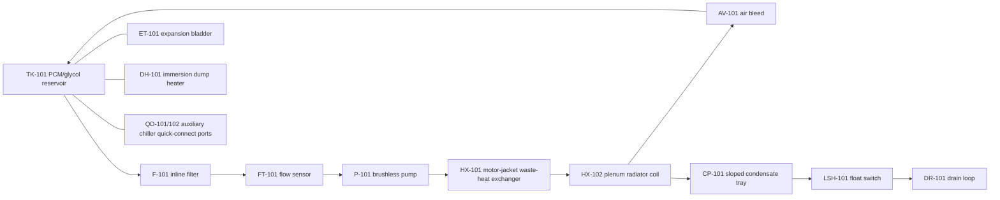
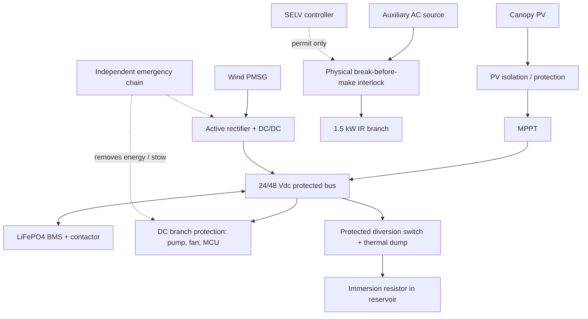

# Hybrid SELV Micro-Climate Cassette — Technical Engineering Package and Working Patent Draft

> **Engineering and legal review notice.** This is a conceptual pre-design package and working patent draft. It is not a safety certification, construction release, grid-interconnection design, product compliance determination, or filing-ready legal opinion. A chartered/registered structural, mechanical, electrical, battery, wind, HVAC and product-safety engineer must validate the installed product. A qualified patent attorney/agent must perform a professional prior-art/FTO review and review any filing before reliance or submission.

## Design basis and non-negotiable boundaries

| Parameter | Screening value / assumption | Engineering boundary |
|---|---:|---|
| Universal cassette envelope | 2.5–3.0 m diameter | Final load path, modal response, material and anchor design are site-specific. |
| Supply architecture | 24/48 V nominal DC | Treat as a SELV design **objective**, not status; verify peak, transient and single-fault limits. [1] [2] |
| High-draw IR load | Up to 1.5 kW auxiliary source | Isolated physical break-before-make transfer hardware; controller provides permit only. |
| Micro-chiller/PCM | 0.6 kW screening input | Requires measured duty, PCM enthalpy, hydraulic head/flow and ambient derating. |
| Plenum | 75 mm / 3 in nominal | CFD/smoke/velocity testing required for radial uniformity. |
| Diffuser | 10 mm equivalent slot, 35° inward/downward | Prototype acoustics/throw/condensate carryover validation required. |
| Curtain breakaway | 14.7–31.7 N screening range | Not a final release force; verify full deployed/stowed/partial wind cases and debris hazards. [3] |
| Gust thresholds | 18 mph curtains deployed; 35 mph open | Firmware threshold only; independent overspeed/stow hardware and structural load basis required. [4] |

# Section 1: Detailed Technical Schematics & Vector Diagrams

## 1.1 Mechanical cross-section and packaging schematic

```text
                           [01] CANOPY PV / SHADE SKIN
                 ┌────────────────────────────────────────┐
                 │                                        │
                 │      [02] guarded rotating cassette    │
                 └───────────────┬────────────────────────┘
                                 │
                    [03] BLDC HUB / PMSG DRIVE
                  ┌──────────────┴───────────────┐
                  │ [04] guarded rotor / cassette │
                  └──────────────┬───────────────┘
                                 │ [05] sealed slip ring
          ┌──────────────────────┴──────────────────────────────┐
          │                75 mm PLENUM CHAMBER                  │
          │  [06] low-profile Cu/Al coil     [07] guide vanes    │
          │   ┌──────────────────────────────────────────────┐  │
          │   │        chilled/warm airflow distribution       │  │
          │   └──────────────────────────────────────────────┘  │
          │ [08] sloped condensate tray 3° → drain [09]          │
          └───────────────╲──────────────────────╱───────────────┘
             [10] 10 mm equivalent radial slot, 35° inward/downward
        ════════════════════╲══════════════════╱═══════════════════
                              \ comfort airflow /

                     50 mm OD / 44 mm ID MAST SECTION
                 ┌─────────────────────────────────┐
                 │ [11] 10 mm-ID EPDM supply hose  │
                 │ [12] 10 mm-ID EPDM return hose  │
                 │ ║ vibration/anti-snag baffles ║ │
                 │ [13] high-draw DC conductors   │
                 │ [14] shielded SELV sensor cable│
                 └─────────────────────────────────┘
                                 │
            ┌────────────────────┴─────────────────────┐
            │ [15] PCM/chilled reservoir and battery base│
            │ [16] pump/filter/expansion/dump heater     │
            └────────────────────────────────────────────┘
```

### Standalone SVG — mechanical cross-section

```svg
<svg xmlns="http://www.w3.org/2000/svg" width="1100" height="650" viewBox="0 0 1100 650">
<style>.s{fill:none;stroke:#172554;stroke-width:3}.f{fill:#dbeafe;stroke:#172554;stroke-width:3}.t{font:15px Arial;fill:#111827}.n{font:12px Arial;fill:#1e3a8a}</style>
<rect x="130" y="40" width="840" height="35" rx="8" class="f"/><text x="145" y="64" class="t">01 PV shade skin / canopy</text>
<ellipse cx="550" cy="135" rx="100" ry="38" class="f"/><text x="470" y="140" class="t">02/03 rotor hub</text>
<rect x="500" y="172" width="100" height="28" class="f"/><text x="610" y="192" class="n">05 slip ring</text>
<path d="M180 215 H920 V330 H180 Z" class="f"/><text x="410" y="245" class="t">75 mm plenum chamber</text>
<rect x="325" y="260" width="450" height="32" class="s"/><text x="450" y="282" class="n">06 radiator coil</text>
<path d="M190 315 L900 290 L900 330 L190 355 Z" class="f"/><text x="350" y="345" class="n">08 tray, 3° slope → drain</text>
<path d="M190 355 L250 385 M910 330 L850 385" class="s"/><text x="385" y="400" class="n">10 perimeter diffuser: 10 mm eq., 35° inward/downward</text>
<rect x="520" y="200" width="60" height="300" class="f"/><text x="590" y="430" class="n">50 OD / 44 ID mast</text>
<circle cx="540" cy="450" r="9" class="s"/><circle cx="560" cy="450" r="9" class="s"/><text x="590" y="455" class="n">11/12 EPDM hoses</text>
<rect x="530" y="465" width="18" height="20" class="s"/><rect x="552" y="465" width="18" height="20" class="s"/><text x="590" y="480" class="n">13 power / 14 shielded sensor</text>
<rect x="330" y="510" width="440" height="95" rx="12" class="f"/><text x="425" y="550" class="t">15 PCM reservoir / battery base</text><text x="415" y="580" class="n">16 pump, filter, expansion, dump resistor</text>
</svg>
```

## 1.2 Hydronic piping & instrumentation diagram (P&ID)

```text
     [P-101] 24/48 V BLDC PUMP          [HX-101] motor waste-heat jacket
  ┌───────────────────────┐       ┌─────────────────────────────────┐
  │                       ▼       ▼                                 │
[TK-101] PCM / glycol ──[F-101]─[FT-101]───►───[HX-101]──►──[HX-102] coil
 reservoir + expansion     filter  flow meter                     │
  │     ▲                                                         │ [AV-101]
  │     │                                                         │ air bleed
  │ [ET-101] expansion bladder                                  ▼
  └─────┴──────◄────────── return ◄────[TT-102]◄─────── coil return
  │
  ├──[DR-101] low-point service/drain
  ├──[QD-101/102] auxiliary chiller supply/return quick-connects
  ├──[DH-101] diversion immersion heater (thermal dump only)
  └──[CP-101] sloped condensate tray → float [LSH-101] → drain loop

INSTRUMENTS: TT-101/102 water RTDs; TS-101 coil surface RTD;
             FT-101 Hall/pulse flow; LSL-101 reservoir leak; LSH-101 pan high float.
```



## 1.3 Electrical single-line diagram

```text
              CANOPY PV ARRAY                         PMSG WIND PATH
       [PV fuse/SPD/isolation]                    [3φ generator]
                  │                                        │
               [MPPT]                           [active rectifier / DC-DC]
                  │                                        │
                  └──────────────┬─────────────────────────┘
                                 ▼
                       [24/48 Vdc protected bus]
                     ┌───────────┼───────────┐
                     ▼           ▼           ▼
               [LiFePO4]   [DC load fuse] [dump branch]
                [BMS +     pump/fan/MCU    [DC switch +
               contactor]    /sensors      resistor or immersion]
                                                │
                                            [base reservoir]

 Auxiliary 1.5 kW IR source:
 [mains supply] → [listed source/transfer enclosure] → [mechanical B-B-M interlock]
       → [IR branch protection / certified contactor] → [IR element]
                         ▲
                   MCU dry-contact PERMIT only

 Emergency/independent chain: E-stop / BMS trip / gust hardware / thermal cutout
                           → removes actuator energy, applies brake/stow as designed.
```



### Reference numerals

| Ref. | Component | Ref. | Component |
|---:|---|---:|---|
| 10 | Canopy | 12 | Rotating cassette | 14 | BLDC/PMSG hub motor |
| 16 | Slip ring | 18 | 75 mm plenum | 20 | Radiator coil |
| 22 | Condensate tray | 24 | Drain line | 26 | Radial diffuser |
| 28 | Mast | 30/32 | Supply/return hoses | 34 | DC power conductors |
| 36 | Sensor cable | 40 | Reservoir | 42 | Pump | 44 | Filter |
| 46 | Flow sensor | 48 | Waste-heat HX | 50 | Air bleed | 52 | Expansion bladder |
| 54 | Chiller quick-connects | 56 | PV | 58 | MPPT | 60 | Battery/BMS |
| 62 | Rectifier/DC-DC | 64 | Dump switch | 66 | Immersion heater | 68 | Controller |

# Section 2: Parametric 3D CAD Generation

The executable source files are included as standalone attachments: `universal_plenum_diffuser_sector.scad` and `mast_separator_bushing.scad`. Both use millimetres and expose their primary fit/geometry variables at the top of each source file. They are prototype/fit-check geometry only: printer tolerance, actual hose OD, live bend radius, materials, UV/fire behaviour, airflow, water ingress, creep, fatigue and electrical protective separation require separate engineering validation.

# Section 3: Embedded Control Firmware

The standalone `hybrid_cassette_controller.ino` attachment is an Arduino-ESP32 reference implementation. It contains the specified real-time input map, Magnus dew-point calculation, the requested states (`SAFE_STOW`, `SOLAR_FAN_COOL`, `HYDRONIC_CHILL`, `HYDRONIC_HEAT`, `WIND_GENERATION`, `DUMP_HEAT`), flow proof, pan/leak/gust interlocks and a latched safe state.

The program deliberately commands only a **dry-contact permit** for the high-draw auxiliary path; the required break-before-make action belongs in a mechanically/electrically interlocked, independently certified power assembly. Firmware reset or nominal SELV voltage is not an independent safety function. Small-wind and outdoor electrical design should be tested as an integrated machine with independent overspeed, source-isolation and fault controls. [3] [4]

# Section 4: Working Patent Application Draft

## Title

**Modular Multi-Layer Micro-Climate Cassette with Isolated Radial Plenum, Hydronic Thermal Routing and Dual-Mode Kinetic Energy Interface**

## Field of the invention

The present disclosure relates to outdoor micro-climate structures and, more particularly, to a cassette for a parasol, canopy, pergola or architectural cowl having an air-distribution plenum, a hydronic thermal loop, segregated mast routing, and a renewable-energy interface.

## Background

Outdoor shade structures can reduce solar gain but commonly provide limited controlled air distribution, condensation management, portable thermal storage or safety-integrated renewable generation. Exposed rotating members can create visual strobe effects, mechanical hazards and wind-induced loads. Conventional evaporative, electric or hydronic comfort devices may have poor distributed delivery, may create condensate outside a drain path, and may demand an installation-specific duct or power arrangement. A combined energy system may further suffer from uncoordinated wind input, waste heat and storage management.

## Summary

A micro-climate cassette is disclosed having a structural annular body, an air plenum separated from a kinetic cassette, a heat exchanger arranged to condition plenum air, a sloped condensate tray, and a radial diffuser. A mast carries segregated fluid and electrical paths. A controller may route power from photovoltaic and wind sources to a protected direct-current bus, thermal reservoir and loads while operating a hydronic loop in response to moisture, temperature, flow and wind conditions. The arrangement can reduce unwanted liquid discharge, preserve a bounded air path, use waste heat from a motor or conversion component, and provide a repeatable cassette interface for shade or roof-cowl embodiments.

## Brief description of drawings

**Figure 1** is the mechanical cross-section and mast-routing diagram in Section 1.1. **Figure 2** is the hydronic P&ID in Section 1.2. **Figure 3** is the electrical single-line diagram in Section 1.3.

## Detailed description of preferred embodiments

Referring to Figure 1, a canopy 10 supports an annular cassette 12. The cassette 12 optionally contains a direct-drive motor-generator 14 and a slip-ring or non-rotating electrical interface 16. A plenum 18 of approximately 75 mm internal height is physically separated from the rotational components. A heat-exchanger coil 20 is arranged in the plenum 18. A condensate tray 22 slopes toward a drain line 24. A radial diffuser 26 has a nominal equivalent slot height of approximately 10 mm and is directed inwardly and downwardly at approximately 35 degrees.

A mast 28 may have an outer diameter of approximately 50 mm and internal diameter of approximately 44 mm. The mast receives first and second insulated EPDM fluid conduits 30, 32, high-current direct-current conductors 34 and shielded sensor conductors 36. A bushing maintains spatial segregation and strain relief. Exact dimensions may vary with structural calculation, insulation system, hose outer diameter and applicable electrical requirements.

Referring to Figure 2, a reservoir 40 contains a heat-transfer fluid and may include phase-change material. A pump 42 circulates the fluid through a filter 44 and a flow sensor 46. A first heat exchanger 48 scavenges motor/converter waste heat when available. A second heat exchanger 20 exchanges heat with plenum air. An air-bleed valve 50, expansion bladder 52, drain/service outlet, and chiller quick-connects 54 are included. A control process determines a dew-point temperature from ambient temperature and relative humidity; it limits cooling if exposed coil surfaces would fall below the dew-point temperature plus a selected margin or if pan/flow faults occur.

Referring to Figure 3, PV source 56 charges the direct-current bus through MPPT converter 58. A battery 60 with BMS is coupled through suitable isolation and protection. A permanent-magnet wind generator is coupled through a rectifier/DC-DC stage 62. A diversion branch 64 sends excess electrical energy to an immersion heater 66 within the reservoir 40 under controlled conditions. A controller 68 reads fluid temperature, coil temperature, humidity, flow, leak, pan-level, rotor speed and wind information. The controller causes a safe stow and/or braking state upon a gust threshold or a fault. A high-draw auxiliary heating branch is electrically and mechanically separated from the direct-current control circuit; any source transfer is protected by a physical break-before-make interlock.

Alternative embodiments include a stationary canopy with a non-rotating fan, a roof cowl, multiple plenum sectors, multiple coils, a thermal store without PCM, a sealed coolant circuit with external chiller, a different renewable source, and a physical blade-stow mechanism in addition to electrical braking.

## Claims

1. **An outdoor micro-climate apparatus**, comprising: an annular cassette body; an air plenum within the annular cassette body; a heat-exchanger coil disposed to exchange heat with air in the air plenum; a perimeter diffuser in fluid communication with the air plenum; a condensate tray positioned below the heat-exchanger coil and sloped toward a drain; a mast coupled to the annular cassette body and defining segregated internal paths for at least one fluid conduit and electrical conductors; and a controller, wherein the controller receives temperature and moisture information and controls a fluid-moving device to limit operation associated with coil-surface condensation.

2. The apparatus of claim 1, wherein the air plenum has an internal height between 60 mm and 90 mm.

3. The apparatus of claim 1, wherein the perimeter diffuser has an equivalent outlet dimension between 6 mm and 14 mm and is directed inwardly and downwardly by an angle between 25 degrees and 45 degrees.

4. The apparatus of claim 1, wherein the condensate tray has a slope of at least 3 degrees toward the drain.

5. The apparatus of claim 1, wherein the mast has an outer diameter of about 50 mm and an internal diameter of about 44 mm and includes a separator bushing defining first and second fluid-conduit channels and separate electrical-conductor channels.

6. The apparatus of claim 5, wherein the first and second fluid-conduit channels each receive an insulated fluid hose having an internal diameter of about 10 mm.

7. The apparatus of claim 1, further comprising a motor-generator arranged in a kinetic cassette physically separated from the air plenum by a protective shield.

8. The apparatus of claim 7, wherein the controller commands a stow mechanism or electrical braking in response to a wind measurement exceeding a first threshold with a curtain deployed and a second, higher threshold with the curtain not deployed.

9. The apparatus of claim 8, wherein a curtain coupling releases at a predetermined tensile load in a range of 14.7 N to 31.7 N, subject to a separately tested retention and hazard condition.

10. The apparatus of claim 1, wherein the heat-exchanger coil, tray and diffuser are formed in interchangeable arcuate sectors that include alignment features.

11. **A thermal-energy routing system** for an outdoor micro-climate apparatus, comprising: a photovoltaic input coupled through a maximum-power-point tracker to a direct-current bus; a wind-generator input coupled through a rectification or conversion stage to the direct-current bus; a battery management system coupled to the direct-current bus; a fluid reservoir; a diversion circuit selectively coupling electrical energy from the direct-current bus to an immersion heating element associated with the fluid reservoir; a heat exchanger recovering heat from a motor or power-conversion component into a fluid loop; and a controller configured to select an operating state using wind, fluid-flow, temperature and moisture measurements.

12. The system of claim 11, wherein the wind-generator input comprises a selectable winding connection or an active rectifier configured to control generator loading without relying on a battery connection as a sole overspeed protection mechanism.

13. The system of claim 11, wherein the controller calculates a dew-point temperature using measured ambient temperature and relative humidity and reduces a pump duty cycle or inhibits cooling when a coil-temperature value is less than the dew-point temperature plus a stored margin.

14. The system of claim 11, wherein the controller inhibits hydronic cooling upon a low-flow indication, leak indication, high condensate-pan indication, or sensor-plausibility fault.

15. The system of claim 11, wherein an auxiliary heating source is coupled through a physical break-before-make interlock separate from a low-voltage controller permit output.

## Abstract

A modular outdoor micro-climate cassette includes an annular air plenum, a hydronic heat-exchanger coil, a sloped condensate tray and a radial air diffuser. A mast carries segregated fluid and electrical paths. A controller manages a photovoltaic input, a wind-generator input, a direct-current storage bus, a thermal diversion path and a hydronic loop in response to temperature, humidity, flow and wind information. The cassette may be used on a canopy, parasol or roof cowl and can provide distributed conditioned airflow while limiting condensate and coordinating thermal energy recovery.

## References

[1]: https://webstore.iec.ch/en/publication/60169 "IEC 60364-4-41 protection against electric shock"
[2]: https://www.itu.int/epublications/ru/publication/itu-t-k-suppl-28-2022-07-electric-shock-and-related-terms-and-definitions "SELV/PELV terminology"
[3]: https://webstore.iec.ch/en/publication/5433 "IEC 61400-2 small wind turbines"
[4]: https://docs.nlr.gov/docs/fy02osti/31666.pdf "NREL small-wind safety and function testing"
[5]: https://www.epa.gov/mold/mold-course-chapter-2 "Condensate and moisture management"
[6]: https://www.gov.uk/guidance/manual-of-patent-practice-mopp/section-14-the-application "UK IPO application drafting guidance"
[7]: https://www.epo.org/en/legal/guidelines-epc/2026/d_v_5.html "EPO claim clarity and support"
[8]: https://www.uspto.gov/web/offices/pac/mpep/s2164.html "USPTO enablement guidance"
