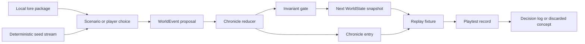

# WOF Engine Blueprint: Tidelock Chronicle Kernel

**Status:** Proposed baseline  
**Owner:** Manus AI  
**Scope:** `wof/` and `docs/research/wof/` only

## Architectural intent

World of Fantasy is a **research kernel for replayable fantasy expeditions**. Its primary question is not how to simulate every aspect of a persistent role-playing game. Instead, it asks whether a campaign built from compact, named, and replayable chronicle events can produce stronger narrative continuity than a system that relies on sprawling mutable state.

The kernel treats a world snapshot as a local research artifact. A player decision, a generator result, or a scripted scenario proposes a `WorldEvent`. The reducer applies that event, performs invariant checks, and appends a chronicle entry. The new snapshot can then be replayed, compared, or retired with no network, database, deployment, or production-system dependency.

| Architectural goal | WOF response | Acceptance signal |
| --- | --- | --- |
| Explore alternate state management | Use immutable snapshots plus an append-only chronicle. | A fixture replay reaches the same state given the same ordered events. |
| Keep fiction auditable | Require event identifiers, summary, cause, and payload. | A reviewer can explain a state change from its chronicle entry. |
| Preserve consequence without runaway complexity | Bind consequences to oaths, memories, faction relations, routes, and story threads. | An experiment changes meaningful but bounded state surfaces. |
| Support rapid rejection | Make worlds and content packages disposable local artifacts. | A discarded concept can be deleted or archived without migration work. |
| Enforce separation | Treat all non-WOF namespaces as forbidden dependencies. | The local isolation check succeeds before a research result is recorded. |

> **Kernel principle:** The chronicle is the authoritative explanation of change; a snapshot is a convenient, replaceable projection of that history.

## Component model



| Component | Location | Responsibility | May depend on | Must not depend on |
| --- | --- | --- | --- | --- |
| Domain contracts | `wof/src/models.ts` | Defines localized entity and event shapes. | TypeScript standard tooling | Any external application model |
| Chronicle reducer | `wof/src/engine/reducer.ts` | Applies state transitions and rejects contradictions. | Local domain contracts | Network, persistence, UI, services |
| Seed stream | `wof/src/engine/seed.ts` | Creates reproducible pseudo-random choices. | Local code only | Shared random utilities or global state |
| JSON Schema | `wof/data/schemas/` | Validates portable fixtures and save candidates. | JSON Schema-compatible validator | Database DDL or migrations |
| Fixture library | `wof/src/fixtures/` | Supplies narrow, disposable research worlds. | Local contracts | Imported saves or user data |
| Namespace guard | `wof/scripts/verify-isolation.mjs` | Rejects forbidden code references. | Node standard library | Repository-specific automation |

## Domain model

WOF uses five linked state surfaces. **Regions** establish geography and progression; **factions** define ideology and obligation; **characters** retain personal costs; **routes** regulate opportunity; and **threads** translate unresolved tensions into a visible narrative rhythm. The `Tidelock` is a global clock whose phase changes which routes and interventions are viable.

| State surface | What it models | Key fields | Deliberate limit |
| --- | --- | --- | --- |
| Tidelock | World rhythm and current pressure. | `turn`, `season`, `phase`, `intensity` | One clock, four phases, five intensity levels. |
| Region | A place with consequences rather than a map tile. | `tier`, `condition`, `tensions`, `resonance` | Regions cannot carry arbitrary hidden subsystem state. |
| Faction relation | Social permission and obligation. | `disposition`, `esteem`, `debt` | Relations are bounded from -10 to +10. |
| Character | A person transformed by play. | `wounds`, `focus`, `memories`, `oathIds` | Advancement should create story leverage, not stat inflation. |
| Route | A conditional path between regions. | `requiredPhase`, `risk`, `state` | A route is rumoured, open, or sealed. |
| Thread | A local dramatic question. | `pressure`, `stage`, `status`, `stakes` | A thread resolves within a declared maximum stage. |
| Chronicle | Explanation of state changes. | `id`, `kind`, `summary`, `payload` | IDs are unique and entries are append-only. |

## Event contract

The `WorldEvent` union is the only mutation interface for the initial kernel. Events are intentionally declarative: they state what happened, why it happened, and the small payload needed to apply it. The kernel does not make hidden choices during reduction.

| Event family | Controlled outcome | Examples of research questions |
| --- | --- | --- |
| Tidelock | Advances the global rhythm. | Do route windows create satisfying urgency? |
| Route | Discovers or seals opportunity. | Does loss of access produce meaningful re-planning? |
| Accord | Changes faction relation and obligation. | Can debt generate more interesting choices than reputation alone? |
| Memory and oath | Records personal consequence. | Does remembrance make repeated expeditions feel continuous? |
| Thread | Changes local narrative pressure. | Do bounded, staged threads prevent unresolved-story overload? |
| Ledger | Tracks expedition cost and discoveries. | Does an explicit supply cost keep event choices legible? |

The kernel validates the following baseline invariants: supplies may not become negative; event identifiers are unique; route endpoints must exist; characters cannot own missing or mismatched oaths; and vitality values may not fall below zero. Additional rules should be added only when a playtest demonstrates a specific contradiction the current constraints cannot prevent.

## Extension seams

WOF experiments must extend through narrow, local seams rather than by adding ambient coupling. The following categories are allowed when they live under the WOF namespace and pass the isolation guard.

| Extension type | Suggested location | Constraint |
| --- | --- | --- |
| New event family | `wof/src/models.ts` and `wof/src/engine/` | Add reducer behavior, invariants, a fixture, and a test together. |
| New world package | `wof/data/worlds/<world-id>/` | Use the localized schema; do not require a database migration. |
| Content generator | `wof/src/generators/` | Accept a seed and return event proposals or content, never direct state mutation. |
| Presentation exploration | `wof/prototypes/` | Read local snapshots only; treat UI as a replaceable projection. |
| Measurement script | `wof/scripts/` | Read fixtures and write results beneath `wof/` or `docs/research/wof/`. |

## Isolation and archival protocol

The WOF namespace is an explicit boundary, not a temporary convention. A WOF artifact must remain local even if it is promising. The `verify:isolation` script searches WOF code, tests, and scripts for protected path references. Reviewers should also confirm that no development workflow adds WOF files to a deployment manifest, shared package alias, database migration, or external save loader.

When a concept concludes, its code can remain in `wof/` as a tagged fixture or be deleted after its result has been recorded in `docs/research/wof/discarded/`. A positive research outcome means only that WOF has learned something; it does not authorize a merge, copy, dependency, or data transfer into another project.

## Minimal experiment loop

A complete WOF experiment begins by registering a question and success threshold. It creates or clones a fixture, uses a deterministic seed where uncertainty is involved, replays a short event sequence, captures measurable observations, and closes with a decision record. The test suite validates mechanics; the playtest record evaluates whether those mechanics created the intended player experience.

```text
question → fixture → seeded event sequence → reducer replay → observations → decision record
```

The next design artifacts are the lore bible, regional progression map, visual R&D guide, and road map held within this same research namespace.
