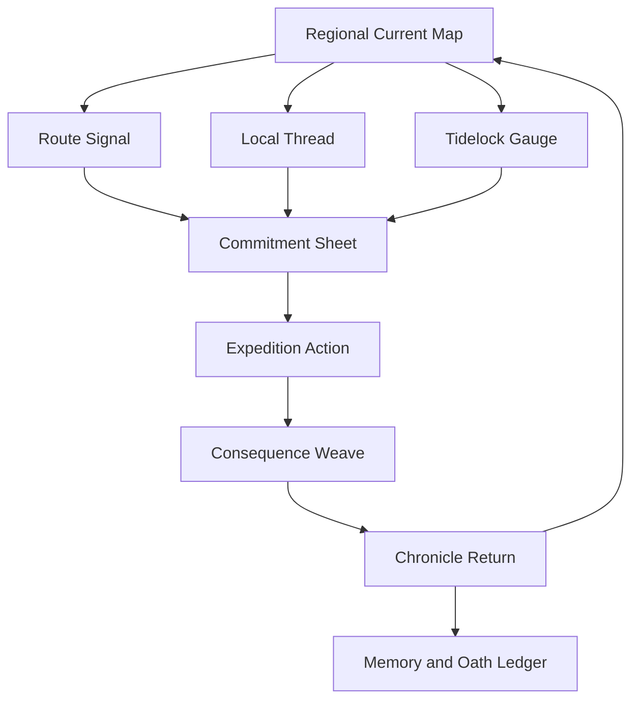

# WOF Visual R&D: The Weathered Instrument

**Status:** Active exploration guide  
**Scope:** WOF concept art, interface studies, and asset briefs only  
**Visual thesis:** The world should feel measured by people who know that measurement changes what is observed.

## Aesthetic identity

WOF’s visual language is called **the Weathered Instrument**. It combines civic fieldcraft, submerged observatory technology, and living materials. The world is not a medieval manuscript, a collectible-card frame, or a stack of ornamental plaques. It should read as a working instrument: tide gauges, reed bells, inked calibration marks, rope splices, pressure stains, sealed glass, and annotated weather maps.

The objective is to make story information feel **handled and contingent**. A memory is a stitched observation. An oath is a physical tension line. A faction relation is a changing signal strength. A route is a measured but unreliable current. Screens should reveal these meanings through spatial hierarchy, material contrast, motion, and clear symbols rather than walls of literary text.

| Element | WOF direction | Deliberately avoid |
| --- | --- | --- |
| Material | Tideglass, basalt, weathered brass, charcoal fiber, waxed rope, wet paper, root-fiber. | Gold-trim parchment, lacquered fantasy-card frames, polished royal ornament. |
| Geometry | Concentric gauges, tide contours, asymmetric route knots, signal rings, folded field charts. | Symmetrical plate stacks, rigid heraldic borders, repeated rectangular panels. |
| Typography | Clean humanist sans for navigation; restrained serif or monospaced annotation for witness notes. | Decorative pseudo-medieval display type or dense ornamental text. |
| Information | Layered evidence: signal, consequence, cause, then lore on demand. | Front-loading every screen with prose exposition. |
| Motion | Slow pressure shifts, waterline rise, thread tension, signal flicker. | Constant particle noise, aggressive pulsing, or spectacle that obscures state. |

## Palette, texture, and light

The palette is deliberately maritime and mineral rather than tavern-warm. Use a dark inked foundation with a small number of resonant accents. Accent colors should communicate a world condition or available approach, not merely decorate a panel.

| Token | Hex | Narrative use | Accessibility role |
| --- | --- | --- | --- |
| **Abyss Ink** | `#101D28` | Default background, deep water, unobserved state. | High-contrast neutral foundation. |
| **Tideglass** | `#5AB6B2` | Brine signals, open route currents, discovery. | Primary interactive accent. |
| **Kiln Ember** | `#D46A45` | Heat, danger, transformation, cost. | Destructive or high-consequence action cue. |
| **Morrow Moss** | `#789A6B` | Root binding, care, stability. | Confirmed protective state. |
| **Veil Violet** | `#8872B8` | Archives, absence, concealed information. | Optional/uncertain signal. |
| **Weather Paper** | `#E7DEC8` | Witness notes, fine labels, readable contrast. | Long-form reading surface. |
| **Salt Iron** | `#66727A` | Inactive gauge, unavailable path, secondary metadata. | De-emphasized but legible state. |

Light should behave like weather. Open routes may carry a diffuse cyan reflection; memory activations may produce an inward, muted glow; danger comes from heat beneath surfaces rather than a generic red alarm. Texture must never reduce text contrast or obscure critical controls.

## Asset system

Asset R&D should favor a reusable family of environmental signals over isolated hero illustrations. A concept is successful when it can support a character silhouette, location key art, route marker, inventory object, and interface accent without losing identity.

| Asset family | Visual anchor | Reuse in the system | Evaluation question |
| --- | --- | --- | --- |
| Resonance sigils | Five incomplete measurement marks, each with a distinct break pattern. | Skills, routes, crafting, faction outlook. | Can a player distinguish them at small size without text? |
| Witness objects | Bell, spool, tide vial, ash tool, root seal, blank ledger tab. | Inventory, events, memories, empty states. | Does each imply a past and a possible cost? |
| Route markers | Knots, current arrows, submerged elevation lines, signal buoys. | Regional map and expedition selection. | Is risk legible before hover or selection? |
| Character silhouettes | Practical layered field garments, distinct carried instrument, a resonance-colored detail. | Roster, dialogue, portrait prompts, map pawn. | Can the archetype be identified in silhouette? |
| Regional keys | Hushmere reeds and bell towers; Cinder Spine rope-forges; drifting orchards; windborne archive ribbons; drowned engine-crown. | Splash art, map vignettes, loading transitions. | Does the region remain recognizable in monochrome? |

## Generative art prompt library

The following prompts are WOF-specific briefs for concept generation. They describe original worldbuilding and avoid named artist imitation. Use each as a starting point; store generated outputs only beneath `wof/assets/rnd/` and record their prompt/version in the associated playtest or decision note.

### 1. Regional key art: Hushmere

```text
Create cinematic environmental concept art for an original fantasy research world called World of Fantasy.
Subject: Hushmere, a flooded marsh observatory at dusk. Slender reed-bell towers rise from dark brackish water; a half-submerged brass observatory dome is wrapped in root-fiber cables. A lone expedition skiff approaches through soft cyan bioluminescent currents. No visible logos, no readable text, no medieval castle.
Composition: wide 16:9 landscape, low waterline viewpoint, observatory offset to the right, distant reeds and mist on the left, a clear dark upper area for optional interface overlay.
Style: weathered instrument aesthetic; tideglass cyan reflections, abyss-ink water, brass oxidization, wet charcoal paper texture, restrained painterly realism, calm melancholy and measured wonder.
Constraints: original visual design; practical scale; cinematic but not glossy; preserve an atmosphere of civic fieldwork and dangerous memory.
Avoid: parchment UI, ornate fantasy card borders, gold filigree, generic wizard robes, crowded combat action, typography.
```

### 2. Character concept sheet: Witness-binder

```text
Create a single original fantasy character concept sheet for a World of Fantasy Witness-binder.
Subject: an adult field archivist who binds magical testimony into stitchwork, carrying a narrow brass listening horn, waxed cord spools, weatherproof notebook, and a tideglass memory vial. Their coat is practical charcoal fiber with one muted veil-violet lining; no armor, no crown, no wand.
Composition: 3:4 vertical design board with one full-body front-facing figure, two small detail callouts of the listening horn and memory stitchwork, clean negative space, no labels or text.
Style: weathered instrument aesthetic, understated painterly illustration, readable silhouette, salt-stained materials, restrained cyan and violet accents on a weather-paper background.
Constraints: mature practical fieldwear, clear hands and tools, stable silhouette suitable for UI portrait derivation.
Avoid: sexualized styling, historical uniform imitation, ornate baroque trim, anime exaggeration, text, logos.
```

### 3. Prop set: consequential inventory

```text
Create an original game prop set for World of Fantasy, presented as individual separated objects on a neutral weather-paper surface with no text.
Subject: six consequential expedition objects: a cracked tideglass vial emitting a cyan line, a soot-black brass kiln key, a root-wrapped ferry token, a sealed reed-bell capsule, a folded current chart marked by water damage, and a spool of witness-thread with a violet knot.
Composition: overhead flat lay, each object separated with clear silhouette and consistent scale, centered grid spacing, no overlapping items.
Style: weathered instrument aesthetic, semi-realistic painted materials, tactile wear, abyss-ink shadows, cyan ember green and violet accents.
Constraints: each object must read at 64-pixel icon scale; no wording, no numbers, no border frames.
Avoid: generic loot icons, gold coins, gemstone piles, tarot cards, ornate plaques.
```

### 4. Route-map visual mockup

```text
Create a visual mockup of a fantasy expedition route map for World of Fantasy, shown as a full desktop application screen, not a functional product.
Subject: an asymmetric tide-current map centered on Hushmere, with a submerged observatory, reed-bell nodes, a risky route to the Cinder Spine, and a four-phase Tidelock gauge. Use simple UI labels only: Hushmere, Cinder Spine, Slack, Rising, Crest, Ebb, Supplies 4. Include a small legend for risk shown by knot density rather than stars.
Composition: 16:9 desktop screen, large map canvas, compact left-side expedition roster with one character, narrow right-side consequence preview, bottom tide gauge. Make the map the dominant visual field.
Style: weathered instrument UI, abyss-ink background, tideglass route lines, weather-paper annotation blocks, restrained brass indicators, clean humanist type, ample whitespace.
Constraints: the UI must feel like a field instrument rather than panels or cards; readable hierarchy; original interface.
Avoid: fantasy parchment, stacked text plates, large modal windows, dashboard clutter, standard minimap, collectible-card frames.
```

### 5. Event aftermath illustration

```text
Create an original fantasy narrative aftermath illustration for World of Fantasy.
Subject: an expedition team standing on a flooded causeway after sealing a route. A rope bridge dissolves into bright tideglass mist behind them; one person ties a new oath-thread around their wrist while another records the event in a wet notebook. The mood is sober relief, not victory celebration.
Composition: 3:2 horizontal, medium-wide shot, characters grouped lower center, dissolving route visible in the background, quiet sky and reeds above.
Style: weathered instrument aesthetic, brine and veil palette with one kiln-ember accent, cinematic painterly realism, tactile wet fabric and oxidized brass.
Constraints: communicate irreversible consequence without text, banners, symbols of royalty, or violence.
Avoid: triumphant battle pose, heroic glow, generic fantasy city, crowded cast, title typography.
```

## Experimental interface concept: the expedition instrument

The proposed UI does not use a universal home dashboard. It presents the current expedition as an instrument with three persistent questions: **What is changing? What will this cost? Who will remember?** The map is the primary surface; inventory, characters, and story threads are contextual overlays that preserve spatial orientation.



| Interface surface | Primary question | Core content | Experimental distinction |
| --- | --- | --- | --- |
| **Regional Current Map** | Where can we act before the world changes? | Routes, phase windows, region pressure, faction signals. | Map lines swell, knot, or fade according to risk and timing. |
| **Commitment Sheet** | What do we accept before leaving? | Supplies, companion, oath exposure, expected cost. | Choices appear as tension lines crossing a small field chart, not buttons in a menu stack. |
| **Consequence Weave** | What changed because of this action? | Event summary, linked memory, relation, route, and thread changes. | The outcome is a connected evidence weave rather than a reward popup. |
| **Memory and Oath Ledger** | What will follow us? | Triggerable memories, open oath clocks, due turns, scars. | Oaths are drawn as taut threads that change texture as deadlines approach. |
| **Tide Cache** | What can be carried, spent, or transformed? | Supply objects, tools, discoveries, resonance traces. | Inventory is a field tray with physical placement constraints rather than a generic grid. |

### Inventory grid study: the tide cache

The Tide Cache is a deliberately constrained 4×4 field tray. The outer rim is reserved for **stable supplies**; the inner wells are reserved for **volatile discoveries**. Objects occupy one or more slots based on physical shape, but the primary design experiment is semantic placement: putting a memory-bound item beside a brine tool can expose a possible working, while placing it beside a kiln tool may show an ethical warning.

| Zone | Capacity | Contents | Interaction hypothesis |
| --- | --- | --- | --- |
| Outer rim | 8 narrow slots | Rope, rations, signal lamps, repair kits. | Stable preparation should be read at a glance. |
| Inner wells | 6 flexible slots | Tideglass, sealed testimony, ash tools, root tokens. | Adjacency should reveal rather than hide possible combinations. |
| Witness pocket | 1 protected slot | The item or memory most likely to be changed by the expedition. | Choosing it should make emotional stakes visible before departure. |
| Oath thread | 1 linear track | Current open oath and due turn. | It should remain visible without competing with the map. |

## Visual validation protocol

Visual R&D must be tested for clarity before polish. A first review should ask whether a viewer can identify the world’s material language, tell one region from another, read a route’s risk, and locate the immediate consequence of an action. It should not ask whether every surface contains more decoration.

| Test | Method | Pass condition | Failure response |
| --- | --- | --- | --- |
| Silhouette distinction | Show desaturated regional/character thumbnails. | Viewer identifies at least three asset families by role. | Strengthen unique shapes before adding detail. |
| Palette meaning | Show UI states without labels. | Viewer distinguishes available, risky, unavailable, and uncertain states. | Increase contrast and reduce decorative accent reuse. |
| Map comprehension | Give a route-choice task using the mockup. | Viewer identifies timing, risk, and consequence preview. | Simplify layers; retain the map as primary surface. |
| Consequence legibility | Show before-and-after event state. | Viewer names a linked memory, relation, route, or thread shift. | Reduce prose and make causal links spatial. |
| First-contact distinction | Compare WOF mockup with neutral fantasy UI references. | Viewer describes WOF using weather, measurement, tide, or witness language. | Revisit material and geometry, not just color. |

No visual concept becomes baseline canon merely because it is attractive. It must support the stated information task, remain original, and fit the Tidelock Chronicle’s consequence-first design language.
